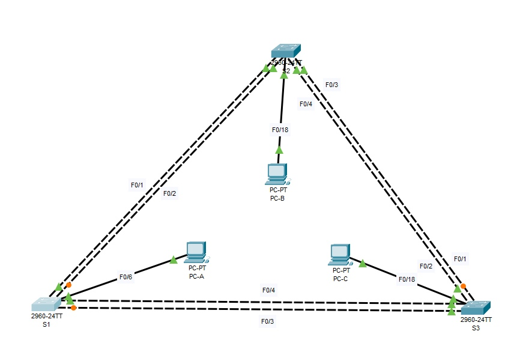

# Настройка расширенных сетей VLAN, VTP и DTP

### Задачи
###### Часть 1. Настройка VTP
###### Часть 2. Настройка DTP
###### Часть 3. Добавление сетей VLAN и назначение портов
###### Часть 4. Настройка расширенной сети VLAN

### Таблица адресации	
Заголовок таблицы	Интерфейс	IP-адрес		Маска подсети
S1					VLAN 99		192.168.99.1	255.255.255.0
S2					VLAN 99		192.168.99.2	255.255.255.0
S3					VLAN 99		192.168.99.3	255.255.255.0
PC-A				NIC			192.168.10.1	255.255.255.0
PC-B				NIC			192.168.20.1	255.255.255.0
PC-C				NIC			192.168.10.2	255.255.255.0

	Вопросы и ответы

Какой административный и оперативный режим у коммутационного порта f0/1?
1.  Administrative Mode: dynamic auto
Operational Mode: static access

2. 	Настройте постоянную магистраль между коммутаторами S2 и S3.
	Запишите команды, использованные для создания статической магистрали.
	
S3>en
S3#configure
S3(config)#interface f0/1
S3(config-if)#switchport mode trunk

3. 	На коммутаторе S1 добавьте сеть VLAN 10.
	S1(config)# vlan 10
	Удалось ли вам создать сеть VLAN 10 на коммутаторе S1? Поясните ответ.
Не удалось, в виду того, что юзается клиент мод

4. Какие команды show вы использовали для проверки обновлений VTP на коммутаторах S1 и S3?
show vlan brief

5.1. Отправьте ping-запрос с компьютера PC-B на PC-A и проверьте результат. Поясните ответ.
Ping не проходит, в виду того, что в разных вланах
5.2. Отправьте ping-запрос с компьютера PC-A на PC-C и проверьте результат. Поясните ответ.
Ping проходит, т.к. в одном влане
5.3. Отправьте ping-запрос с коммутатора S1 на компьютер PC-A. Была ли проверка успешной? Поясните ответ.
Не проходит ping. SVI на vlan 99, а PC-A на vlan 10
5.4. Проходит ping. SVI обоих на vlan 99

6. Каковы преимущества и недостатки использования VTP?
К преимуществам относится поддержка согласованности по всей сети. Добавив, удалив, перенастроив влан на одном свитче, все остальные свитчи согласуются и примут данные изменения...
К недостаткам - STP (риск возникновения петли), не забывать о разных версиях протокола, при вводе нового свитча в сеть. 

	
