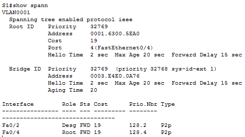
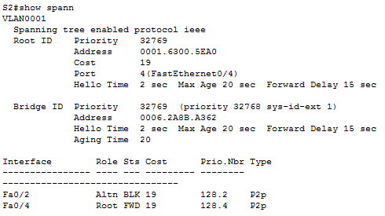
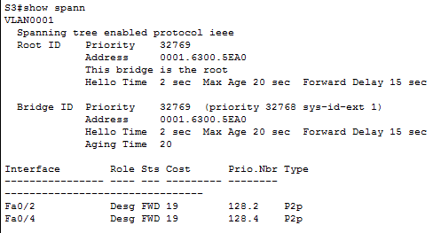

# Развертывание коммутируемой сети с резервными каналами

### Таблица адресации
|Устройство|Интерфейс|IP-адрес   |Маска подсети|
|----------|---------|-----------|-------------|
|S1        |VLAN 1   |192.168.1.1|255.255.255.0|
|S2        |VLAN 1   |192.168.1.2|255.255.255.0|
|S3        |VLAN 1   |192.168.1.3|255.255.255.0|
------------------------------------------------
### Цели
#### Часть 1. Создание сети и настройка основных параметров устройства
#### Часть 2. Выбор корневого моста
#### Часть 3. Наблюдение за процессом выбора протоколом STP порта, исходя из стоимости портов
#### Часть 4. Наблюдение за процессом выбора протоколом STP порта, исходя из приоритета портов

## Часть 1:	Создание сети и настройка основных параметров устройства

### Шаг 1:	Создайте сеть согласно топологии.
#### Подключите устройства, как показано в топологии, и подсоедините необходимые кабели.
##### Выполнено
#### Шаг 2:	Выполните инициализацию и перезагрузку коммутаторов.
#### Шаг 3:	Настройте базовые параметры каждого коммутатора.
###### a.	Отключите поиск DNS.
###### b.	Присвойте имена устройствам в соответствии с топологией.
###### c.	Назначьте class в качестве зашифрованного пароля доступа к привилегированному режиму.
###### d.	Назначьте cisco в качестве паролей консоли и VTY и активируйте вход для консоли и VTY каналов.
###### e.	Настройте logging synchronous для консольного канала.
###### f.	Настройте баннерное сообщение дня (MOTD) для предупреждения пользователей о запрете несанкционированного доступа.
###### g.	Задайте IP-адрес, указанный в таблице адресации для VLAN 1 на всех коммутаторах.
###### h.	Скопируйте текущую конфигурацию в файл загрузочной конфигурации.

##### Switch(config)#hostname S1
##### S1(config)#no ip domain-lookup
##### S1(config)#exit
##### S1(config)#service password-encryption 
##### S1(config)#enable secret class
##### S1(config)#line console 0
##### S1(config-line)#password cisco
##### S1(config-line)#exec-timeout 5 0 
##### S1(config-line)#logging synchronous
##### S1(config-line)#login
##### S1(config-line)#exit
##### S1(config)#line vty 0 4
##### S1(config-line)#password cisco
##### S1(config-line)#exec-timeout 5 0 
##### S1(config-line)#logging synchronous
##### S1(config-line)#login
##### S1(config-line)#exit
##### S1(config)#banner motd #He BJle3au, naJlbu,u oTopBeT!!!#
##### S1#configure
##### S1(config)#interface vlan 1
##### S1(config)#ip address 192.168.1.1 255.255.255.0
##### S1(config)#exit
##### S1# copy running-config startup-config

#### Шаг 4: Проверить связь.
###### Проверьте способность компьютеров обмениваться эхо-запросами.
###### Успешно ли выполняется эхо-запрос от коммутатора S1 на коммутатор S2?
###### Успешно ли выполняется эхо-запрос от коммутатора S1 на коммутатор S3?
###### Успешно ли выполняется эхо-запрос от коммутатора S2 на коммутатор S3?
##### Все эхо-запрсы выполнились успешно

## Часть 2. Выбор корневого моста

### Шаг 1. Отключите все порты на коммутаторах.
#### S1#conf t
#### S1(config)#int range f0/1-24
#### S1(config-if-range)#shutdown
### Шаг 2: Настройте подключенные порты в качестве транковых.
#### S1(config)#int range f0/1-24
#### S1(config-if-range)#switchport mode trunk
### Шаг 3: Включите порты F0/2 и F0/4 на всех коммутаторах.
#### S1#conf
#### S1(config)#int range f0/2,f0/4
#### S1(config-if-range)#no shut
### Шаг 4: Отобразите данные протокола spanning-tree.
###### S1#show spann

###### S2#show spann

###### S3#show spann
