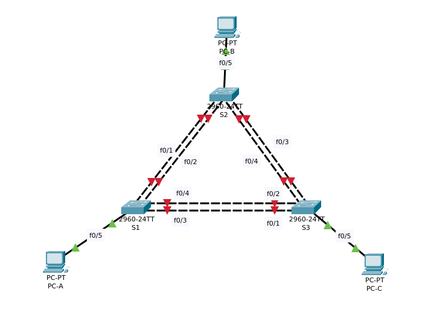

# Агрегация соединений
## Настройка EtherChannel



Таблица адресации
|Устройство|Интерфейс|IP-адрес	   |Маска подсети|
|----------|---------|-------------|-------------|
|S1		   |VLAN 99	 |192.168.99.11|255.255.255.0|
|S2		   |VLAN 99	 |192.168.99.12|255.255.255.0|
|S3		   |VLAN 99	 |192.168.99.13|255.255.255.0|
|PC-A  	   |NIC	     |192.168.10.1 |255.255.255.0|
|PC-B	   |NIC		 |192.168.10.2 |255.255.255.0|
|PC-C	   |NIC	     |192.168.10.3 |255.255.255.0|
--------------------------------------------------

#	Цели:

### Часть 1. Настройка базовых параметров коммутатора
### Часть 2. Настройка PAgP
### Часть 3. Настройка LACP

# Решения:

#№№ Часть 1. Настройка базовых параметров коммутатора
#### Шаг 1. Создайте сеть согласно топологии.
#### Подключите устройства, как показано в топологии, и подсоедините необходимые кабели (схема в начале)
#### Шаг 2. Выполните инициализацию и перезагрузку коммутаторов.
#### Шаг 3. Настройте базовые параметры каждого коммутатора.

<details>
 <summary>Свитч S1</summary>

``` bash
Switch#conf t
Switch(config)#no ip domain-lookup 
Switch(config)#hostname S1
S1(config)#service password-encryption
S1(config)#enable secret class
S1(config)#line console 0
S1(config-line)#password cisco
S1(config-line)#login
S1(config-line)#exec-timeout 5 0
S1(config-line)#logging synchronous
S1(config-line)#exit
S1(config)#line vty 0 4
S1(config-line)#password cisco
S1(config-line)#login
S1(config-line)#exec-timeout 5 0
S1(config-line)#logging synchronous
S1(config-line)#exit
S1(config)#int range f0/1-4,f0/6-24
S1(config-if-range)#shut
S1(config)#no logging console
S1(config)#vtp mode transparent
S1(config)#vlan 99
S1(config-vlan)#name Management
S1(config-vlan)#vlan 10
S1(config-vlan)#name Staff
S1(config-vlan)#exit
S1(config)#int f0/5
S1(config-if)#switchport mode access
S1(config-if)#switchport access vlan 10
S1(config-if)#exit
S1(config)#int vlan 99
S1(config-if)#ip address 192.168.99.11 255.255.255.0
S1(config-if)#exit
S1(config)#exit
S1#copy running-config startup-config
```

</details>
S2 и S3 настраиваются также, за исключением:

<details>
 <summary>S2</summary>

``` bash
Switch(config)#hostname S2
S1(config-if)#ip address 192.168.99.12 255.255.255.0
```
</details>
<details>
 <summary>S3</summary>

``` bash
Switch(config)#hostname S3
S1(config-if)#ip address 192.168.99.13 255.255.255.0
```
</details>

##### Шаг 4: Настройте компьютеры.

### Часть 2. Настройка протокола PAgP
##### Настройте PAgP на S1 и S3

<details>
 <summary>S1</summary>

``` bash
S1#conf t
S1(config)#interface range f0/3-4
S1(config-if-range)#channel-group 1 mode desirable
Creating a port-channel interface Port-channel 1

S1(config-if-range)#no shutdown
```
</details>

<details>
 <summary>S3</summary>

``` bash
S1#conf t
S1(config)#interface range f0/3-4
S1(config-if-range)#channel-group 1 mode auto
Creating a port-channel interface Port-channel 1

S1(config-if-range)#no shutdown
```
</details>

##### Проверить конфигурации на портах

<details>
 <summary>S1</summary>

``` bash
S1#sh run interface f0/3

interface Ethernet0/3
 channel-group 1 mode desirable
end
```

``` bash
S1#sh run interface f0/4

interface Ethernet0/4
 channel-group 1 mode desirable
end
```

``` bash
S1#sh int f0/3 switchport
Administrative Mode: dynamic auto
Operational Mode: static access (member of bundle Po1)
```

``` bash
S1#sh int f0/4 switchport
Administrative Mode: dynamic auto
Operational Mode: static access (member of bundle Po1)

```
</details>

<details>
 <summary>S3</summary>

``` bash
S3#sh run interface f0/3
interface Ethernet0/1
 channel-group 1 mode auto
```

``` bash
S3#sh run interface f0/4
interface Ethernet0/2
 channel-group 1 mode auto
```

``` bash
S3#sh int f0/3 switch
Administrative Mode: dynamic auto
Operational Mode: static access (member of bundle Po1)
```

``` bash
S3#sh int f0/4 switch
Administrative Mode: dynamic auto
Operational Mode: static access (member of bundle Po1)
```
</details>

##### Убедиться, что порты объединены
<details>
 <summary>Проверка объединения портов в EtherChannel S1:</summary>

``` bash
S1#show etherchannel summary

Group  Port-channel  Protocol    Ports
------+-------------+-----------+----------------------------------------------

1      Po1(SU)           PAgP   Fa0/3(P) Fa0/4(P)
```
</details>
<details>
 <summary>Проверка объединения портов в EtherChannel S3:</summary>

``` bash
S3#show etherchannel summary

Group  Port-channel  Protocol    Ports
------+-------------+-----------+----------------------------------------------

1      Po1(SU)           PAgP   Fa0/3(P) Fa0/4(P) 
```
</details>

##### Настройте транковые порты (S1 и S3)

</details>
<details>
 <summary>S1:</summary>
``` bash
S1(config)# interface port-channel 1
S1(config-if)# switchport mode trunk
S1(config-if)# switchport trunk native vlan 99
```
</details>

</details>
<details>
 <summary>S3:</summary>
``` bash
S1(config)# interface port-channel 1
S1(config-if)# switchport mode trunk
S1(config-if)# switchport trunk native vlan 99
```
</details>

##### Убедитесь в том, что порты настроены в качестве транковых
###### Выполните команды show run interface идентификатор-интерфейса на S1 и S3. Какие команды включены в список для интерфейсов F0/3 и F0/4 на обоих коммутаторах? Сравните результаты с текущей конфигурацией для интерфейса Po1. Запишите наблюдения.
<details>
 <summary>S1</summary>

``` bash
S1# sh run interface Po1

interface Port-channel1
 switchport trunk native vlan 99
end
S1#sh int Po1 switchport
Name: Po1
Switchport: Enabled
Administrative Mode: dynamic auto
Operational Mode: static access
Administrative Trunking Encapsulation: negotiate
Operational Trunking Encapsulation: native
Negotiation of Trunking: On
Access Mode VLAN: 1 (default)
Trunking Native Mode VLAN: 99 (Management)
Administrative Native VLAN tagging: enabled
Voice VLAN: none
Administrative private-vlan host-association: none
Administrative private-vlan mapping: none
Administrative private-vlan trunk native VLAN: none
Administrative private-vlan trunk Native VLAN tagging: enabled
Administrative private-vlan trunk encapsulation: dot1q
Administrative private-vlan trunk normal VLANs: none
Administrative private-vlan trunk associations: none
Administrative private-vlan trunk mappings: none
Operational private-vlan: none
Trunking VLANs Enabled: ALL
Pruning VLANs Enabled: 2-1001
```
</details>
<details>
 <summary>S3</summary>
 
``` bash
S3# sh run interface Po1

interface Port-channel1
 switchport trunk native vlan 99
end
S3#sh int Po1 switchport
Name: Po1
Switchport: Enabled
Administrative Mode: dynamic auto
Operational Mode: static access
Administrative Trunking Encapsulation: negotiate
Operational Trunking Encapsulation: native
Negotiation of Trunking: On
Access Mode VLAN: 1 (default)
Trunking Native Mode VLAN: 99 (Management)
Administrative Native VLAN tagging: enabled
Voice VLAN: none
Administrative private-vlan host-association: none
Administrative private-vlan mapping: none
Administrative private-vlan trunk native VLAN: none
Administrative private-vlan trunk Native VLAN tagging: enabled
Administrative private-vlan trunk encapsulation: dot1q
Administrative private-vlan trunk normal VLANs: none
Administrative private-vlan trunk associations: none
Administrative private-vlan trunk mappings: none
Operational private-vlan: none
Trunking VLANs Enabled: ALL
Pruning VLANs Enabled: 2-1001
```
</details>

###### Выполните команды show interfaces trunk и show spanning-tree на S1 и S3. Какой транковый порт включен в список? Какая используется сеть native VLAN? Какой вывод можно сделать на основе выходных данных?

<details>
 <summary>S1</summary>
``` bash
S1#show interfaces trunk 
Port        Mode         Encapsulation  Status        Native vlan
Po1         on           802.1q         trunking      99

Port        Vlans allowed on trunk
Po1         1-1005

Port        Vlans allowed and active in management domain
Po1         1,10,99

Port        Vlans in spanning tree forwarding state and not pruned
Po1         1,10,99

S1#show spanning-tree
VLAN0001
  Spanning tree enabled protocol ieee
  Root ID    Priority    32769
             Address     0001.C772.84E8
             This bridge is the root
             Hello Time  2 sec  Max Age 20 sec  Forward Delay 15 sec

  Bridge ID  Priority    32769  (priority 32768 sys-id-ext 1)
             Address     0001.C772.84E8
             Hello Time  2 sec  Max Age 20 sec  Forward Delay 15 sec
             Aging Time  20

Interface        Role Sts Cost      Prio.Nbr Type
---------------- ---- --- --------- -------- --------------------------------
Po1              Desg FWD 9         128.28   Shr

VLAN0010
  Spanning tree enabled protocol ieee
  Root ID    Priority    32778
             Address     0001.C772.84E8
             This bridge is the root
             Hello Time  2 sec  Max Age 20 sec  Forward Delay 15 sec

  Bridge ID  Priority    32778  (priority 32768 sys-id-ext 10)
             Address     0001.C772.84E8
             Hello Time  2 sec  Max Age 20 sec  Forward Delay 15 sec
             Aging Time  20

Interface        Role Sts Cost      Prio.Nbr Type
---------------- ---- --- --------- -------- --------------------------------
Fa0/5            Desg FWD 19        128.5    P2p
```
</details>

details>
 <summary>S3</summary>
``` bash
S3#show interfaces trunk 
Port        Mode         Encapsulation  Status        Native vlan
Po1         on           802.1q         trunking      99

Port        Vlans allowed on trunk
Po1         1-1005

Port        Vlans allowed and active in management domain
Po1         1,10,99

Port        Vlans in spanning tree forwarding state and not pruned
Po1         none

S3#show spanning-tree 
VLAN0001
  Spanning tree enabled protocol ieee
  Root ID    Priority    32769
             Address     0001.C772.84E8
             Cost        9
             Port        28(Port-channel1)
             Hello Time  2 sec  Max Age 20 sec  Forward Delay 15 sec

  Bridge ID  Priority    32769  (priority 32768 sys-id-ext 1)
             Address     0007.EC51.4628
             Hello Time  2 sec  Max Age 20 sec  Forward Delay 15 sec
             Aging Time  20

Interface        Role Sts Cost      Prio.Nbr Type
---------------- ---- --- --------- -------- --------------------------------
Po1              Root BKN*9         128.28   Shr *TYPE_Inc
Fa0/2            Desg FWD 19        128.2    P2p
Fa0/1            Desg FWD 19        128.1    P2p

VLAN0010
  Spanning tree enabled protocol ieee
  Root ID    Priority    32778
             Address     0007.EC51.4628
             This bridge is the root
             Hello Time  2 sec  Max Age 20 sec  Forward Delay 15 sec

  Bridge ID  Priority    32778  (priority 32768 sys-id-ext 10)
             Address     0007.EC51.4628
             Hello Time  2 sec  Max Age 20 sec  Forward Delay 15 sec
             Aging Time  20

Interface        Role Sts Cost      Prio.Nbr Type
---------------- ---- --- --------- -------- --------------------------------
Fa0/5            Desg FWD 19        128.5    P2p
```
</details>

###### Ответы:
Порт Po1, Native vlan 99, S1 корневой во VLAN1, во VLAN10 оба свитча руты, в виду того, что анонс данного влана по транку не настрекн.


###### Какие значения стоимости и приоритета порта для агрегированного канала отображены в выходных данных команды show spanning-tree?
``` bash
Po1              Desg FWD 9         128.28   Shr
```
``` bash
Po1              Root BKN*9         128.28   Shr *TYPE_Inc
```


### Часть 3. Настройка протокола LACP
##### Настройте LACP между S1 и S2
<details>
 <summary>S1</summary>
``` bash
S1(config)# interface range f0/1-2
S1(config-if-range)# switchport mode trunk
S1(config-if-range)# switchport trunk native vlan 99
S1(config-if-range)# channel-group 2 mode active
```
</details>

<details>
 <summary>S2</summary>
``` bash
S1(config)# interface range f0/1-2
S1(config-if-range)# switchport mode trunk
S1(config-if-range)# switchport trunk native vlan 99
S1(config-if-range)# channel-group 2 mode active
```
</details>

Для агрегирования каналов используется протокол LACP
Для образования Po2 используются порты Fa0/1(P) Fa0/2(P)

``` bash
S2#sh etherchannel summary

Group  Port-channel  Protocol    Ports
------+-------------+-----------+-----------------------------------------------
2      Po2(SU)           LACP   Fa0/1(P) Fa0/2(P)
```

##### Настройте LACP между S2 и S3

<details>
 <summary>S2</summary>
``` bash
S2(config)# interface range f0/3-4
S2(config-if-range)# switchport mode trunk
S2(config-if-range)# switchport trunk native vlan 99
S2(config-if-range)# channel-group 3 mode active
Creating a port-channel interface Port-channel 3
S2(config-if-range)# no shutdown
```
</details>

<details>
 <summary>S3</summary>
``` bash
S3(config)# interface range f0/1-2
S3(config-if-range)# switchport mode trunk
S3(config-if-range)# switchport trunk native vlan 99
S3(config-if-range)# channel-group 3 mode passive
Creating a port-channel interface Port-channel 3

S3(config-if-range)# no shutdown
```
</details>