# Настройка базового протокола OSPFv2 для одной области
## Топология

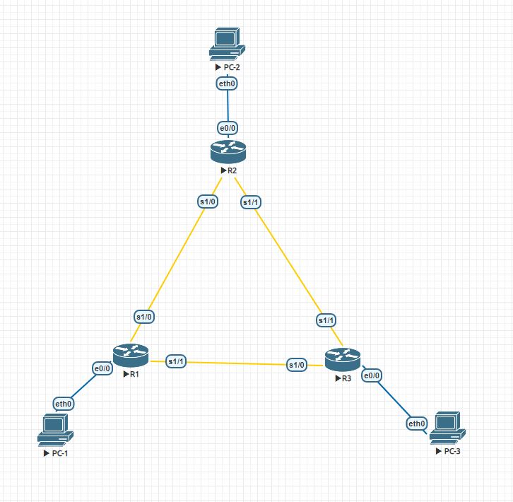

## Таблица адресации

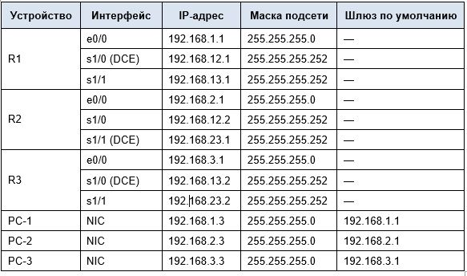

Базовая настройка маршрутизаторов.

<details>
 <summary>R1</summary>

``` bash
Router(config)#conf t
Enter configuration commands, one per line.  End with CNTL/Z.
Router(config)#hostname R1
R1(config)#no logging console
R1(config)#no ip domain-lookup
R1(config)#int s1/0
R1(config-if)#ip address 192.168.12.1 255.255.255.252
R1(config-if)#clock rate 128000
R1(config-if)#no shutdown
R1(config-if)#exit
R1(config)#
R1(config)#int s1/1
R1(config-if)#ip address 192.168.13.1 255.255.255.252
R1(config-if)#no shutdown
R1(config-if)#exit
R1(config)#
R1(config)#int e0/0
R1(config-if)#ip address 192.168.1.1 255.255.255.0
R1(config-if)#no shutdown
R1(config-if)#exit
R1(config)#
R1(config)#service password-encryption
R1(config)#enable secret class
R1(config)#line console 0
R1(config-line)#password cisco
R1(config-line)#exec-timeout 5 0
R1(config-line)#logging synchronous
R1(config-line)#login
R1(config-line)#exit
R1(config)#line vty 0 4
R1(config-line)#password cisco
R1(config-line)#exec-timeout 5 0
R1(config-line)#logging synchronous
R1(config-line)#login
R1(config-line)#exit
R1(config)#exit
R1#wr
Building configuration...
[OK]
R1#
```
</details>

<details>
 <summary>R2</summary>

``` bash
Router(config)#hostname R2
R2(config)#no logging console
R2(config)#no ip domain-lookup
R2(config)#int s1/0
R2(config-if)#ip address 192.168.12.2 255.255.255.252
R2(config-if)#no shutdown
R2(config-if)#exit
R2(config)#int s1/1
R2(config-if)#ip address 192.168.23.1 255.255.255.252
R2(config-if)#clock rate 128000
R2(config-if)#no shutdown
R2(config-if)#exit
R2(config)#int e0/0
R2(config-if)#ip address 192.168.2.1 255.255.255.0
R2(config-if)#no shutdown
R2(config-if)#exit
R2(config)#service password-encryption
R2(config)#enable secret class
R2(config)#line console 0
R2(config-line)#password cisco
R2(config-line)#exec-timeout 5 0
R2(config-line)#logging synchronous
R2(config-line)#login
R2(config-line)#exit
R2(config)#line vty 0 4
R2(config-line)#password cisco
R2(config-line)#exec-timeout 5 0
R2(config-line)#logging synchronous
R2(config-line)#login
R2(config-line)#exit
R2(config)#exit
R2#wr
Building configuration...
[OK]
R2#
```
</details>

<details>
 <summary>R3</summary>

``` bash
Router#conf t
Enter configuration commands, one per line.  End with CNTL/Z.
Router(config)#hostname R3
R3(config)#no logging console
R3(config)#no ip domain-lookup
R3(config)#int s1/0
R3(config-if)#ip address 192.168.13.2 255.255.255.252
R3(config-if)#clock rate 128000
R3(config-if)#no shutdown
R3(config-if)#exit
R3(config)#int s1/1
R3(config-if)#ip address 192.168.23.2 255.255.255.252
R3(config-if)#no shutdown
R3(config-if)#exit
R3(config)#int e0/0
R3(config-if)#ip address 192.168.3.1 255.255.255.0
R3(config-if)#no shutdown
R3(config-if)#exit
R3(config)#service password-encryption
R3(config)#enable secret class
R3(config)#line console 0
R3(config-line)#password cisco
R3(config-line)#exec-timeout 5 0
R3(config-line)#logging synchronous
R3(config-line)#login
R3(config-line)#exit
R3(config)#line vty 0 4
R3(config-line)#password cisco
R3(config-line)#exec-timeout 5 0
R3(config-line)#logging synchronous
R3(config-line)#login
R3(config-line)#exit
R3(config)#exit
R3#wr
Building configuration...
[OK]
R3#wr

```
</details>

<details>
 <summary>Настройка компьютеров</summary>

Настройка PC-1
``` bash
VPCS> set pcname PC-1
PC-1> ip 192.168.1.3/24 192.168.1.1
Checking for duplicate address...
PC1 : 192.168.1.3 255.255.255.0 gateway 192.168.1.1
```
Настройка PC-2
``` bash
VPCS> set pcname PC-2
PC-2> ip 192.168.2.3/24 192.168.2.1
Checking for duplicate address...
PC1 : 192.168.2.3 255.255.255.0 gateway 192.168.2.1
```
Настройка PC-3
``` bash
VPCS> set pcname PC-3
PC-3> ip 192.168.3.3/24 192.168.3.1
Checking for duplicate address...
PC1 : 192.168.3.3 255.255.255.0 gateway 192.168.3.1

```
</details>

Проверка доступности маршрутизаторов 


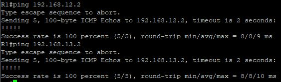
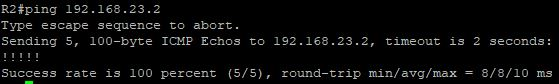

### Часть 2. Настройка и проверка маршрутизации OSPF

Настроить протокол OSPF на маршрутизаторах.

<details>
 <summary>R1</summary>

``` bash
R1#conf t
Enter configuration commands, one per line.  End with CNTL/Z.
R1(config)#router ospf 1
R1(config-router)#network 192.168.1.0 0.0.0.255 area 0
R1(config-router)#network 192.168.12.0 0.0.0.3 area 0
R1(config-router)#network 192.168.13.0 0.0.0.3 area 0
R1(config-router)#exit
R1(config)#exit
R1#wr
```
</details>
<details>
 <summary>R2</summary>

``` bash
R2#conf t
Enter configuration commands, one per line.  End with CNTL/Z.
R2(config)#router ospf 1
R2(config-router)#network 192.168.2.0 0.0.0.255 area 0
R2(config-router)#network 192.168.12.0 0.0.0.3 area 0
R2(config-router)#network 192.168.23.0 0.0.0.3 area 0
R2(config-router)#exit
R2(config)#exit
R2#wr
```
</details>

<details>
 <summary>R3</summary>

``` bash
R3#conf t
Enter configuration commands, one per line.  End with CNTL/Z.
R3(config)#router ospf 1
R3(config-router)#network 192.168.3.0 0.0.0.255 area 0
R3(config-router)#network 192.168.13.0 0.0.0.3 area 0
R3(config-router)#network 192.168.23.0 0.0.0.3 area 0
R3(config-router)#exit
R3(config)#exit
R3#wr
```
</details>

Проверить информацию о соседних устройствах и маршрутизации OSPF

<details>
 <summary>show ip ospf nei </summary>

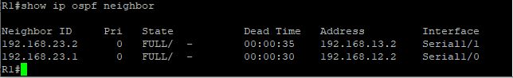
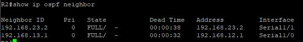
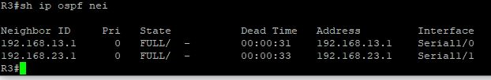

</details>

<details>
 <summary>show ip route </summary>
 
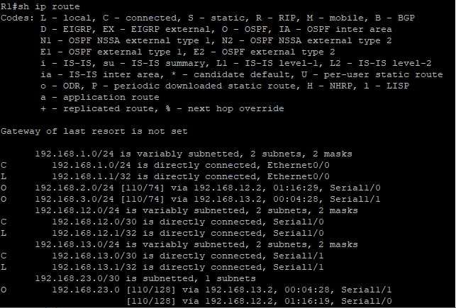
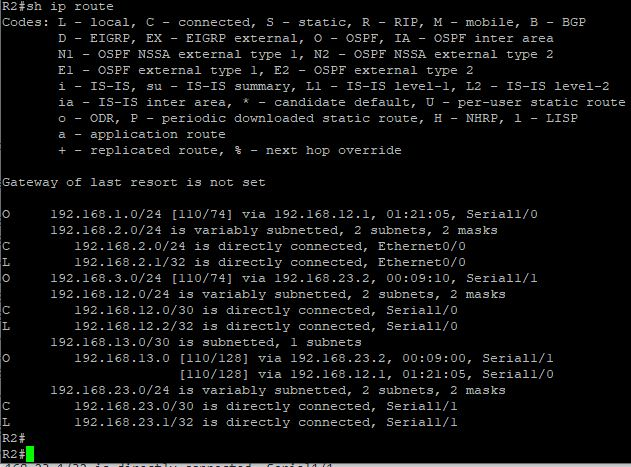
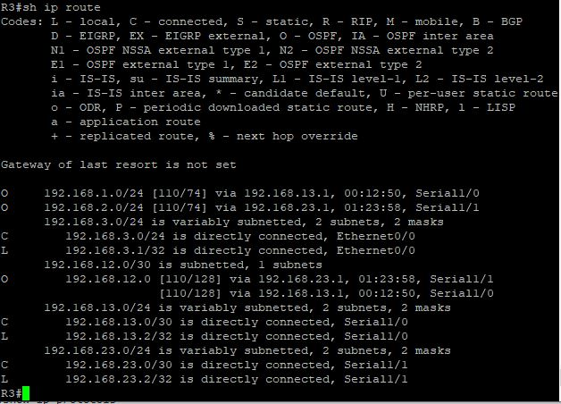

</details>

<details>
 <summary>show ip protocols </summary>
 
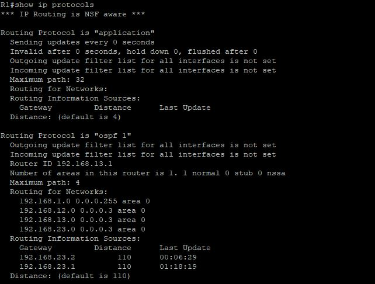
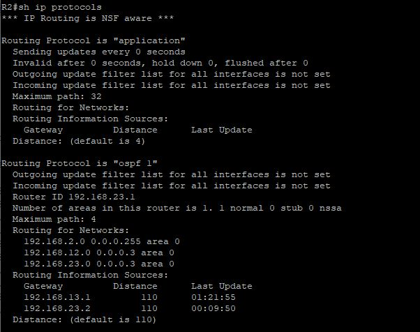
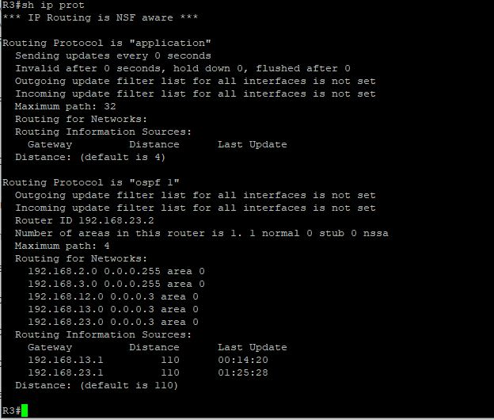

</details>

Какую команду вы бы применили, чтобы просмотреть в таблице маршрутизации только маршруты OSPF?

*show ip route ospf*

Проверить данные процесса OSPF

<details>
 <summary>R1</summary>

``` bash
R1#show ip ospf
 Routing Process "ospf 1" with ID 192.168.13.1
 
    Area BACKBONE(0)
        Number of interfaces in this area is 3
        
        SPF algorithm last executed 01:12:23.892 ago
        
```
</details>

<details>
 <summary>R2</summary>

``` bash
R2#show ip ospf
 Routing Process "ospf 1" with ID 192.168.23.1
     Area BACKBONE(0)
        Number of interfaces in this area is 3
        SPF algorithm last executed 01:16:48.954 ago
```
</details>
<details>
 <summary>R3</summary>

``` bash
R3#show ip ospf
 Routing Process "ospf 1" with ID 192.168.23.2
 
    Area BACKBONE(0)
        Number of interfaces in this area is 3
        SPF algorithm last executed 01:21:25.001 ago
```
</details>

Проверить параметры интерфейса OSPF

<details>
 <summary>show ip ip ospf int bri </summary>
 
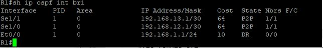
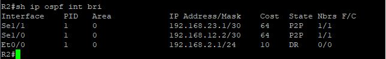
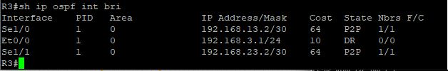

</details>

Наличие сквозного соединения

<details>
 <summary>PC ping </summary>
 
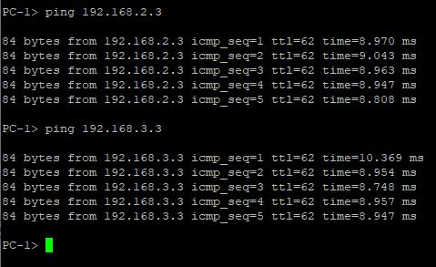
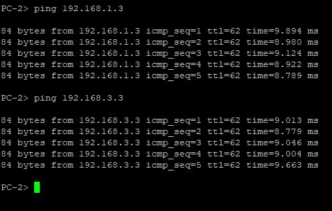
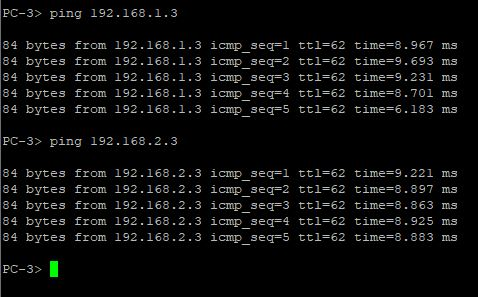

</details>

### Часть 3. Изменение назначенных идентификаторов маршрутизаторов

##### Шаг 1. Изменить идентификаторы loopback-интерфейсов

Настроим значения loopback-интерфейсов маршрутизаторов

<details>
 <summary>R1</summary>

``` bash
R1#conf t
R1(config)#interface lo0
R1(config-if)#ip address 1.1.1.1 255.255.255.255
R1(config-if)#end
```
</details>

<details>
 <summary>R2</summary>

``` bash
R2#conf t
R2(config)#interface lo0
R2(config-if)#ip address 2.2.2.2 255.255.255.255
R2(config-if)#end
```
</details>

<details>
 <summary>R3</summary>

``` bash
R3#conf t
R3(config)#interface lo0
R3(config-if)#ip address 3.3.3.3 255.255.255.255
R3(config-if)#end
```
</details>

<details>
 <summary>R1# (after change lo0) show ip ospf neighbor</summary>

``` bash
R1#sh ip ospf nei

Neighbor ID     Pri   State           Dead Time   Address         Interface
3.3.3.3           0   FULL/  -        00:00:34    192.168.13.2    Serial1/1
2.2.2.2           0   FULL/  -        00:00:35    192.168.12.2    Serial1/0
```
</details>

<details>
 <summary>R2# (after change lo0) show ip ospf neighbor</summary>

``` bash
R2#sh ip ospf nei

Neighbor ID     Pri   State           Dead Time   Address         Interface
1.1.1.1           0   FULL/  -        00:00:30    192.168.23.2    Serial1/1
3.3.3.3           0   FULL/  -        00:00:39    192.168.12.1    Serial1/0
```
</details>

<details>
 <summary>R3# (after change lo0) show ip ospf neighbor</summary>

``` bash
R3#sh ip ospf nei

Neighbor ID     Pri   State           Dead Time   Address         Interface
1.1.1.1           0   FULL/  -        00:00:38    192.168.13.1    Serial1/0
2.2.2.2           0   FULL/  -        00:00:32    192.168.23.1    Serial1/1
```
</details>


