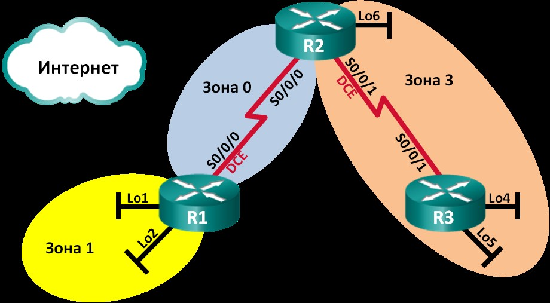

# Лабораторная работа. Настройка OSPFv2 для нескольких областей

Таблица адресации

| Устройство | Интерфейс | IP-адрес | Маска подсети |
| ---------- | --------- | -------- | ------------- |
| R1       | lo/0 | 209.165.200.225 | 255.255.255.252 |
|  | lo1 | 192.168.1.1 | 255.255.255.0 |
|	   	     | lo2 | 192.168.2.1 | 255.255.255.0 |
|	| s1/0 (DCE) | 192.168.12.1 | 255.255.255.252 |
| R2         | lo6 | 192.168.6.1 | 255.255.255.0 |
|  | s1/0 | 192.168.12.2 | 255.255.255.252 |
|  | s1/1 (DCE) | 192.168.23.1 | 255.255.255.252 |
| R3       | lo4 | 192.168.4.1     | 255.255.255.0   |
|  | lo5 | 192.168.5.1     | 255.255.255.0   |
|  | s1/1 | 192.168.23.2    | 255.255.255.252 |

