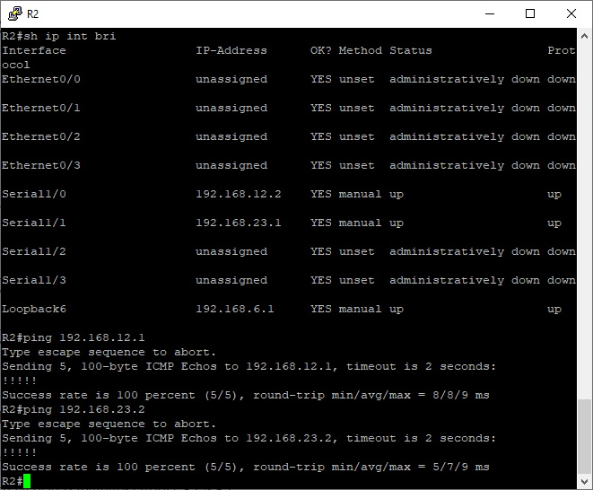
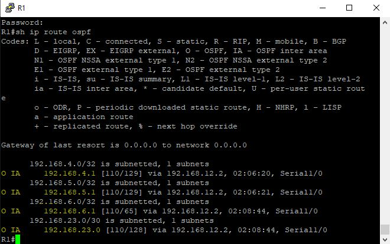
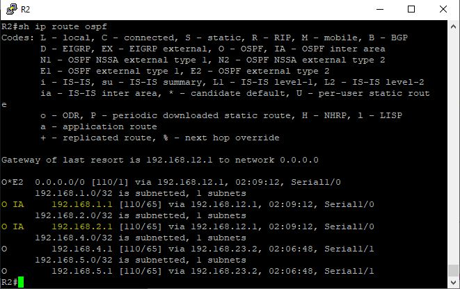
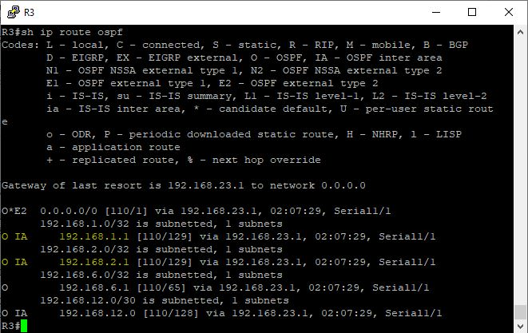
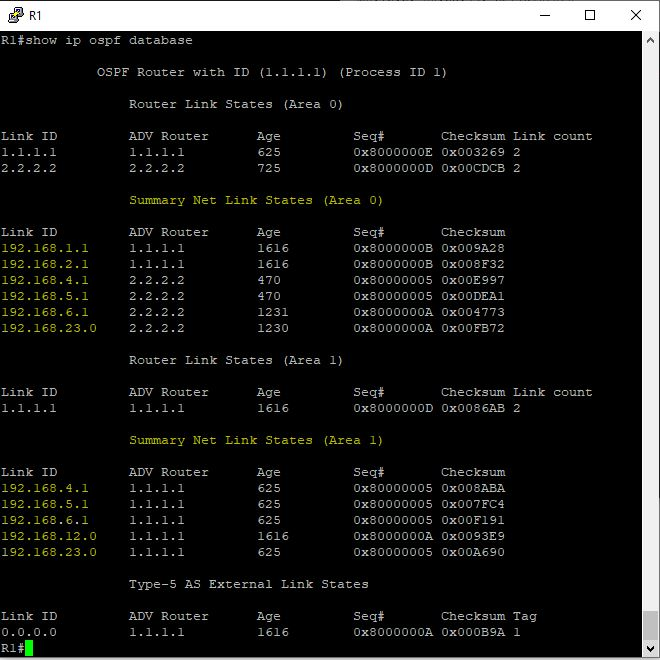
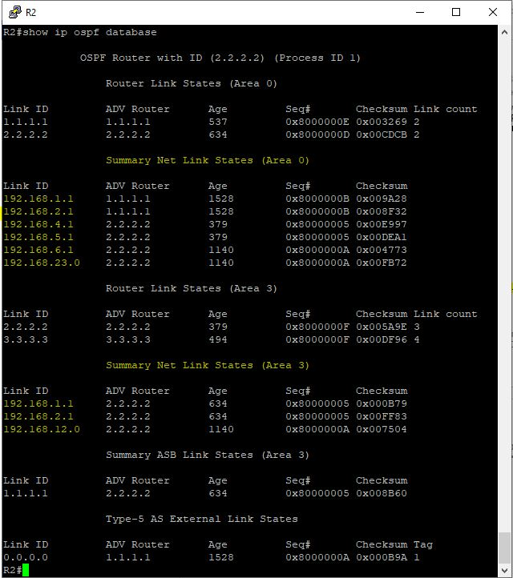
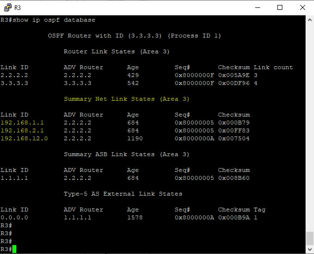

---

---

# Лабораторная работа. Настройка OSPFv2 для нескольких областей


Таблица адресации

| Устройство | Интерфейс | IP-адрес | Маска подсети |
| ---------- | --------- | -------- | ------------- |
| R1       | lo/0 | 209.165.200.225 | 255.255.255.252 |
|  | lo1 | 192.168.1.1 | 255.255.255.0 |
|	   	     | lo2 | 192.168.2.1 | 255.255.255.0 |
|	| s1/0 (DCE) | 192.168.12.1 | 255.255.255.252 |
| R2         | lo6 | 192.168.6.1 | 255.255.255.0 |
|  | s1/0 | 192.168.12.2 | 255.255.255.252 |
|  | s1/1 (DCE) | 192.168.23.1 | 255.255.255.252 |
| R3       | lo4 | 192.168.4.1     | 255.255.255.0   |
|  | lo5 | 192.168.5.1     | 255.255.255.0   |
|  | s1/1 | 192.168.23.2    | 255.255.255.252 |

### Часть 1:   Создание сети и настройка основных параметров устройства

Произвести базовую настройку маршрутизаторов


<details>
 <summary>R1</summary>

``` bash

Router>en
Router#conf t
Router(config)#hostname R1
R1(config)#no logging console
R1(config)#no ip domain-lookup
R1(config)#service password-encryption 
R1(config)#enable secret class
R1(config)#line console 0
R1(config-line)#password cisco
R1(config-line)#logging synchronous
R1(config-line)#login
R1(config-line)#exit
R1(config)#line vty 0 4
R1(config-line)#password cisco
R1(config-line)#logging synchronous
R1(config-line)#login
R1(config-line)#exit
R1(config)#int lo0
R1(config-if)#ip address 209.165.200.225 255.255.255.252
R1(config-if)#description internet
R1(config-if)#no shutdown
R1(config-if)#exit
R1(config)#int lo1
R1(config-if)#ip address 192.168.1.1 255.255.255.0
R1(config-if)#no shutdown
R1(config-if)#exit
R1(config)#int lo2
R1(config-if)#ip address 192.168.2.1 255.255.255.0
R1(config-if)#no shutdown
R1(config-if)#exit
R1(config)#int s1/0
R1(config-if)#ip address 192.168.12.1 255.255.255.252
R1(config-if)#clock rate 128000
R1(config-if)#no shutdown
R1(config-if)#end
R1#wr
Building configuration...
[OK]
R1#

```
</details>

<details>
 <summary>R2</summary>

``` bash

Router>en
Router#conf t
Router(config)#hostname R2
R2(config)#no logging console
R2(config)#no ip domain-lookup
R2(config)#service password-encryption 
R2(config)#enable secret class
R2(config)#line console 0
R2(config-line)#password cisco
R2(config-line)#logging synchronous
R2(config-line)#login
R2(config-line)#exit
R2(config)#line vty 0 4
R2(config-line)#password cisco
R2(config-line)#logging synchronous
R2(config-line)#login
R2(config-line)#exit
R2(config)#int lo6
R2(config-if)#ip address 192.168.6.1 255.255.255.0
R2(config-if)#no shutdown
R2(config-if)#exit
R2(config)#int s1/0
R2(config-if)#ip address 192.168.12.2 255.255.255.252
R2(config-if)#no shutdown
R2(config-if)#exit
R2(config)#int s1/1
R2(config-if)#ip address 192.168.23.1 255.255.255.252
R2(config-if)#clock rate 128000
R2(config-if)#no shutdown
R2(config-if)#end
R2#wr
Building configuration...
[OK]
R2#

```
</details>

<details>
 <summary>R3</summary>

``` bash

Router>en
Router#conf t
Router(config)#hostname R3
R3(config)#no logging console
R3(config)#no ip domain-lookup
R3(config)#service password-encryption 
R3(config)#enable secret class
R3(config)#line console 0
R3(config-line)#password cisco
R3(config-line)#logging synchronous
R3(config-line)#login
R3(config-line)#exit
R3(config)#line vty 0 4
R3(config-line)#password cisco
R3(config-line)#logging synchronous
R3(config-line)#login
R3(config-line)#exit
R3(config)#int lo4
R3(config-if)#ip address 192.168.4.1 255.255.255.0
R3(config-if)#no shutdown
R3(config-if)#exit
R3(config)#int lo5
R3(config-if)#ip address 192.168.5.1 255.255.255.0
R3(config-if)#no shutdown
R3(config-if)#exit
R3(config)#int s1/1
R3(config-if)#ip address 192.168.23.2 255.255.255.252
R3(config-if)#no shutdown
R3(config-if)#end
R3#wr
Building configuration...
[OK]

```
</details>

Проверить  наличие подключения на уровне 3


<details>
 <summary>R2</summary>



</details>

### Часть 2. Настройка сети OSPFv2 для нескольких областей


#### Шаг 1:	Определить типы маршрутизаторов OSPF в топологии

> Магистральные маршрутизаторы: R1 и R2;
>
> Граничные маршрутизаторы автономной области (ASBR): R1
>
> Граничные маршрутизаторы области (ABR): R2;
>
> Внутренние маршрутизаторы: R3.


#### Шаг 2-4:	Настройка протокол OSPF на маршрутизаторах  R1, R2, R3


<details>
<summary>R1</summary>

``` bash
R1#conf t
Enter configuration commands, one per line.  End with CNTL/Z.
R1(config)#router ospf 1
R1(config-router)#router-id 1.1.1.1
R1(config-router)#network 192.168.1.0 0.0.0.255 area 1
R1(config-router)#network 192.168.2.0 0.0.0.255 area 1
R1(config-router)#network 192.168.12.0 0.0.0.3 area 0
R1(config-router)#passive-interface default
R1(config-router)#no passive-interface s1/0
R1(config-router)#default-information originate
R1(config-router)#exit
R1(config)#ip route 0.0.0.0 0.0.0.0 lo1
%Default route without gateway, if not a point-to-point interface, may impact performance
R1(config)#exit
R1#wr
Building configuration...
[OK]
```

</details>

<details>
<summary>R2</summary>

``` bash
R2#conf t
Enter configuration commands, one per line.  End with CNTL/Z.
R2(config)#router ospf 1
R2(config-router)#router-id 2.2.2.2
R2(config-router)#passive-interface default
R2(config-router)#network 192.168.6.0 0.0.0.255 area 3
R2(config-router)#network 192.168.12.0 0.0.0.3 area 0
R2(config-router)#network 192.168.23.0 0.0.0.3 area 3
R2(config-router)#no passive-interface s1/0
R2(config-router)#no passive-interface s1/1
R2(config-router)#end
R2#wr
Building configuration...
[OK]
```

</details>

<details>
<summary>R3</summary>

``` bash
R3#conf t
Enter configuration commands, one per line.  End with CNTL/Z.
R3(config)#router ospf 1
R3(config-router)#router-id 3.3.3.3
R3(config-router)#passive-interface default
R3(config-router)#network 192.168.4.0 0.0.0.255 area 3
R3(config-router)#network 192.168.5.0 0.0.0.255 area 3
R3(config-router)#network 192.168.23.0 0.0.0.3 area 3
R3(config-router)#no passive-interface s1/1
R3(config-router)#end
R3#wr
Building configuration...
[OK]
```

</details>

#### Шаг 5:	Убедиться в правильности настройки протокола OSPF и в установлении отношений смежности между маршрутизаторами

<details>
<summary>R1</summary>

``` bash
R1#show ip protocols
*** IP Routing is NSF aware ***

Routing Protocol is "application"
  Sending updates every 0 seconds
  Invalid after 0 seconds, hold down 0, flushed after 0
  Outgoing update filter list for all interfaces is not set
  Incoming update filter list for all interfaces is not set
  Maximum path: 32
  Routing for Networks:
  Routing Information Sources:
    Gateway         Distance      Last Update
  Distance: (default is 4)

Routing Protocol is "ospf 1"
  Outgoing update filter list for all interfaces is not set
  Incoming update filter list for all interfaces is not set
  Router ID 1.1.1.1
  It is an area border and autonomous system boundary router
 Redistributing External Routes from,
  Number of areas in this router is 2. 2 normal 0 stub 0 nssa
  Maximum path: 4
  Routing for Networks:
    192.168.1.0 0.0.0.255 area 1
    192.168.2.0 0.0.0.255 area 1
    192.168.12.0 0.0.0.3 area 0
  Passive Interface(s):
    Ethernet0/0
    Ethernet0/1
    Ethernet0/2
    Ethernet0/3
    Serial1/1
    Serial1/2
    Serial1/3
    Loopback0
    Loopback1
    Loopback2
    RG-AR-IF-INPUT1
    VoIP-Null0
  Routing Information Sources:
    Gateway         Distance      Last Update
    2.2.2.2              110      00:03:22
  Distance: (default is 110)

```

</details>

<details>
<summary>R2</summary>

``` bash
R2#sh ip prot
*** IP Routing is NSF aware ***

Routing Protocol is "application"
  Sending updates every 0 seconds
  Invalid after 0 seconds, hold down 0, flushed after 0
  Outgoing update filter list for all interfaces is not set
  Incoming update filter list for all interfaces is not set
  Maximum path: 32
  Routing for Networks:
  Routing Information Sources:
    Gateway         Distance      Last Update
  Distance: (default is 4)

Routing Protocol is "ospf 1"
  Outgoing update filter list for all interfaces is not set
  Incoming update filter list for all interfaces is not set
  Router ID 2.2.2.2
  It is an area border router
  Number of areas in this router is 2. 2 normal 0 stub 0 nssa
  Maximum path: 4
  Routing for Networks:
    192.168.6.0 0.0.0.255 area 3
    192.168.12.0 0.0.0.3 area 0
    192.168.23.0 0.0.0.3 area 3
  Passive Interface(s):
    Ethernet0/0
    Ethernet0/1
    Ethernet0/2
    Ethernet0/3
    Serial1/2
    Serial1/3
    Loopback6
    RG-AR-IF-INPUT1
    VoIP-Null0
  Routing Information Sources:
    Gateway         Distance      Last Update
    3.3.3.3              110      00:06:56
    1.1.1.1              110      00:11:10
  Distance: (default is 110)

```

</details>

<details>
<summary>R3</summary>

``` bash
R3#sh ip prot
*** IP Routing is NSF aware ***

Routing Protocol is "application"
  Sending updates every 0 seconds
  Invalid after 0 seconds, hold down 0, flushed after 0
  Outgoing update filter list for all interfaces is not set
  Incoming update filter list for all interfaces is not set
  Maximum path: 32
  Routing for Networks:
  Routing Information Sources:
    Gateway         Distance      Last Update
  Distance: (default is 4)

Routing Protocol is "ospf 1"
  Outgoing update filter list for all interfaces is not set
  Incoming update filter list for all interfaces is not set
  Router ID 3.3.3.3
  Number of areas in this router is 1. 1 normal 0 stub 0 nssa
  Maximum path: 4
  Routing for Networks:
    192.168.4.0 0.0.0.255 area 3
    192.168.5.0 0.0.0.255 area 3
    192.168.23.0 0.0.0.3 area 3
  Passive Interface(s):
    Ethernet0/0
    Ethernet0/1
    Ethernet0/2
    Ethernet0/3
    Serial1/0
    Serial1/2
    Serial1/3
    Loopback4
    Loopback5
    RG-AR-IF-INPUT1
    VoIP-Null0
  Routing Information Sources:
    Gateway         Distance      Last Update
    1.1.1.1              110      00:07:16
    2.2.2.2              110      00:07:16
  Distance: (default is 110)

```

</details>
К какому типу маршрутизаторов OSPF относится каждый маршрутизатор?

R1: Backbone+ASBR
R2: Backbone+ABR
R3: Internal

 Убедимся в установлении отношений смежности OSPF между маршрутизаторами

 <details>
<summary>show ip ospf neighbor</summary>

.JPG)

</details>

 <details>
<summary>show ip ospf interface brief</summary>

.JPG)

</details>


#### Шаг 6. Настроить аутентификацию MD5 для всех последовательных интерфейсов

<details>
 <summary> R1</summary>

``` bash
R1#conf t
R1(config)#int s1/0
R1(config-if)#ip ospf authentication message-digest
R1(config-if)#ip ospf message-digest-key 1 md5 Cisco123
R1(config-if)#end

```
</details>

<details>
 <summary> R2</summary>

``` bash
R2#conf t
R2(config)#int s1/0
R2(config-if)#ip ospf authentication message-digest
R2(config-if)#ip ospf message-digest-key 1 md5 Cisco123
R2(config-if)#int s1/1
R2(config-if)#ip ospf authentication message-digest
R2(config-if)#ip ospf message-digest-key 1 md5 Cisco123
R2(config-if)#end


```
</details>

<details>
 <summary> R3</summary>

``` bash
R3#conf t
R3(config)#int s1/1
R3(config-if)#ip ospf authentication message-digest
R3(config-if)#ip ospf message-digest-key 1 md5 Cisco123
R3(config-if)#end

```

</details>

Проверить восстановление отношений смежности OSPF.

<details>
 <summary>Проверка соседей (sh ip ospf nei)</summary>

.JPG)

  </details>

  ### Часть 3: Настройка межобластных суммарных маршрутов

  #### Шаг 1: Просмотреть таблицы маршрутизации OSPF для всех маршрутизаторов.

<details>
 <summary>R1</summary>



  </details>

  <details>
 <summary>R2</summary>



  </details>

  <details>
 <summary>R3</summary>



  </details>

  #### Шаг 2: Просмотреть базы данных LSDB на всех маршрутизаторах

  <details>
 <summary>R1</summary>



  </details>

   <details>
 <summary>R2</summary>



  </details>

   <details>
 <summary>R3</summary>



  </details>

  #### Шаг 3: Настройте межобластные суммарные маршруты

  a. Рассчитать суммарный маршрут для сетей в области 1  

```
В зоне 1 две подсети 192.168.1.0/24 и 192.168.2.0/24,
объединим в одну c 22ой маской для получения суммарного маршрута
```

  b.  Hастроить суммарный маршрут для области 1 на маршрутизаторе R1

  <details>
 <summary>R1</summary>

 ``` bash
 R1(config)# router ospf 1
 R1(config-router)# area 1 range 192.168.0.0 255.255.252.0
 ```

 </details>

  c. Рассчитать суммарный маршрут для сетей в области 3

  ```
В зоне 3 четыре подсети 
192.168.4.0/24
192.168.5.0/24
192.168.6.0/24
192.168.23.0/30

Первые три объединяем в одну: 192.168.4.0/22. R2 будет анонсировать две подсети третьей зоны:
192.168.4.0/22
192.168.23.0/30
  ```

d.  Hастроить суммарный маршрут для области 3 на маршрутизаторе R2


  <details>
 <summary>R2</summary>

 ``` bash
 R2(config)# router ospf 1
 R2(config-router)# area 3 range 192.168.4.0 255.255.252.0
 ```

 </details>

#### Шаги 4-5: LSDB и Таблица OSPF на всех роутерах
 <details>
 <summary>LSDB и Таблица OSPF R1</summary>


.JPG)

 .JPG)


</details>

  <details>
 <summary>LSDB и Таблица OSPF R2</summary>

.JPG)

 .JPG)

</details>

  <details>
 <summary>LSDB и Таблица OSPF R3</summary>

.JPG)

 .JPG)

</details>

Пакет LSA какого типа передается в магистраль маршрутизатором ABR, когда включено объединение межобластных маршрутов?
* LSA 3


#### Шаг 6: Проверить наличие сквозного соединения

.jpg)


##### Какие три преимущества при проектировании сети предоставляет OSPF для нескольких областей?

###### Преимущества многозонального протокола OSPF 

• Таблицы маршрутизации меньшего размера — меньшее число записей в таблицах маршрутизации, поскольку сетевые адреса могут объединяться между областями. 

• Сокращение накладных расходов на обновление состояний каналов. 

• Уменьшение частоты расчётов SPF