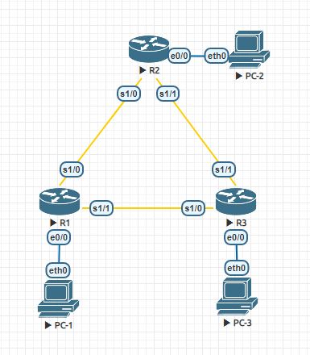
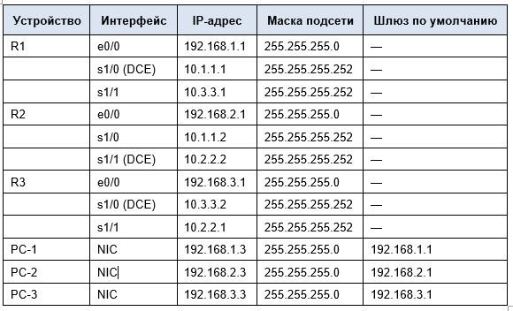
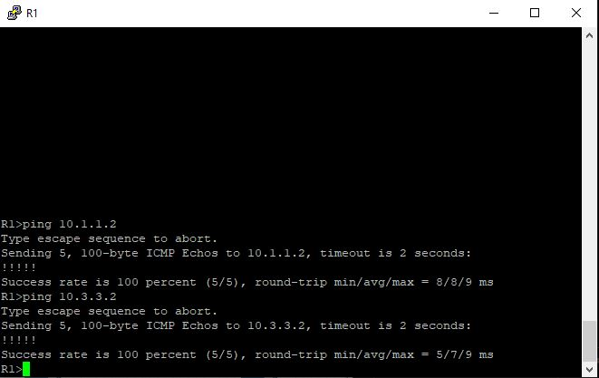
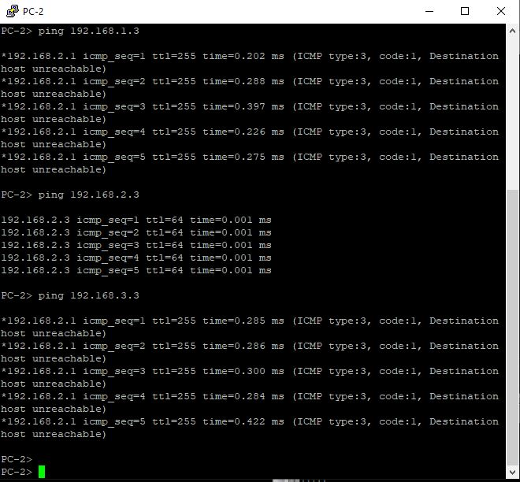
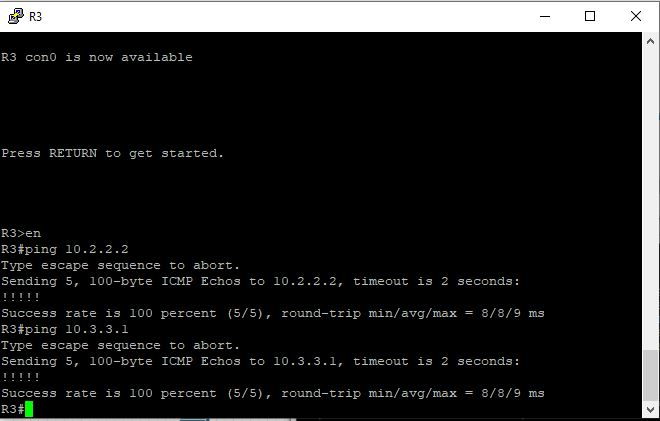
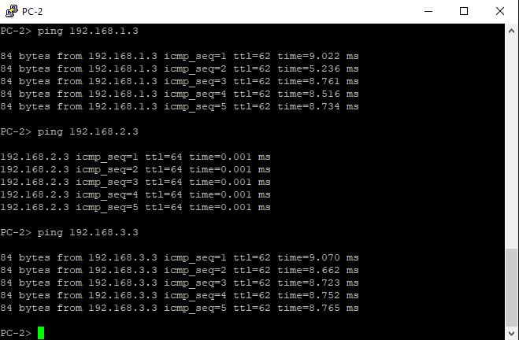

# Лабораторная работа. Базовая настройка протокола EIGRP для IPv4





<details>
  <summary>R1</summary>

```bash
Router#conf t
Router(config)#host R1
R1(config)#no logging console
R1(config)#no ip domain-lookup
R1(config)#service password-encryption
R1(config)#enable secret class
R1(config)#line console 0
R1(config-line)#password cisco
R1(config-line)#logging synchronous
R1(config-line)#login
R1(config-line)#exit
R1(config)#line vty 0 4
R1(config-line)#password cisco
R1(config-line)#logging synchronous
R1(config-line)#login
R1(config-line)#exit
R1(config)#int e0/0
R1(config-if)#ip address 192.168.1.1 255.255.255.0
R1(config-if)#no shut
R1(config-if)#exit
R1(config)#int s1/0
R1(config-if)#ip address 10.1.1.1 255.255.255.252
R1(config-if)#clock rate 128000
R1(config-if)#no shut
R1(config-if)#exit
R1(config)#int s1/1
R1(config-if)#ip address 10.3.3.1 255.255.255.252
R1(config-if)#no shut
R1(config-if)#end
R1#wr

```
</details>

<details>
  <summary>R2</summary>

```bash
Router#conf t
Router(config)#host R2
R2(config)#no logging console
R2(config)#no ip domain-lookup
R2(config)#service password-encryption
R2(config)#enable secret class
R2(config)#line console 0
R2(config-line)#password cisco
R2(config-line)#logging synchronous
R2(config-line)#login
R2(config-line)#exit
R2(config)#line vty 0 4
R2(config-line)#password cisco
R2(config-line)#logging synchronous
R2(config-line)#login
R2(config-line)#exit
R2(config)#exit
R2#wr
Building configuration...
[OK]
R2#
R2#conf t
R2(config)#int e0/0
R2(config-if)#ip address 192.168.2.1 255.255.255.0
R2(config-if)#no shut
R2(config-if)#exit
R2(config)#int s1/0
R2(config-if)#ip address 10.1.1.2 255.255.255.252
R2(config-if)#no shut
R2(config-if)#exit
R2(config)#int s1/1
R2(config-if)#ip address 10.2.2.2 255.255.255.252
R2(config-if)#clock rate 128000
R2(config-if)#no shut
R2(config-if)#end
R2#wr

```
</details>

<details>
  <summary>R3</summary>

```bash
Router#conf t
Router(config)#host R3
R3(config)#no logging console
R3(config)#no ip domain-lookup
R3(config)#service password-encryption
R3(config)#enable secret class
R3(config)#line console 0
R3(config-line)#password cisco
R3(config-line)#logging synchronous
R3(config-line)#login
R3(config-line)#exit
R3(config)#line vty 0 4
R3(config-line)#password cisco
R3(config-line)#logging synchronous
R3(config-line)#login
R3(config-line)#exit
R3(config)#int e0/0
R3(config-if)#ip address 192.168.3.1 255.255.255.0
R3(config-if)#no shut
R3(config-if)#exit
R3(config)#int s1/0
R3(config-if)#ip address 10.3.3.2 255.255.255.252
R3(config-if)#clock rate 128000
R3(config-if)#no shutdown
R3(config-if)#exit
R3(config)#int s1/1
R3(config-if)#ip address 10.2.2.1 255.255.255.252
R3(config-if)#no shutdown
R3(config-if)#end
R3#wr
Building configuration...
[OK]

```
</details>

<details>
 <summary>Настройка ПК</summary>

Настройка PC-1
``` bash
VPCS> set pcname PC-1
PC-1> ip 192.168.1.3/24 192.168.1.1
Checking for duplicate address...
PC1 : 192.168.1.3 255.255.255.0 gateway 192.168.1.1
```
Настройка PC-2
``` bash
VPCS> set pcname PC-2
PC-2> ip 192.168.2.3/24 192.168.2.1
Checking for duplicate address...
PC1 : 192.168.2.3 255.255.255.0 gateway 192.168.2.1
```
Настройка PC-3
``` bash
VPCS> set pcname PC-3
PC-3> ip 192.168.3.3/24 192.168.3.1
Checking for duplicate address...
PC1 : 192.168.3.3 255.255.255.0 gateway 192.168.3.1

```
</details>


<details>
 <summary>Ping</summary>








* Пинги между ПК не проходят в виду того, что не настроена маршрутизация между роутерами, а роутеры друг друга видят, так как соединены между собой напрямую

</details>


###  Часть 2. Настройкак маршрутизации EIGRP

<details>
 <summary>R1</summary>

``` bash
R1#conf t
R1(config)#router eigrp 10
R1(config-router)#network 192.168.1.0 0.0.0.255
R1(config-router)#network 10.1.1.0 0.0.0.3
R1(config-router)#network 10.3.3.0 0.0.0.3
R1(config-router)#end
R1#wr
```
</details>

<details>
 <summary>R2</summary>

``` bash
R2#conf t
R2(config)#router eigrp 10
R2(config-router)#network 192.168.2.0 0.0.0.255
R2(config-router)#network 10.1.1.0 0.0.0.3
R2(config-router)#network 10.2.2.0 0.0.0.3
R2(config-router)#end
R2#wr
```
</details>

<details>
 <summary>R3</summary>

``` bash
R3#conf t
R3(config)#router eigrp 10
R3(config-router)#network 192.168.3.0 0.0.0.255
R3(config-router)#network 10.3.3.0 0.0.0.3
R3(config-router)#network 10.2.2.0 0.0.0.3
R3(config-router)#end
R3#wr
```
</details>


Вопрос: почему рекомендуется использовать шаблонные маски при объявлении сетей? Можно ли исключить маску в какой-нибудь из вышеприведённых инструкций network? Если да, то в какой (в каких)? 


Шаблонную маску при объявлении сетей рекомендуется использовать для выбора определенных адресов из заданного сетевой маской диапазона. 
* network 192.168.1.0 0.0.0.255
а если использовать 
* network 192.168.1.0 
то обьявиться вся подсеть с 24 маской.

Так же целесообразно использовать шаблонную маску при создании правил ACL, скажем если понадобиться исключить каждый нечетный хост. Если не использовать шаблонную маску, то в акссес листе придется добавить правила для каждого нечетного хоста...

<details>
 <summary>PC-2# ping</summary>




</details>


### Часть 3. Проверка маршрутизации EIGRP

Проверки отношений смежности, установленных с соседними маршрутизаторами.

<details>
 <summary>R1</summary>

``` bash
R1#sh ip eigrp nei
EIGRP-IPv4 Neighbors for AS(10)
H   Address                 Interface              Hold Uptime   SRTT   RTO  Q  Seq
                                                   (sec)         (ms)       Cnt Num
1   10.3.3.2                Se1/1                    12 02:30:22   14   100  0  7
0   10.1.1.2                Se1/0                    11 02:31:26   14   100  0  9
```
``` bash
R1#sh ip route eigrp
Codes: L - local, C - connected, S - static, R - RIP, M - mobile, B - BGP
       D - EIGRP, EX - EIGRP external, O - OSPF, IA - OSPF inter area
       N1 - OSPF NSSA external type 1, N2 - OSPF NSSA external type 2
       E1 - OSPF external type 1, E2 - OSPF external type 2
       i - IS-IS, su - IS-IS summary, L1 - IS-IS level-1, L2 - IS-IS level-2
       ia - IS-IS inter area, * - candidate default, U - per-user static route
       o - ODR, P - periodic downloaded static route, H - NHRP, l - LISP
       a - application route
       + - replicated route, % - next hop override

Gateway of last resort is not set

      10.0.0.0/8 is variably subnetted, 5 subnets, 2 masks
D        10.2.2.0/30 [90/2681856] via 10.3.3.2, 02:30:45, Serial1/1
                     [90/2681856] via 10.1.1.2, 02:30:45, Serial1/0
D     192.168.2.0/24 [90/2195456] via 10.1.1.2, 02:30:45, Serial1/0
D     192.168.3.0/24 [90/2195456] via 10.3.3.2, 02:30:45, Serial1/1

```
</details>

<details>
 <summary>R2</summary>

``` bash
R2#sh ip eigrp nei
EIGRP-IPv4 Neighbors for AS(10)
H   Address                 Interface              Hold Uptime   SRTT   RTO  Q  Seq
                                                   (sec)         (ms)       Cnt Num
1   10.2.2.1                Se1/1                    10 02:31:57   15   100  0  8
0   10.1.1.1                Se1/0                    12 02:33:05   17   102  0  9

```

``` bash
R2#sh ip route eigrp
Codes: L - local, C - connected, S - static, R - RIP, M - mobile, B - BGP
       D - EIGRP, EX - EIGRP external, O - OSPF, IA - OSPF inter area
       N1 - OSPF NSSA external type 1, N2 - OSPF NSSA external type 2
       E1 - OSPF external type 1, E2 - OSPF external type 2
       i - IS-IS, su - IS-IS summary, L1 - IS-IS level-1, L2 - IS-IS level-2
       ia - IS-IS inter area, * - candidate default, U - per-user static route
       o - ODR, P - periodic downloaded static route, H - NHRP, l - LISP
       a - application route
       + - replicated route, % - next hop override

Gateway of last resort is not set

      10.0.0.0/8 is variably subnetted, 5 subnets, 2 masks
D        10.3.3.0/30 [90/2681856] via 10.2.2.1, 02:32:13, Serial1/1
                     [90/2681856] via 10.1.1.1, 02:32:13, Serial1/0
D     192.168.1.0/24 [90/2195456] via 10.1.1.1, 02:32:13, Serial1/0
D     192.168.3.0/24 [90/2195456] via 10.2.2.1, 02:32:13, Serial1/1


```
</details>

<details>
 <summary>R3</summary>

``` bash
R3#sh ip eigrp nei
EIGRP-IPv4 Neighbors for AS(10)
H   Address                 Interface              Hold Uptime   SRTT   RTO  Q  Seq
                                                   (sec)         (ms)       Cnt Num
1   10.2.2.2                Se1/1                    11 02:34:23   19   114  0  8
0   10.3.3.1                Se1/0                    14 02:34:27   16   100  0  10

```

``` bash
R3#sh ip route eigrp
Codes: L - local, C - connected, S - static, R - RIP, M - mobile, B - BGP
       D - EIGRP, EX - EIGRP external, O - OSPF, IA - OSPF inter area
       N1 - OSPF NSSA external type 1, N2 - OSPF NSSA external type 2
       E1 - OSPF external type 1, E2 - OSPF external type 2
       i - IS-IS, su - IS-IS summary, L1 - IS-IS level-1, L2 - IS-IS level-2
       ia - IS-IS inter area, * - candidate default, U - per-user static route
       o - ODR, P - periodic downloaded static route, H - NHRP, l - LISP
       a - application route
       + - replicated route, % - next hop override

Gateway of last resort is not set

      10.0.0.0/8 is variably subnetted, 5 subnets, 2 masks
D        10.1.1.0/30 [90/2681856] via 10.3.3.1, 02:34:47, Serial1/0
                     [90/2681856] via 10.2.2.2, 02:34:47, Serial1/1
D     192.168.1.0/24 [90/2195456] via 10.3.3.1, 02:34:47, Serial1/0
D     192.168.2.0/24 [90/2195456] via 10.2.2.2, 02:34:47, Serial1/1

```
</details>

Почему у маршрутизатора R1 два пути к сети 10.2.2.0/30?
* Идентичные стоимости маршрутов

<details>
 <summary>Таблица соседних устройств EIGRP на R1</summary>

``` bash
R1#show ip eigrp topology
EIGRP-IPv4 Topology Table for AS(10)/ID(192.168.1.1)
Codes: P - Passive, A - Active, U - Update, Q - Query, R - Reply,
       r - reply Status, s - sia Status

P 192.168.3.0/24, 1 successors, FD is 2195456
        via 10.3.3.2 (2195456/281600), Serial1/1
P 192.168.2.0/24, 1 successors, FD is 2195456
        via 10.1.1.2 (2195456/281600), Serial1/0
P 10.2.2.0/30, 2 successors, FD is 2681856
        via 10.1.1.2 (2681856/2169856), Serial1/0
        via 10.3.3.2 (2681856/2169856), Serial1/1
P 10.3.3.0/30, 1 successors, FD is 2169856
        via Connected, Serial1/1
P 192.168.1.0/24, 1 successors, FD is 281600
        via Connected, Ethernet0/0
P 10.1.1.0/30, 1 successors, FD is 2169856
        via Connected, Serial1/0

```
</details>

Почему в таблице топологии маршрутизатора R1 отсутствуют возможные преемники?
* Так как не выполняется условие FC, которое требует, чтобы сообщенное расстояние (RD) у возможного приемника (FS) был меньше допустимого расстояния (FD) приемника (successor).

<details>
 <summary>Параметры маршрутизации EIGRP на R1</summary>

``` bash
R1#sh ip protocols
*** IP Routing is NSF aware ***

Routing Protocol is "application"
  Sending updates every 0 seconds
  Invalid after 0 seconds, hold down 0, flushed after 0
  Outgoing update filter list for all interfaces is not set
  Incoming update filter list for all interfaces is not set
  Maximum path: 32
  Routing for Networks:
  Routing Information Sources:
    Gateway         Distance      Last Update
  Distance: (default is 4)

Routing Protocol is "eigrp 10"
  Outgoing update filter list for all interfaces is not set
  Incoming update filter list for all interfaces is not set
  Default networks flagged in outgoing updates
  Default networks accepted from incoming updates
  EIGRP-IPv4 Protocol for AS(10)
    Metric weight K1=1, K2=0, K3=1, K4=0, K5=0
    NSF-aware route hold timer is 240
    Router-ID: 192.168.1.1
    Topology : 0 (base)
      Active Timer: 3 min
      Distance: internal 90 external 170
      Maximum path: 4
      Maximum hopcount 100
      Maximum metric variance 1

  Automatic Summarization: disabled
  Maximum path: 4
  Routing for Networks:
    10.1.1.0/30
    10.3.3.0/30
    192.168.1.0
  Routing Information Sources:
    Gateway         Distance      Last Update
    10.3.3.2              90      02:46:47
    10.1.1.2              90      02:46:47
  Distance: internal 90 external 170
```
</details>

Вопросы:

Какой номер автономной системы используется?
* 10

Какие сети объявляются?
* 10.1.1.0/30 
* 10.3.3.0/30 
* 192.168.1.0

Каково значение административной дистанции для маршрутов EIGRP?
* 90 для внутренних 
* 170 для внешних

Сколько маршрутов с равной стоимостью по умолчанию использует EIGRP?
* 2

### Часть 4. Настройка пропускной способности и пассивных интерфейсов

<details>
 <summary>R1</summary>

``` bash

R1(config)#exit
R1#sh int s1/0
Serial1/0 is up, line protocol is up
  Hardware is M4T
  Internet address is 10.1.1.1/30
  MTU 1500 bytes, BW 1544 Kbit/sec, DLY 20000 usec,
     reliability 255/255, txload 1/255, rxload 1/255
  Encapsulation HDLC, crc 16, loopback not set
  Keepalive set (10 sec)
  Restart-Delay is 0 secs
  Last input 00:00:00, output 00:00:00, output hang never
  Last clearing of "show interface" counters 05:44:50
  Input queue: 0/75/0/0 (size/max/drops/flushes); Total output drops: 0
  Queueing strategy: fifo
  Output queue: 0/40 (size/max)
  5 minute input rate 0 bits/sec, 0 packets/sec
  5 minute output rate 0 bits/sec, 0 packets/sec
     5522 packets input, 378580 bytes, 0 no buffer
     Received 2460 broadcasts (0 IP multicasts)
     0 runts, 0 giants, 0 throttles
     0 input errors, 0 CRC, 0 frame, 0 overrun, 0 ignored, 0 abort
     5541 packets output, 381677 bytes, 0 underruns
     0 output errors, 0 collisions, 3 interface resets
     0 unknown protocol drops
     0 output buffer failures, 0 output buffers swapped out
     2 carrier transitions     DCD=up  DSR=up  DTR=up  RTS=up  CTS=up
```
</details>

Какова пропускная способность по умолчанию для этого последовательного интерфейса?

* 1544 Kbit/sec

Изменим пропускную способность на всех последовательных интерфейсах маршрутизаторов

<details>
 <summary>R1</summary>

``` bash
R1#conf t
R1(config)#int s1/0
R1(config-if)#bandwidth 2000
R1(config-if)#int s1/1
R1(config-if)#band 64
R1(config-if)#end
R1#wr
```
</details>

<details>
 <summary>R2</summary>

``` bash
R2#conf t
R2(config)#int s1/0
R2(config-if)#band 2000
R2(config-if)#int s1/1
R2(config-if)#band 2000
R2(config-if)#end
R2#wr
```
</details>

<details>
 <summary>R3</summary>

``` bash
R3#conf t
R3(config)#int s1/0
R3(config-if)#band 64
R3(config-if)#int s1/1
R3(config-if)#band 2000
R3(config-if)#end
R3#wr
```
</details>

Проверим изменения bandwidth R1

<details>
 <summary>R1</summary>

``` bash
R1#sh int s1/0
Serial1/0 is up, line protocol is up
  Hardware is M4T
  Internet address is 10.1.1.1/30
  MTU 1500 bytes, BW 2000 Kbit/sec, DLY 20000 usec,
     reliability 255/255, txload 1/255, rxload 1/255
  Encapsulation HDLC, crc 16, loopback not set
  Keepalive set (10 sec)
  Restart-Delay is 0 secs
  Last input 00:00:01, output 00:00:03, output hang never
  Last clearing of "show interface" counters 05:54:53
  Input queue: 0/75/0/0 (size/max/drops/flushes); Total output drops: 0
  Queueing strategy: fifo
  Output queue: 0/40 (size/max)
  5 minute input rate 0 bits/sec, 0 packets/sec
  5 minute output rate 0 bits/sec, 0 packets/sec
     5733 packets input, 392852 bytes, 0 no buffer
     Received 2531 broadcasts (0 IP multicasts)
     0 runts, 0 giants, 0 throttles
     0 input errors, 0 CRC, 0 frame, 0 overrun, 0 ignored, 0 abort
     5751 packets output, 395840 bytes, 0 underruns
     0 output errors, 0 collisions, 3 interface resets
     0 unknown protocol drops
     0 output buffer failures, 0 output buffers swapped out
     2 carrier transitions     DCD=up  DSR=up  DTR=up  RTS=up  CTS=up
```
``` bash
R1#sh int s1/1
Serial1/1 is up, line protocol is up
  Hardware is M4T
  Internet address is 10.3.3.1/30
  MTU 1500 bytes, BW 64 Kbit/sec, DLY 20000 usec,
     reliability 255/255, txload 1/255, rxload 1/255
  Encapsulation HDLC, crc 16, loopback not set
  Keepalive set (10 sec)
  Restart-Delay is 0 secs
  Last input 00:00:02, output 00:00:02, output hang never
  Last clearing of "show interface" counters never
  Input queue: 0/75/0/0 (size/max/drops/flushes); Total output drops: 0
  Queueing strategy: fifo
  Output queue: 0/40 (size/max)
  5 minute input rate 0 bits/sec, 0 packets/sec
  5 minute output rate 0 bits/sec, 0 packets/sec
     5750 packets input, 394734 bytes, 0 no buffer
     Received 2552 broadcasts (0 IP multicasts)
     0 runts, 0 giants, 0 throttles
     0 input errors, 0 CRC, 0 frame, 0 overrun, 0 ignored, 0 abort
     5785 packets output, 401175 bytes, 0 underruns
     0 output errors, 0 collisions, 1 interface resets
     5 unknown protocol drops
     0 output buffer failures, 0 output buffers swapped out
     2 carrier transitions     DCD=up  DSR=up  DTR=up  RTS=up  CTS=up
```

</details>

Как будут выглядеть таблицы маршрутизации маршрутизаторов R2 и R3? Останутся ли их таблицы маршрутизации прежними или изменятся?
* Таблица маршрутизации R2 не изменится, т.к. на обоих интерфейсах назначили одинаковый bandwidth. => На R2 до сети 10.3.3.0/30  остается два равноценных маршрута.
* На R3 таблица маршрутизации  изменится. Подсети 10.1.1.0/30 и 192.168.1.0/24 будут доступны за 10.2.2.0/30 через  s1/1.
* 
Таблицы маршрутизации после изменения bandwidth

<details>
 <summary>R1</summary>

``` bash
R1#sh ip route eigrp
Codes: L - local, C - connected, S - static, R - RIP, M - mobile, B - BGP
       D - EIGRP, EX - EIGRP external, O - OSPF, IA - OSPF inter area
       N1 - OSPF NSSA external type 1, N2 - OSPF NSSA external type 2
       E1 - OSPF external type 1, E2 - OSPF external type 2
       i - IS-IS, su - IS-IS summary, L1 - IS-IS level-1, L2 - IS-IS level-2
       ia - IS-IS inter area, * - candidate default, U - per-user static route
       o - ODR, P - periodic downloaded static route, H - NHRP, l - LISP
       a - application route
       + - replicated route, % - next hop override

Gateway of last resort is not set

      10.0.0.0/8 is variably subnetted, 5 subnets, 2 masks
D        10.2.2.0/30 [90/2304000] via 10.1.1.2, 00:05:43, Serial1/0
D     192.168.2.0/24 [90/1817600] via 10.1.1.2, 00:06:49, Serial1/0
D     192.168.3.0/24 [90/2329600] via 10.1.1.2, 00:05:43, Serial1/0

```
</details>

<details>
 <summary>R2</summary>

``` bash
R2#sh ip route eigrp
Codes: L - local, C - connected, S - static, R - RIP, M - mobile, B - BGP
       D - EIGRP, EX - EIGRP external, O - OSPF, IA - OSPF inter area
       N1 - OSPF NSSA external type 1, N2 - OSPF NSSA external type 2
       E1 - OSPF external type 1, E2 - OSPF external type 2
       i - IS-IS, su - IS-IS summary, L1 - IS-IS level-1, L2 - IS-IS level-2
       ia - IS-IS inter area, * - candidate default, U - per-user static route
       o - ODR, P - periodic downloaded static route, H - NHRP, l - LISP
       a - application route
       + - replicated route, % - next hop override

Gateway of last resort is not set

      10.0.0.0/8 is variably subnetted, 5 subnets, 2 masks
D        10.3.3.0/30 [90/41024000] via 10.2.2.1, 00:05:33, Serial1/1
                     [90/41024000] via 10.1.1.1, 00:05:33, Serial1/0
D     192.168.1.0/24 [90/1817600] via 10.1.1.1, 00:05:33, Serial1/0
D     192.168.3.0/24 [90/1817600] via 10.2.2.1, 00:06:13, Serial1/1

```
</details>

<details>
 <summary>R3</summary>

``` bash
R3#sh ip route eigrp
Codes: L - local, C - connected, S - static, R - RIP, M - mobile, B - BGP
       D - EIGRP, EX - EIGRP external, O - OSPF, IA - OSPF inter area
       N1 - OSPF NSSA external type 1, N2 - OSPF NSSA external type 2
       E1 - OSPF external type 1, E2 - OSPF external type 2
       i - IS-IS, su - IS-IS summary, L1 - IS-IS level-1, L2 - IS-IS level-2
       ia - IS-IS inter area, * - candidate default, U - per-user static route
       o - ODR, P - periodic downloaded static route, H - NHRP, l - LISP
       a - application route
       + - replicated route, % - next hop override

Gateway of last resort is not set

      10.0.0.0/8 is variably subnetted, 5 subnets, 2 masks
D        10.1.1.0/30 [90/2304000] via 10.2.2.2, 00:05:47, Serial1/1
D     192.168.1.0/24 [90/2329600] via 10.2.2.2, 00:05:47, Serial1/1
D     192.168.2.0/24 [90/1817600] via 10.2.2.2, 00:05:47, Serial1/1
```
</details>

Настроить интерфейс e0/0 как пассивный на всех роутерах

<details>
 <summary>R1</summary>

``` bash
R1#conf t
R1(config)#router eigrp 10
R1(config-router)#passive-interface e0/0
R1(config-router)#end
R1#wr
Building configuration...
[OK]
```
</details>

<details>
 <summary>R2</summary>

``` bash
R2#conf t
R2(config)#router eigrp 10
R2(config-router)#passive-interface e0/0
R2(config-router)#end
R2#wr
Building configuration...
[OK]
```
</details>

<details>
 <summary>R3</summary>

``` bash
R3#conf t
R3(config)#router eigrp 10
R3(config-router)#passive-interface e0/0
R3(config-router)#end
R3#wr
Building configuration...
[OK]
```
</details>

Проверка "пассивности интерфейса"

<details>
 <summary> R1</summary>

``` bash
R1#sh ip protocols | section Pass
  Passive Interface(s):
    Ethernet0/0
```
</details>

<details>
 <summary> R2</summary>

``` bash
R2#sh ip protocols | section Pass
  Passive Interface(s):
    Ethernet0/0
```
</details>

<details>
 <summary> R3</summary>

``` bash
R3#sh ip protocols | section Pass
  Passive Interface(s):
    Ethernet0/0
```
</details>

### Вопросы для повторения

При выполнении лабораторной работы можно было ограничиться только статической маршрутизацией. Каковы преимущества использования EIGRP?
* При выборе статической маршрутизации пришлось бы в ручную добавить 6 маршрутов, что является минусом.
* Быстрая сходимость, чего не добиться при статической маршрутизации. при обрыве пришлось бы в ручную перенастраивать
* Для определения качества маршрута используется алгоритм DUAL

