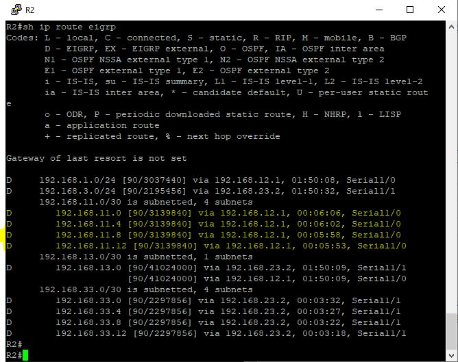

# Лабораторная работа. Настройка расширенных функций EIGRP для IPv4


### Топология


### Часть 1. Создание сети и настройка основных параметров устройства

<details>
 <summary>R1</summary>

``` bash
Router>en
Router#conf t
Router(config)#host R1
R1(config)#no logging console
R1(config)#no ip domain-lookup
R1(config)#service password-encryption 
R1(config)#enable secret class
R1(config)#line console 0
R1(config-line)#password cisco
R1(config-line)#logging synchronous
R1(config-line)#login
R1(config-line)#exit
R1(config)#line vty 0 4
R1(config-line)#password cisco
R1(config-line)#logging synchronous
R1(config-line)#login
R1(config-line)#exit
R1(config)#int e0/0
R1(config-if)#ip address 192.168.1.1 255.255.255.0
R1(config-if)#no shut
R1(config)#int s1/0
R1(config-if)#ip address 192.168.12.1 255.255.255.252
R1(config-if)#clock rate 128000
R1(config-if)#no shut
R1(config)#int s1/1
R1(config-if)#ip address 192.168.13.1 255.255.255.252
R1(config-if)#no shut
R1(config-if)#end
R1#wr
Building configuration...
[OK]
```
</details>

<details>
 <summary>R2</summary>

``` bash
Router>en
Router#conf t
Router(config)#host R2
R2(config)#no logging console
R2(config)#no ip domain-lookup
R2(config)#service password-encryption 
R2(config)#enable secret class
R2(config)#line console 0
R2(config-line)#password cisco
R2(config-line)#logging synchronous
R2(config-line)#login
R2(config-line)#exit
R2(config)#line vty 0 4
R2(config-line)#password cisco
R2(config-line)#logging synchronous
R2(config-line)#login
R2(config-line)#exit
R2(config)#int e0/0
R2(config-if)#ip address 192.168.2.1 255.255.255.0
R2(config-if)#no shut
R2(config)#int s1/0
R2(config-if)#ip address 192.168.12.2 255.255.255.252
R2(config-if)#no shut
R2(config)#int s1/1
R2(config-if)#ip address 192.168.23.1 255.255.255.252
R2(config-if)#clock rate 128000
R2(config-if)#no shut
R2(config-if)#end
R2#wr
Building configuration...
[OK]
```
</details>

<details>
 <summary>R3</summary>

``` bash
Router>en
Router#conf t
Router(config)#host R3
R3(config)#no logging console
R3(config)#no ip domain-lookup
R3(config)#service password-encryption 
R3(config)#enable secret class
R3(config)#line console 0
R3(config-line)#password cisco
R3(config-line)#logging synchronous
R3(config-line)#login
R3(config-line)#exit
R3(config)#line vty 0 4
R3(config-line)#password cisco
R3(config-line)#logging synchronous
R3(config-line)#login
R3(config-line)#exit
R3(config)#int e0/0
R3(config-if)#ip address 192.168.3.1 255.255.255.0
R3(config-if)#no shut
R3(config)#int s1/0
R3(config-if)#ip address 192.168.13.2 255.255.255.252
R3(config-if)#clock rate 128000
R3(config-if)#no shut
R3(config)#int s1/1
R3(config-if)#ip address 192.168.23.2 255.255.255.252
R3(config-if)#no shut
R3(config-if)#end
R3#wr
Building configuration...
[OK]
```
</details>


### Часть 2. Настройка EIGRP и проверка подключения

Настройка EIGRP на всех маршрутизаторах
<details>
 <summary>R1</summary>

``` bash
R1#conf t
R1(config)#router eigrp 1
R1(config-router)#network 192.168.1.0 0.0.0.255
R1(config-router)#network 192.168.12.0 0.0.0.3
R1(config-router)#network 192.168.13.0 0.0.0.3
R1(config-router)#passive-int e0/0
R1(config)#exit
R1(config)#int s1/0
R1(config-if)#band 1024
R1(config-if)#int s1/1
R1(config-if)#band 64
R1(config-if)#end
R1#wr
Building configuration...
[OK]

```
</details>

<details>
 <summary>R2</summary>

``` bash
R2#conf t
R2(config)#router eigrp 1
R2(config-router)#network 192.168.2.0
R2(config-router)#network 192.168.12.0 0.0.0.3
R2(config-router)#network 192.168.23.0 0.0.0.3
R2(config-router)#passive-int e0/0
R2(config-router)#exit
R2(config)#int s1/0
R2(config-if)#band 1024
R2(config-if)#int s1/1
R2(config-if)#band 1544
R2(config-if)#end
R2#wr
Building configuration...
[OK]

```
</details>

<details>
 <summary>R3</summary>

``` bash
R3#conf t
R3(config)#router eigrp 1
R3(config-router)#network 192.168.3.0
R3(config-router)#network 192.168.13.0 0.0.0.3
R3(config-router)#network 192.168.23.0 0.0.0.3
R3(config-router)#passive-int e0/0
R3(config-router)#exit
R3(config)#int s1/0
R3(config-if)#band 64
R3(config-if)#int s1/1
R3(config-if)#band 1544
R3(config-if)#end
R3#wr
Building configuration...
[OK]

```
</details>

<details>
 <summary>Ping</summary>

</details>

### Часть 3. Настройка EIGRP для автоматического объединения

<details>
 <summary>R1</summary>

``` bash
R1#conf t
R1(config)#int lo1
R1(config-if)#ip address 192.168.11.1 255.255.255.252
R1(config-if)#no shut
R1(config)#int lo5
R1(config-if)#ip address 192.168.11.5 255.255.255.252
R1(config-if)#no shut
R1(config)#int lo9
R1(config-if)#ip address 192.168.11.9 255.255.255.252
R1(config-if)#no shut
R1(config)#int lo13
R1(config-if)#ip address 192.168.11.13 255.255.255.252
R1(config-if)#no shut
R1(config-if)#exit
R1(config)#router eigrp 1
R1(config-router)#network 192.168.11.0 0.0.0.3
R1(config-router)#network 192.168.11.5 0.0.0.3
R1(config-router)#network 192.168.11.9 0.0.0.3
R1(config-router)#network 192.168.11.13 0.0.0.3
R1(config-router)#end
R1#wr
Building configuration...
[OK]
```
</details>

<details>
 <summary>R2</summary>

``` bash
R2#conf t
R2(config)#int lo1
R2(config-if)#ip address 192.168.22.1 255.255.255.252
R2(config-if)#no shut
R2(config-if)#exit
R2(config)#router eigrp 1
R2(config-router)#network 192.168.22.0 0.0.0.3
R2(config-router)#end
R2#wr
Building configuration...
[OK]
```
</details>

<details>
 <summary>R3</summary>

``` bash
R3#conf t
R3(config)#int lo1
R3(config-if)#ip address 192.168.33.1 255.255.255.252
R3(config-if)#no shut
R3(config)#int lo5
R3(config-if)#ip address 192.168.33.5 255.255.255.252
R3(config-if)#no shut
R3(config)#int lo9
R3(config-if)#ip address 192.168.33.9 255.255.255.252
R3(config-if)#no shut
R3(config)#int lo13
R3(config-if)#ip address 192.168.33.13 255.255.255.252
R3(config-if)#no shut
R3(config-if)#exit
R3(config)#router eigrp 1
R3(config-router)#network 192.168.33.0 0.0.0.3
R3(config-router)#network 192.168.33.5 0.0.0.3
R3(config-router)#network 192.168.33.9 0.0.0.3
R3(config-router)#network 192.168.33.13 0.0.0.3
R3(config-router)#end
R3#wr
Building configuration...
[OK]
```
</details>

Таблица маршрутизации R2 до включения автосуммирования на R1.

<details>
 <summary>R2</summary>
 



</details>

Включение автосуммирования на R1

<details>
 <summary>R1</summary>

``` bash
R1#conf t
Enter configuration commands, one per line.  End with CNTL/Z.
R1(config)#router eigrp 1
R1(config-router)#auto-summary
R1(config-router)#end
R1#wr
Building configuration...
[OK]
```
</details>

Таблица маршрутизации R2 после включения автосуммирования на R1.

<details>
 <summary>R2</summary>
 
.JPG)


</details>

### Часть 4. Настройка и распространение статического маршрута по умолчанию

<details>
 <summary>R2</summary>

``` bash
R2#conf t
Enter configuration commands, one per line.  End with CNTL/Z.
R2(config)#ip route 0.0.0.0 0.0.0.0 lo1
R2(config)#router eigrp 1
R2(config-router)#redistribute static
R2(config-router)#end
R2#wr
Building configuration...
[OK]

```
</details>


<details>
 <summary>R2#sh ip protocols</summary>


</details>

.JPG)

AD имеет значение по умолчанию (170)

### Часть 5. Выполнение точной настройки EIGRP

<details>
 <summary>R1</summary>

``` bash
R1#conf t
R1(config)#int s1/0
R1(config-if)#ip bandwidth-percent eigrp 1 75
R1(config)#int s1/1
R1(config-if)#ip bandwidth-percent eigrp 1 40
R1(config)#int s1/0
R1(config-if)#ip hello-interval eigrp 1 60
R1(config-if)#ip hold-time eigrp 1 180
R1(config)#int s1/1
R1(config-if)#ip hello-interval eigrp 1 60
R1(config-if)#ip hold-time eigrp 1 180
R1(config-if)#end
R1#wr
Building configuration...
[OK]

```
</details>

<details>
 <summary>R2</summary>

``` bash
R2#conf t
R2(config)#int s1/0
R2(config-if)#ip bandwidth-percent eigrp 1 75
R2(config)#int s1/0
R2(config-if)#ip hello-interval eigrp 1 60
R2(config-if)#ip hold-time eigrp 1 180
R2(config-if)#int s1/1
R2(config-if)#ip hello-interval eigrp 1 60
R2(config-if)#ip hold-time eigrp 1 180
R2(config-if)#end
R2#wr
Building configuration...
[OK]

```
</details>

<details>
 <summary>R3</summary>

``` bash
R3#conf t
R3(config)#int s1/0
R3(config-if)#ip bandwidth-percent eigrp 1 40
R3(config)#int s1/0
R3(config-if)#ip hello-interval eigrp 1 60
R3(config-if)#ip hold-time eigrp 1 180
R3(config-if)#int s1/1
R3(config-if)#ip hello-interval eigrp 1 60
R3(config-if)#ip hold-time eigrp 1 180
R3(config-if)#end
R3#wr
Building configuration...
[OK]
```
</details>

### Вопросы для повторения

1. В чем заключаются преимущества объединения маршрутов?
* Уменьшение количества передаваемого трафика, маршрутов
* Читаемость таблицы маршрутизации

2. Почему при настройке таймеров EIGRP необходимо настраивать значение времени удержания равным или больше интервала приветствия?
* Если не соблюсти данное правило, то маршрутизаторы не смогут установить соседство