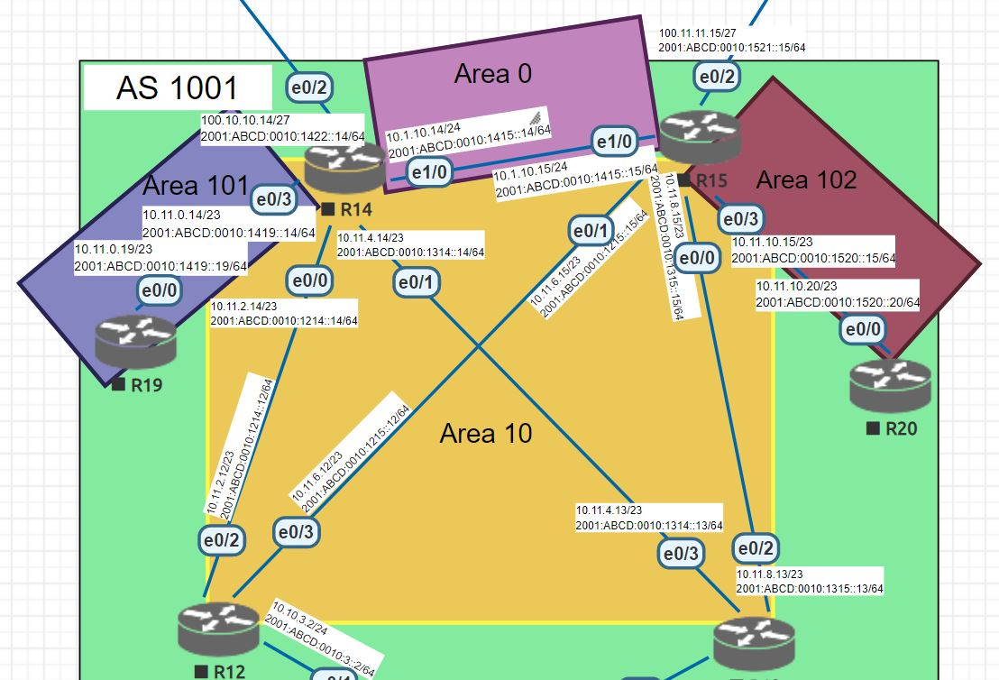

# Различные виды фильтрации в протоколе OSPF
# Лабораторная работа №9. OSPF


### Топология



#### 1. Маршрутизаторы R14-R15 должны находяться в зоне 0 (backbone)
Для начала на стенде eve-ng добавим новую группу из 4 интерфейсов к роутерам R14 и R15, далее соединим между и настроим на них int e1/0

<details>
 <summary>R14</summary>

``` bash
en
conf t
int e1/0
  description "R14 to R15 (ospf area 0)"
  ip address 10.1.10.14 255.255.255.0
  ipv6 address FE80::14 link-local
  ipv6 address 2001:ABCD:0010:1415::14/64
  ipv6 enable
  no shutdown
  end

```
</details>

<details>
 <summary>R15</summary>

``` bash
en
conf t
int e1/0
  description "R15 to R14 (ospf area 0)"
  ip address 10.1.10.15 255.255.255.0
  ipv6 address FE80::15 link-local
  ipv6 address 2001:ABCD:0010:1415::15/64
  ipv6 enable
  no shutdown
  end

```
</details>

Теперь настроим OSPF на данных роутерах  и добавим их в зону 0.

<details>
 <summary>R14</summary>

``` bash
conf t
router ospf 1
 network 10.1.10.0 0.0.0.255 area 0
 passive-interface default
 no passive-interface e1/0
exit

```
</details>

<details>
 <summary>R15</summary>

``` bash
conf t
router ospf 1
 network 10.1.10.0 0.0.0.255 area 0
 passive-interface default
 no passive-interface e1/0
exit

```
</details>

#### 2. Маршрутизаторы R12-R13 должны находяться в зоне 10. Дополнительно к маршрутам должны получать маршрут по-умолчанию

R12 и R13 добавим в зону 10

<details>
 <summary>R12</summary>

en
conf t
router ospf 1
 network 10.10.2.0 0.0.0.255 area 10
 network 10.10.3.0 0.0.0.255 area 10
 network 10.11.2.0 0.0.1.255 area 10
 network 10.11.6.0 0.0.1.255 area 10
 passive-interface default
 no passive-interface e0/2
 no passive-interface e0/3
 end

```
</details>

<details>
 <summary>R13</summary>

​``` bash

en
conf t
router ospf 1
 network 10.10.2.0 0.0.0.255 area 10
 network 10.10.3.0 0.0.0.255 area 10
 network 10.11.8.0 0.0.1.255 area 10
 network 10.11.4.0 0.0.1.255 area 10
 
 passive-interface default
 no passive-interface e0/2
 no passive-interface e0/3
 end

```
</details>

R14 и R15 добавим в area 10, настроим статические маршруты и анонсируем их через OSPF

<details>
 <summary>R14</summary>

``` bash

conf t

 ip route 0.0.0.0 0.0.0.0 100.10.10.10 1 name R22_Kitorn
 ipv6 route ::/0 2001:ABCD:0010:1422::22 1 name R22_Kitorn
 
router ospf 1
 network 10.11.2.0 0.0.1.255 area 10
 network 10.11.4.0 0.0.1.255 area 10
 no passive-interface e0/0
 no passive-interface e0/1
 default-information originate
 end

```
</details>

<details>
 <summary>R15</summary>

``` bash

conf t
 ip route 0.0.0.0 0.0.0.0 100.11.11.11 1 name R21_Lamas
 ipv6 route ::/0 2001:ABCD:0010:1521::21 1 name R21_Lamas
router ospf 1
 network 10.11.8.0 0.0.1.255 area 10
 network 10.11.6.0 0.0.1.255 area 10
 no passive-interface e0/0
 no passive-interface e0/1
 default-information originate
 end

```
</details>


#### 3. Маршрутизатор R19 должен находиться в зоне 101 и получать только маршрут по умолчанию

R14 добавим в area 101

<details>
 <summary>R14</summary>

``` bash

conf t
router ospf 1
 network 10.11.0.0 0.0.1.255 area 101
 no passive-interface e0/3
 end

```
</details>

R19 добавим в area 101

<details>
 <summary>R19</summary>

``` bash
conf t
router ospf 1
 network 10.11.0.0 0.0.1.255 area 101
 passive-interface default
 no passive-interface e0/0
end
```

</details>

<details>
 <summary>R19#sh ip route ospf</summary>

``` bash
R19#sh ip route ospf

Gateway of last resort is 10.11.0.14 to network 0.0.0.0

O*E2  0.0.0.0/0 [110/1] via 10.11.0.14, 00:00:38, Ethernet0/0
      10.0.0.0/8 is variably subnetted, 9 subnets, 3 masks
O IA     10.1.10.0/24 [110/20] via 10.11.0.14, 00:00:38, Ethernet0/0
O IA     10.10.2.0/24 [110/30] via 10.11.0.14, 00:00:38, Ethernet0/0
O IA     10.10.3.0/24 [110/30] via 10.11.0.14, 00:00:38, Ethernet0/0
O IA     10.11.2.0/23 [110/20] via 10.11.0.14, 00:00:38, Ethernet0/0
O IA     10.11.4.0/23 [110/20] via 10.11.0.14, 00:00:38, Ethernet0/0
O IA     10.11.6.0/23 [110/30] via 10.11.0.14, 00:00:38, Ethernet0/0
O IA     10.11.8.0/23 [110/30] via 10.11.0.14, 00:00:38, Ethernet0/0
```

</details>

Через префикс лист на R14 отфильтруем ненужный внутренний маршрут (10.0.0.0/8) на входе в 101 


<details>
 <summary>R14</summary>

``` bash

conf t
 ip prefix-list R19_101 deny 10.0.0.0/8
 router ospf 1
 area 101 filter-list prefix R19_101 in
end

```

</details>

<details>
 <summary>R19#sh ip route ospf</summary>

``` bash
R19#sh ip route ospf

Gateway of last resort is 10.11.0.14 to network 0.0.0.0

O*E2  0.0.0.0/0 [110/1] via 10.11.0.14, 00:01:57, Ethernet0/0

```

</details>

#### 4. Маршрутизатор R20 должен находиться в зоне 102 и получать все маршруты, кроме маршрутов до сетей зоны 101.

R15 добавим в area 102

<details>
 <summary>R15</summary>

``` bash

conf t
router ospf 1
 network 10.11.10.0 0.0.1.255 area 102
 no passive-interface e0/3
 end

```
</details>

R20 добавим в area 102

<details>
 <summary>R20</summary>

``` bash
conf t
router ospf 1
 network 10.11.10.0 0.0.1.255 area 102
 passive-interface default
 no passive-interface e0/0
end
```

</details>

<details>
 <summary>R20#sh ip route ospf</summary>

``` bash
R20#sh ip route ospf
Gateway of last resort is 10.11.10.15 to network 0.0.0.0

O*E2  0.0.0.0/0 [110/1] via 10.11.10.15, 00:00:19, Ethernet0/0
      10.0.0.0/8 is variably subnetted, 10 subnets, 3 masks
O IA     10.1.10.0/24 [110/20] via 10.11.10.15, 00:00:19, Ethernet0/0
O IA     10.10.2.0/24 [110/30] via 10.11.10.15, 00:00:19, Ethernet0/0
O IA     10.10.3.0/24 [110/30] via 10.11.10.15, 00:00:19, Ethernet0/0
O IA     10.11.0.0/23 [110/30] via 10.11.10.15, 00:00:19, Ethernet0/0
O IA     10.11.2.0/23 [110/30] via 10.11.10.15, 00:00:19, Ethernet0/0
O IA     10.11.4.0/23 [110/30] via 10.11.10.15, 00:00:19, Ethernet0/0
O IA     10.11.6.0/23 [110/20] via 10.11.10.15, 00:00:19, Ethernet0/0
O IA     10.11.8.0/23 [110/20] via 10.11.10.15, 00:00:19, Ethernet0/0
```

</details>


Через префикс лист на R15 запретим передачу префикса 101 в зону 102 и разрешим остальные

<details>
 <summary>R15</summary>

``` bash
conf t
ip prefix-list R20_102 deny 10.11.0.0/23
ip prefix-list R20_102 permit 0.0.0.0/0 le 32

router ospf 1
 area 102 filter-list prefix R20_102 in
 end

```
</details>

<details>
 <summary>R20#sh ip route ospf</summary>

``` bash
R20#sh ip route ospf
Gateway of last resort is 10.11.10.15 to network 0.0.0.0

O*E2  0.0.0.0/0 [110/1] via 10.11.10.15, 00:02:19, Ethernet0/0
      10.0.0.0/8 is variably subnetted, 9 subnets, 3 masks
O IA     10.1.10.0/24 [110/20] via 10.11.10.15, 00:02:19, Ethernet0/0
O IA     10.10.2.0/24 [110/30] via 10.11.10.15, 00:02:19, Ethernet0/0
O IA     10.10.3.0/24 [110/30] via 10.11.10.15, 00:02:19, Ethernet0/0
O IA     10.11.2.0/23 [110/30] via 10.11.10.15, 00:02:19, Ethernet0/0
O IA     10.11.4.0/23 [110/30] via 10.11.10.15, 00:02:19, Ethernet0/0
O IA     10.11.6.0/23 [110/20] via 10.11.10.15, 00:02:19, Ethernet0/0
O IA     10.11.8.0/23 [110/20] via 10.11.10.15, 00:02:19, Ethernet0/0
```

</details>
