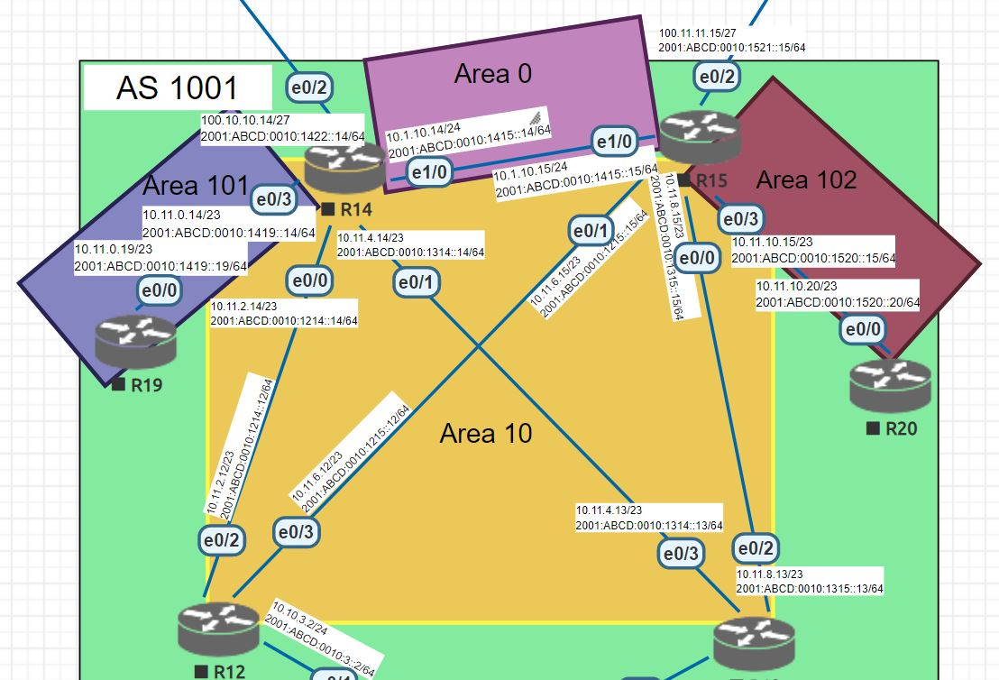

# Лабораторная работа №10

# OSPF для IPv6


### Топология




Роутеры московского офиса будут иметь router id вида 1.1.10.х, где х - номер маршрутизатора. Bключим использование OSPF v3 (ipv6 router ospf 1)


<details>
 <summary>R14</summary>

``` bash
conf t
ipv6 router ospf 1
 router-id 1.1.10.14
 passive-interface e0/2
 default-information originate
 area 101 stub no-summary

int e0/0
 ipv6 ospf 1 area 10
 
int e0/1
 ipv6 ospf 1 area 10
 
int e0/3
 ipv6 ospf 1 area 101
 
int e1/0
 ipv6 ospf 1 area 0
 end
wr mem
```
</details>

Нужно проверить значения таймеров Hello & Dead, в случае расхождения - привести к общему виду путем изменения значений на OSPF v3

<details>
 <summary>R14#sh ospf interface e0/0</summary>

``` bash
R14#sh ospf interface e0/0
Ethernet0/0 is up, line protocol is up
  Link Local Address FE80::14, Interface ID 3
  Area 10, Process ID 1, Instance ID 0, Router ID 1.1.10.14
  Network Type BROADCAST, Cost: 10
  Transmit Delay is 1 sec, State DR, Priority 1
  Designated Router (ID) 1.1.10.14, local address FE80::14
  No backup designated router on this network
  Timer intervals configured, Hello 10, Dead 40, Wait 40, Retransmit 5
    Hello due in 00:00:07
  Graceful restart helper support enabled
  Index 1/1/1, flood queue length 0
  Next 0x0(0)/0x0(0)/0x0(0)
  Last flood scan length is 0, maximum is 0
  Last flood scan time is 0 msec, maximum is 0 msec
  Neighbor Count is 0, Adjacent neighbor count is 0
  Suppress hello for 0 neighbor(s)
```
</details>

<details>
 <summary>R14#sh ospfv3 interface e0/0</summary>

``` bash
R14#sh ospfv3 interface e0/0
Ethernet0/0 is up, line protocol is up
  Link Local Address FE80::14, Interface ID 3
  Area 10, Process ID 1, Instance ID 0, Router ID 1.1.10.14
  Network Type BROADCAST, Cost: 10
  Transmit Delay is 1 sec, State DR, Priority 1
  Designated Router (ID) 1.1.10.14, local address FE80::14
  No backup designated router on this network
  Timer intervals configured, Hello 10, Dead 40, Wait 40, Retransmit 5
    Hello due in 00:00:05
  Graceful restart helper support enabled
  Index 1/1/1, flood queue length 0
  Next 0x0(0)/0x0(0)/0x0(0)
  Last flood scan length is 0, maximum is 0
  Last flood scan time is 0 msec, maximum is 0 msec
  Neighbor Count is 0, Adjacent neighbor count is 0
  Suppress hello for 0 neighbor(s)
```

</details>

Интервалы не отличаются

По аналогии настроим оставшиеся роутеры (router id + "занос" в соответствующие зоны OSPF ipv6 на интерфейсах маршрутизаторов)

<details>
 <summary>R15</summary>

``` bash
conf t
ipv6 router ospf 1
 router-id 1.1.10.15
 passive-interface e0/2
 default-information originate
 distribute-list prefix-list R20_102_v6 in

int e0/0
 ipv6 ospf 1 area 10
 
int e0/1
 ipv6 ospf 1 area 10

int e0/3
 ipv6 ospf 1 area 102
 
int e1/0
 ipv6 ospf 1 area 0
 exit

#запрет получения маршрута до 101 на R20
ipv6 prefix-list R20_102_v6 deny 2001:ABCD:0010:1419::/64 le 128
ipv6 prefix-list R20_102_v6 permit ::0/0 le 128
end
wr mem
```
</details>

<details>
 <summary>R12</summary>

``` bash
conf t
ipv6 router ospf 1
 router-id 1.1.10.12
 passive-interface default
 no passive-interface e0/2
 no passive-interface e0/3

int e0/2
 ipv6 ospf 1 area 10

int e0/3
 ipv6 ospf 1 area 10
 end
wr mem
```
</details>

<details>
 <summary>R13</summary>

``` bash
conf t
ipv6 router ospf 1
 router-id 1.1.10.13
 passive-interface default
 no passive-interface e0/2
 no passive-interface e0/3

int e0/2
 ipv6 ospf 1 area 10

int e0/3
 ipv6 ospf 1 area 10
 end
wr mem
```
</details>

<details>
 <summary>R19</summary>

``` bash
conf t
ipv6 router ospf 1
 router-id 1.1.10.19
 passive-interface default
 no passive-interface e0/0
 area 101 stub

int e0/0
 ipv6 ospf 1 area 101
 end
wr mem
```
</details>

<details>
 <summary>R19#sh ipv6 route ospf</summary>

``` bash
 
 R19#sh ipv6 route ospf
OI  ::/0 [110/11]
     via FE80::14, Ethernet0/0
 
```
</details>

<details>
 <summary>R20</summary>

``` bash

conf t
ipv6 router ospf 1
 router-id 1.1.10.20
 passive-interface default
 no passive-interface e0/0

int e0/0
 ipv6 ospf 1 area 102
 end
wr mem

```

</details>


<details>
 <summary>R20#sh ipv6 route ospf</summary>

``` bash
 
R20#sh ipv6 route ospf
OE2 ::/0 [110/1], tag 1
     via FE80::15, Ethernet0/0
OI  2001:ABCD:10:1214::/64 [110/30]
     via FE80::15, Ethernet0/0
OI  2001:ABCD:10:1215::/64 [110/20]
     via FE80::15, Ethernet0/0
OI  2001:ABCD:10:1314::/64 [110/30]
     via FE80::15, Ethernet0/0
OI  2001:ABCD:10:1315::/64 [110/20]
     via FE80::15, Ethernet0/0
OI  2001:ABCD:10:1415::/64 [110/20]
     via FE80::15, Ethernet0/0
 
 Маршрута до 101 зоны(2001:ABCD:0010:1419::/64) оспф нет
 
```
 