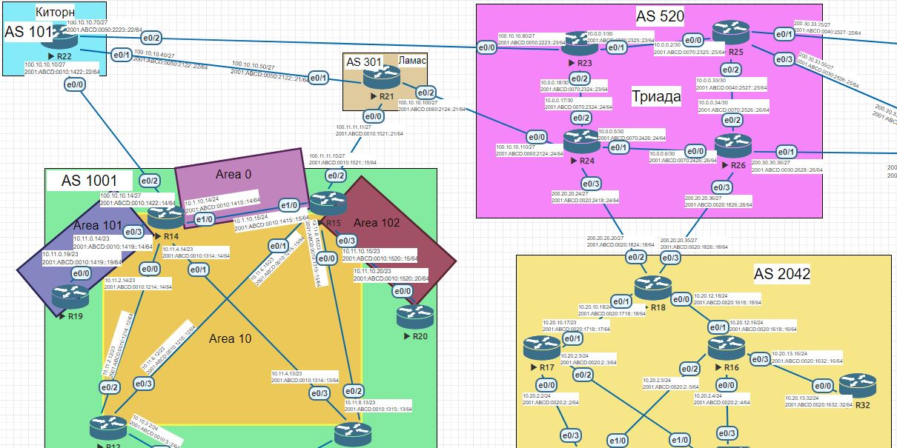
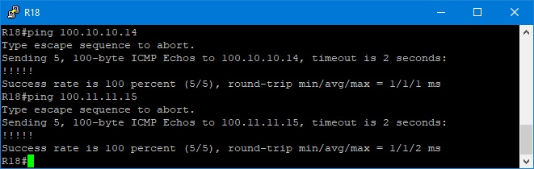

# Лабораторная работа №11. Основы BGP.




### 1. Настроить eBGP между офисом Москва и провайдерами Киторн и Ламас

Настроим eBGP между маршрутизаторами R14-R22 и R15-R21, router-id будем назначать по тому же принципу, что использовали в OSPF.  (Роутеры московского офиса будут иметь router id вида 1.1.10.х, где х - номер маршрутизатора, СПб - 1.1.20.х, Чукордах - 1.1.30.х, Лабытнанги - 1.1.40.27, Киторн -1.1.50.22, Ламас - 1.1.60.21, Триада - 1.1.70.х)
<details>
 <summary>template</summary>

``` bash


```
</details>

<details>
 <summary>R14</summary>

``` bash

conf t
 router bgp 1001
  bgp router-id 1.1.10.14
  neighbor 100.10.10.10 remote-as 101
  neighbor 2001:ABCD:0010:1422::22 remote-as 101

 address-family ipv4
  neighbor 100.10.10.10 activate
  no neighbor 2001:ABCD:0010:1422::22 activate

 address-family ipv6
  neighbor 2001:ABCD:0010:1422::22 activate
  end
wr mem

```
</details>

<details>
 <summary>R22</summary>

``` bash

conf t
router bgp 101
 bgp router-id 1.1.50.22
 neighbor 100.10.10.14 remote-as 1001
 neighbor 2001:ABCD:0010:1422::14 remote-as 1001

address-family ipv4
 neighbor 100.10.10.14 activate
 no neighbor 2001:ABCD:0010:1422::14 activate
 network 100.10.10.0 mask 255.255.255.224
 network 100.10.10.32 mask 255.255.255.224
 network 100.10.10.64 mask 255.255.255.224
 
address-family ipv6
 neighbor 2001:ABCD:0010:1422::14 activate
 network 2001:ABCD:0010:1422::/64
 network 2001:ABCD:0050:2122::/64
 network 2001:ABCD:0050:2223::/64
 end
wr mem

```
</details>

<details>
 <summary>R15</summary>

``` bash
conf t
 router bgp 1001
  bgp router-id 1.1.10.15
  neighbor 100.11.11.11 remote-as 301
  neighbor 2001:ABCD:0010:1521::21 remote-as 301

 address-family ipv4
  neighbor 100.11.11.11 activate
  no neighbor 2001:ABCD:0010:1521::21activate

 address-family ipv6
  neighbor 2001:ABCD:0010:1521::21 activate
  end
wr mem


```
</details>

<details>
 <summary>R21</summary>

``` bash

conf t
router bgp 301
 bgp router-id 1.1.60.21
 neighbor 100.11.11.15 remote-as 1001
 neighbor 2001:ABCD:0010:1521::15 remote-as 1001

address-family ipv4
 neighbor 100.11.11.15 activate
 no neighbor 2001:ABCD:0010:1521::15 activate
 network 100.11.11.0 mask 255.255.255.224
 network 100.10.10.32 mask 255.255.255.224
 network 100.10.10.96 mask 255.255.255.224
 
address-family ipv6
 neighbor 2001:ABCD:0010:1521::15 activate
 network 2001:ABCD:0010:1521::/64
 network 2001:ABCD:0050:1521::/64
 network 2001:ABCD:0060:1521::/64
 end


```
</details>

### 2. eBGP между Киторн и Ламас
.

<details>
 <summary>R21</summary>

``` bash
conf t
router bgp 301
neighbor 100.10.10.40 remote-as 101
neighbor 2001:ABCD:0050:2122::22 remote-as 101

address-family ipv4
 neighbor 100.10.10.40 activate
 no neighbor 2001:ABCD:0050:2122::22 activate
  
address-family ipv6
 neighbor 2001:ABCD:0050:2122::22 activate
 end
wr mem


```
</details>

 <details>
 <summary>R22</summary>

``` bash
conf t
router bgp 101
neighbor 100.10.10.50 remote-as 301
neighbor 2001:ABCD:0050:2122::21 remote-as 301

address-family ipv4
 neighbor 100.10.10.50 activate
 no neighbor 2001:ABCD:0050:2122::21 activate
 network 100.10.10.0 mask 255.255.255.224
 network 100.10.10.32 mask 255.255.255.224
 network 100.10.10.64 mask 255.255.255.224

address-family ipv6
 neighbor 2001:ABCD:0050:2122::21 activate
 network 2001:ABCD:0010:1422::/64
 network 2001:ABCD:0050:2122::/64
 network 2001:ABCD:0050:2223::/64
 end
wr mem


```
</details>

### 3. Настроить eBGP между Ламас и Триада

Настроим eBGP между маршрутизаторами R21-R24.

<details>
 <summary>R21</summary>

``` bash
conf t
router bgp 301
neighbor 100.10.10.110 remote-as 520
neighbor 2001:ABCD:0060:2124::24 remote-as 520

address-family ipv4
 neighbor 100.10.10.110 activate
 no neighbor 2001:ABCD:0060:2124::24 activate
  
address-family ipv6
 neighbor 2001:ABCD:0060:2124::24 activate
 end
wr mem

```
</details>

<details>
 <summary>R24</summary>

``` bash

conf t
router bgp 520
bgp router-id 1.1.70.24
neighbor 100.10.10.100 remote-as 301
neighbor 2001:ABCD:0060:2124::21 remote-as 301

address-family ipv4
 neighbor 100.10.10.100 activate
 no neighbor 2001:ABCD:0060:2124::21 activate
 network 100.10.10.96 mask 255.255.255.224
 network 10.0.0.4 mask 255.255.255.252
 network 10.0.0.16 mask 255.255.255.252
 network 200.20.20.0 mask 255.255.255.224
 
address-family ipv6
 neighbor 2001:ABCD:0060:2124::21 activate
 network 2001:ABCD:0060:2124::/64
 network 2001:ABCD:0070:2324::/64
 network 2001:ABCD:0070:2426::/64
 network 2001:ABCD:0020:1824::/64
 end
wr mem

```
</details>

### 4. eBGP между офисом С.-Петербург и провайдером Триада

Настроим eBGP между R18-R24 и R18-R26

<details>
 <summary>R18</summary>

``` bash
conf t
router bgp 2042
bgp router-id 1.1.30.18
 neighbor 200.20.20.24 remote-as 520
 neighbor 2001:ABCD:0020:1824::24 remote-as 520
 neighbor 200.20.20.36 remote-as 520
 neighbor 2001:ABCD:0020:1826::26 remote-as 520

address-family ipv4
 neighbor 200.20.20.24 activate
 neighbor 200.20.20.36 activate
 no neighbor 2001:ABCD:0020:1824::24 activate
 no neighbor 2001:ABCD:0020:1826::26 activate
address-family ipv6
 neighbor 2001:ABCD:0020:1824::24 activate
 neighbor 2001:ABCD:0020:1826::26 activate
 end
wr mem

```
</details>

<details>
 <summary>R24</summary>

``` bash

conf t
router bgp 520
 neighbor 200.20.20.20 remote-as 2042
 neighbor 2001:ABCD:0020:1824::18 remote-as 2042

address-family ipv4
 neighbor 87.250.250.18 activate
 no neighbor 2001:ABCD:0020:1824::18 activate
 network 100.10.10.96 mask 255.255.255.224
 network 10.0.0.16 mask 255.255.255.252
 network 10.0.0.4 mask 255.255.255.252
 network 87.250.250.0 mask 255.255.255.224

address-family ipv6
 neighbor 2001:ABCD:0020:1824::18 activate
 network 2001:ABCD:0020:1824::/64
 network 2001:ABCD:0060:2124::/64
 network 2001:ABCD:0070:2324::/64
 network 2001:ABCD:0070:2426::/64
 end
wr mem


```
</details>

<details>
 <summary>R26</summary>

``` bash

conf t
router bgp 520
bgp router-id 1.1.70.26
 neighbor 200.20.20.35 remote-as 2042
 neighbor 2001:ABCD:0020:1826::18 remote-as 2042

address-family ipv4
 neighbor 200.20.20.35 activate
 no neighbor 2001:ABCD:0020:1826::18 activate
 network 200.20.20.32 mask 255.255.255.224
 network 10.0.0.4 mask 255.255.255.252
 network 10.0.0.32 mask 255.255.255.252
 network 200.30.30.32 mask 255.255.255.224
 
address-family ipv6
 neighbor 2001:ABCD:0020:1826::18 activate
 network 2001:ABCD:0020:1826::/64
 network 2001:ABCD:0070:2426::/64
 network 2001:ABCD:0070:2526::/64
 network 2001:ABCD:0030:2628::/64
 end
wr mem

```
</details>

### 5. Организовать IP доступность между офисами Москва и С.-Петербург



<details>
 <summary>R15#sh bgp all</summary>

``` bash
R15#sh bgp all
For address family: IPv4 Unicast

BGP table version is 9, local router ID is 1.1.10.15


     Network          Next Hop            Metric LocPrf Weight Path
 *>  10.0.0.4/30      100.11.11.11                           0 301 520 i
 *>  10.0.0.16/30     100.11.11.11                           0 301 520 i
 *>  100.10.10.0/27   100.11.11.11                           0 301 101 i
 *>  100.10.10.32/27  100.11.11.11             0             0 301 i
 *>  100.10.10.64/27  100.11.11.11                           0 301 101 i
 *>  100.10.10.96/27  100.11.11.11             0             0 301 i
 r>  100.11.11.0/27   100.11.11.11             0             0 301 i
 *>  200.20.20.0/27   100.11.11.11                           0 301 520 i

For address family: IPv6 Unicast

BGP table version is 9, local router ID is 1.1.10.15

     Network          Next Hop            Metric LocPrf Weight Path
 *>  2001:ABCD:10:1422::/64
                       2001:ABCD:10:1521::21
                                                              0 301 101 i
 r>  2001:ABCD:10:1521::/64
                       2001:ABCD:10:1521::21
                                                0             0 301 i
 *>  2001:ABCD:20:1824::/64
                       2001:ABCD:10:1521::21
                                                              0 301 520 i
 *>  2001:ABCD:50:2122::/64
                       2001:ABCD:10:1521::21
                                                              0 301 101 i
 *>  2001:ABCD:50:2223::/64
                       2001:ABCD:10:1521::21
                                                              0 301 101 i
 *>  2001:ABCD:60:2124::/64
                       2001:ABCD:10:1521::21
                                                              0 301 520 i
 *>  2001:ABCD:70:2324::/64
                       2001:ABCD:10:1521::21
                                                              0 301 520 i
 *>  2001:ABCD:70:2426::/64
                       2001:ABCD:10:1521::21
                                                              0 301 520 i

```

</details>


<details>
 <summary>R18#sh bgp all</summary>

``` bash

R18#sh bgp all
For address family: IPv4 Unicast

BGP table version is 12, local router ID is 1.1.30.18

     Network          Next Hop            Metric LocPrf Weight Path
 *   10.0.0.4/30      200.20.20.36             0             0 520 i
 *>                   200.20.20.24             0             0 520 i
 *>  10.0.0.16/30     200.20.20.24             0             0 520 i
 *>  10.0.0.32/30     200.20.20.36             0             0 520 i
 *>  100.10.10.0/27   200.20.20.24                           0 520 301 101 i
 *>  100.10.10.32/27  200.20.20.24                           0 520 301 i
 *>  100.10.10.64/27  200.20.20.24                           0 520 301 101 i
 *>  100.10.10.96/27  200.20.20.24             0             0 520 i
 *>  100.11.11.0/27   200.20.20.24                           0 520 301 i
 r>  200.20.20.0/27   200.20.20.24             0             0 520 i
 r>  200.20.20.32/27  200.20.20.36             0             0 520 i
 *>  200.30.30.32/27  200.20.20.36             0             0 520 i

For address family: IPv6 Unicast

BGP table version is 12, local router ID is 1.1.30.18

     Network          Next Hop            Metric LocPrf Weight Path
 *>  2001:ABCD:10:1422::/64
                       2001:ABCD:20:1824::24
                                                              0 520 301 101 i
 *>  2001:ABCD:10:1521::/64
                       2001:ABCD:20:1824::24
                                                              0 520 301 i
 r>  2001:ABCD:20:1824::/64
                       2001:ABCD:20:1824::24
                                                0             0 520 i
 r>  2001:ABCD:20:1826::/64
                       2001:ABCD:20:1826::26
                                                0             0 520 i
 *>  2001:ABCD:30:2628::/64
                       2001:ABCD:20:1826::26
                                                0             0 520 i
 *>  2001:ABCD:50:2122::/64
                       2001:ABCD:20:1824::24
                                                              0 520 301 101 i
 *>  2001:ABCD:50:2223::/64
                       2001:ABCD:20:1824::24
                                                              0 520 301 101 i
 *>  2001:ABCD:60:2124::/64
                       2001:ABCD:20:1824::24
                                                0             0 520 i
 *>  2001:ABCD:70:2324::/64
                       2001:ABCD:20:1824::24
                                                0             0 520 i
 *   2001:ABCD:70:2426::/64
                       2001:ABCD:20:1826::26
                                                0             0 520 i
 *>                   2001:ABCD:20:1824::24
                                                0             0 520 i
 *>  2001:ABCD:70:2526::/64
                       2001:ABCD:20:1826::26
                                                0             0 520 i

```

</details>