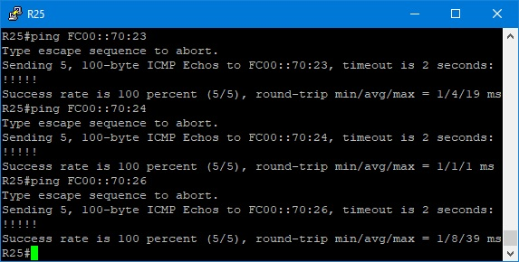

# Лабораторная работа №12. iBGP.

### Задание:

1. Настроить iBGP в офисе Москва между маршрутизаторами R14 и R15;
2. Настроите iBGP в провайдере Триада;
3. Настроить офис Москва так, чтобы приоритетным провайдером стал Ламас;
4. В офисе С.-Петербург работает протокол iBGP. (Не использовать протокол OSPF);
5. Настроить офис С.-Петербург так, чтобы трафик до любого офиса распределялся по двум линкам одновременно;
6. Все сети в лабораторной работе должны иметь IP связность;
7. План работы и изменения зафиксированы в документации.


#### 1. Настроить iBGP в офисе Москва между маршрутизаторами R14 и R15

Для начала нужно настроить loopback на маршрутизаторах и анонсировать его через OSPF. Во время добавления BGP соседа соседского лупбека, не забыть указать себя в качестве некст хопа командой next-hop-self. Так же, т.к. работаем с lo интерфейсом указываем команду update-source

При настройке lo интерфейсов буду придерживаться этих правил:

* Номер int lo - номер офиса
* ipv4 - 100.0.y.x, где у - номер офиса, а  х - роутера
* ipv6 - FC00::y:x, где у - номер офиса, а  х - роутера


<details>
 <summary>R14</summary>

``` bash

conf t

int lo10
 ip address 100.0.10.14 255.255.255.255
 ipv6 enable
 ipv6 address FC00::10:14/128
 ipv6 address FE80::14 link-local
 ipv6 ospf 1 area 0

 router ospf 1
 network 100.0.10.14 0.0.0.0 area 0

router bgp 1001
 address-family ipv4
 neighbor 100.0.10.15 activate
 neighbor 100.0.10.15 remote-as 1001
 neighbor 100.0.10.15 update-source Loopback10
 neighbor 100.0.10.15 next-hop-self

address-family ipv6
 neighbor FC00::10:15 activate
 neighbor FC00::10:15 remote-as 1001
 neighbor FC00::10:15 update-source Loopback10
 neighbor FC00::10:15 next-hop-self
 end
 
```
</details>

<details>
 <summary>R15</summary>

``` bash

conf t

int lo10
 ip address 100.0.10.15 255.255.255.255
 ipv6 enable
 ipv6 address FC00::10:15/128
 ipv6 address FE80::15 link-local
 ipv6 ospf 1 area 0
 
#в зону 0 можно, а в наружу нет
router ospf 1
 network 100.0.10.15 0.0.0.0 area 0

router bgp 1001
 address-family ipv4
 neighbor 100.0.10.14 activate
 neighbor 100.0.10.14 remote-as 1001
 neighbor 100.0.10.14 update-source Loopback10
 neighbor 100.0.10.14 next-hop-self
 address-family ipv6
 neighbor FC00::10:14 activate
 neighbor FC00::10:14 remote-as 1001
 neighbor FC00::10:14 update-source Loopback10
 neighbor FC00::10:14 next-hop-self
 
```
</details>

<details>
 <summary>R14#sh ip bgp sum/ R14#sh bgp ipv6 uni sum</summary>

``` bash
R14#sh ip bgp sum
BGP router identifier 1.1.10.14, local AS number 1001
BGP table version is 9, main routing table version 9
8 network entries using 1184 bytes of memory
8 path entries using 512 bytes of memory
3/3 BGP path/bestpath attribute entries using 408 bytes of memory
6 BGP AS-PATH entries using 144 bytes of memory
0 BGP route-map cache entries using 0 bytes of memory
0 BGP filter-list cache entries using 0 bytes of memory
BGP using 2248 total bytes of memory
BGP activity 16/0 prefixes, 26/3 paths, scan interval 60 secs

Neighbor        V           AS MsgRcvd MsgSent   TblVer  InQ OutQ Up/Down  State/PfxRcd
100.10.10.10    4          101      21      16        9    0    0 00:12:06        8
100.0.10.15     4         1001       0       0        1    0    0 never    Idle


R14#sh bgp ipv6 uni sum
BGP router identifier 1.1.10.14, local AS number 1001
BGP table version is 18, main routing table version 18
8 network entries using 1376 bytes of memory
15 path entries using 1320 bytes of memory
6/3 BGP path/bestpath attribute entries using 816 bytes of memory
6 BGP AS-PATH entries using 144 bytes of memory
0 BGP route-map cache entries using 0 bytes of memory
0 BGP filter-list cache entries using 0 bytes of memory
BGP using 3656 total bytes of memory
BGP activity 16/0 prefixes, 26/3 paths, scan interval 60 secs

Neighbor        V           AS MsgRcvd MsgSent   TblVer  InQ OutQ Up/Down  State/PfxRcd
2001:ABCD:10:1422::22
                4          101      21      18       18    0    0 00:12:17        8
FC00::10:15     4         1001      18      19       18    0    0 00:08:57        7

```

</details>

#### 2. Настроите iBGP в провайдере Триада

Настроим lo, OSPF, iBGP. R25 и R26 назначим route-reflector'ами и объединим в кластер. R23 & R24 будут клиентами rr

<details>
 <summary>R23</summary>

``` bash

# loopback
conf t
int lo70
 ip address 100.0.70.23 255.255.255.255
 ipv6 address FE80::23 link-local
 ipv6 address FC00::70:23/128
 ipv6 enable
 end

# OSPF
conf t
router ospf 1
 router-id 1.1.70.23
 passive-interface default
 no passive-interface e0/1
 no passive-interface e0/2
 no passive-interface lo70
 network 100.0.70.23 0.0.0.0 area 0
 network 10.0.0.0 0.0.0.3 area 0
 network 10.0.0.16 0.0.0.3 area 0
 exit
ipv6 router ospf 1
 router-id 1.1.70.23
 passive-interface default
 no passive-interface e0/1
 no passive-interface e0/2
 no passive-interface lo70
int lo70
 ipv6 ospf 1 area 0
int e0/1
 ipv6 ospf 1 area 0
int e0/2
 ipv6 ospf 1 area 0
 end
 
# BGP
conf t
router bgp 520
 bgp router-id 1.1.70.23
 
 #eBGP_R22_Kitorn
 network 100.10.10.64 mask 255.255.255.224
 neighbor 100.10.10.70 remote-as 101
 #iBGP
 network 100.0.70.0 mask 255.255.255.0
 neighbor 100.0.70.24 remote-as 520
 neighbor 100.0.70.24 update-source Loopback70
 neighbor 100.0.70.24 next-hop-self
 neighbor 100.0.70.24 route-reflector-client

 neighbor 100.0.70.25 remote-as 520
 neighbor 100.0.70.25 update-source Loopback70
 neighbor 100.0.70.25 next-hop-self
 #eBGP_R22_Kitorn
 neighbor 2001:ABCD:0050:2223::22 remote-as 101
 #iBGP
 neighbor FC00::70:24 remote-as 520
 neighbor FC00::70:24 update-source Loopback70
 neighbor FC00::70:24 next-hop-self
 neighbor FC00::70:24 route-reflector-client

 neighbor FC00::70:25 remote-as 520
 neighbor FC00::70:25 update-source Loopback70
 neighbor FC00::70:25 next-hop-self

 address-family ipv4
 neighbor 100.10.10.70 activate
 neighbor 100.0.70.24 activate
 neighbor 100.0.70.25 activate
 no neighbor FC00::70:24 activate
 no neighbor FC00::70:25 activate

 address-family ipv6
 neighbor 2001:ABCD:0050:2223::22 activate
 neighbor FC00::70:24 activate
 neighbor FC00::70:25 activate
 end
wr mem

```

</details>


<details>
 <summary>R24</summary>

``` bash

# loopback
conf t
int lo70
 ip address 100.0.70.24 255.255.255.255
 ipv6 address FE80::24 link-local
 ipv6 address FC00::70:24/128
 ipv6 enable
 end

# OSPF
conf t
router ospf 1
 router-id 1.1.70.24
 passive-interface default
 no passive-interface lo70
 no passive-interface e0/1
 no passive-interface e0/2
 network 100.0.70.24 0.0.0.0 area 0
 network 10.0.0.4 0.0.0.3 area 0
 network 10.0.0.16 0.0.0.3 area 0
 exit
ipv6 router ospf 1
 router-id 1.1.70.24
 passive-interface default
 no passive-interface lo70
 no passive-interface e0/1
 no passive-interface e0/2
int lo70
 ipv6 ospf 1 area 0
int e0/1
 ipv6 ospf 1 area 0
int e0/2
 ipv6 ospf 1 area 0
 end

# iBGP
conf t
router bgp 520
 bgp router-id 1.1.70.24
 bgp cluster-id1
 network 100.0.70.0 mask 255.255.255.0
 neighbor 100.0.70.23 remote-as 520
 neighbor 100.0.70.23 update-source Loopback70
 neighbor 100.0.70.23 next-hop-self
 neighbor 100.0.70.23 route-reflector-client

 neighbor 100.0.70.26 remote-as 520
 neighbor 100.0.70.26 update-source Loopback70
 neighbor 100.0.70.26 next-hop-self

 neighbor FC00::70:23 remote-as 520
 neighbor FC00::70:23 update-source Loopback70
 neighbor FC00::70:23 next-hop-self
 neighbor FC00::70:23 route-reflector-client

 neighbor FC00::70:26 remote-as 520
 neighbor FC00::70:26 update-source Loopback70
 neighbor FC00::70:26 next-hop-self
 
 address-family ipv4
 neighbor 100.0.70.23 activate
 neighbor 100.0.70.26 activate
 no neighbor FC00::70:23 activate
 no neighbor FC00::70:26 activate

 address-family ipv6
 neighbor FC00::70:23 activate
 neighbor FC00::70:26 activate
 no neighbor 100.0.70.23 activate
 no neighbor 100.0.70.26 activate
 end
conf t
router bgp 520
#eBGP_R21_Lamas
 network 100.10.10.96 mask 255.255.255.224
 neighbor 100.10.10.100 remote-as 301

#eBGP_R21_Lamas
 neighbor 2001:ABCD:0060:2124::21 remote-as 301

#eBGP_R21_Lamas
 address-family ipv4
 neighbor 100.10.10.100 activate

#eBGP_R21_Lamas
 address-family ipv6
 neighbor 2001:ABCD:0060:2124::21 activate
 end
wr mem

```

</details>

<details>
 <summary>R25</summary>

``` bash

# loopback
conf t
int lo70
 ip address 100.0.70.25 255.255.255.255
 ipv6 address FE80::25 link-local
 ipv6 address FC00::70:25/128
 ipv6 enable
 end

# OSPF
conf t
router ospf 1
 router-id 1.1.70.25
 passive-interface default
 no passive-interface lo70
 no passive-interface e0/0
 no passive-interface e0/2
 network 100.0.70.25 0.0.0.0 area 0
 network 10.0.0.0 0.0.0.3 area 0
 network 10.0.0.32 0.0.0.3 area 0
 exit
ipv6 router ospf 1
 router-id 1.1.70.25
 passive-interface default
 no passive-interface lo70
 no passive-interface e0/0
 no passive-interface e0/2
int lo70
 ipv6 ospf 1 area 0
int e0/0
 ipv6 ospf 1 area 0
int e0/2
 ipv6 ospf 1 area 0
 end

# iBGP
conf t
router bgp 520
 bgp router-id 1.1.70.25
 bgp cluster-id 1
 network 100.0.70.0 mask 255.255.255.0
 neighbor 100.0.70.23 remote-as 520
 neighbor 100.0.70.23 update-source Loopback70
 neighbor 100.0.70.23 next-hop-self
 neighbor 100.0.70.23 route-reflector-client

 neighbor 100.0.70.26 remote-as 520
 neighbor 100.0.70.26 update-source Loopback70
 neighbor 100.0.70.26 next-hop-self

 neighbor FC00::70:23 remote-as 520
 neighbor FC00::70:23 update-source Loopback70
 neighbor FC00::70:23 next-hop-self
 neighbor FC00::70:23 route-reflector-client

 neighbor FC00::70:26 remote-as 520
 neighbor FC00::70:26 update-source Loopback70
 neighbor FC00::70:26 next-hop-self
 
 address-family ipv4
 neighbor 100.0.70.23 activate
 neighbor 100.0.70.26 activate
 no neighbor FC00::70:23 activate
 no neighbor FC00::70:26 activate

 address-family ipv6
 neighbor FC00::70:23 activate
 neighbor FC00::70:26 activate
 no neighbor 100.0.70.23 activate
 no neighbor 100.0.70.26 activate
 end
wr mem

```

</details>

<details>
 <summary>R26</summary>

``` bash

# loopback
conf t
int lo70
 ip address 100.0.70.26 255.255.255.255
 ipv6 address FE80::26 link-local
 ipv6 address FC00::70:26/128
 ipv6 enable
 end

# OSPF
conf t
router ospf 1
 router-id 1.1.70.26
 passive-interface default
 no passive-interface e0/0
 no passive-interface e0/2
 no passive-interface lo70
 network 100.0.70.26 0.0.0.0 area 0
 network 10.0.0.4 0.0.0.3 area 0
 network 10.0.0.32 0.0.0.3 area 0
 exit
ipv6 router ospf 1
 router-id 1.1.70.26
 passive-interface default
 no passive-interface e0/0
 no passive-interface e0/2
 no passive-interface lo70
int lo70
 ipv6 ospf 1 area 0
int e0/1
 ipv6 ospf 1 area 0
int e0/2
 ipv6 ospf 1 area 0
 end
 
# iBGP
conf t
router bgp 520
 bgp router-id 1.1.70.26
 bgp cluster-id 1
 network 100.0.70.0 mask 255.255.255.0
 neighbor 100.0.70.24 remote-as 520
 neighbor 100.0.70.24 update-source Loopback70
 neighbor 100.0.70.24 next-hop-self
 neighbor 100.0.70.24 route-reflector-client

 neighbor 100.0.70.25 remote-as 520
 neighbor 100.0.70.25 update-source Loopback70
 neighbor 100.0.70.25 next-hop-self

 neighbor FC00::70:24 remote-as 520
 neighbor FC00::70:24 update-source Loopback70
 neighbor FC00::70:24 next-hop-self
 neighbor FC00::70:24 route-reflector-client

 neighbor FC00::70:25 remote-as 520
 neighbor FC00::70:25 update-source Loopback70
 neighbor FC00::70:25 next-hop-self

 address-family ipv4
 neighbor 100.0.70.24 activate
 neighbor 100.0.70.25 activate
 no neighbor FC00::70:24 activate
 no neighbor FC00::70:25 activate

 address-family ipv6
 neighbor FC00::70:24 activate
 neighbor FC00::70:25 activate
 no neighbor 100.0.70.24 activate
 no neighbor 100.0.70.25 activate
 end
wr mem

```

</details>

<details>
 <summary>R25#ping lo's</summary>




</details>

<details>
 <summary>R23#sh bgp all</summary>

``` bash

R23#sh bgp all
For address family: IPv4 Unicast

BGP table version is 12, local router ID is 1.1.70.23
Status codes: s suppressed, d damped, h history, * valid, > best, i - internal,
              r RIB-failure, S Stale, m multipath, b backup-path, f RT-Filter,
              x best-external, a additional-path, c RIB-compressed,
Origin codes: i - IGP, e - EGP, ? - incomplete
RPKI validation codes: V valid, I invalid, N Not found

     Network          Next Hop            Metric LocPrf Weight Path
 r i 10.0.0.4/30      100.0.70.26              0    100      0 i
 r>i                  100.0.70.24              0    100      0 i
 r>i 10.0.0.16/30     100.0.70.24              0    100      0 i
 r i 10.0.0.32/30     100.0.70.26              0    100      0 i
 r>i                  100.0.70.26              0    100      0 i
 *>i 100.10.10.0/27   100.0.70.24              0    100      0 301 101 i
 *>i 100.10.10.32/27  100.0.70.24              0    100      0 301 i
 r>i 100.10.10.64/27  100.0.70.24              0    100      0 301 101 i
 *>i 100.10.10.96/27  100.0.70.24              0    100      0 i
 *>i 100.11.11.0/27   100.0.70.24              0    100      0 301 i
 *>i 200.20.20.0/27   100.0.70.24              0    100      0 i
 * i 200.20.20.32/27  100.0.70.26              0    100      0 i
 *>i                  100.0.70.26              0    100      0 i
 * i 200.30.30.32/27  100.0.70.26              0    100      0 i
 *>i                  100.0.70.26              0    100      0 i

For address family: IPv6 Unicast

BGP table version is 9, local router ID is 1.1.70.23
Status codes: s suppressed, d damped, h history, * valid, > best, i - internal,
              r RIB-failure, S Stale, m multipath, b backup-path, f RT-Filter,
              x best-external, a additional-path, c RIB-compressed,
Origin codes: i - IGP, e - EGP, ? - incomplete
RPKI validation codes: V valid, I invalid, N Not found

     Network          Next Hop            Metric LocPrf Weight Path
 *>i 2001:ABCD:10:1422::/64
                       2001:ABCD:60:2124::21
                                                0    100      0 301 101 i
 *>i 2001:ABCD:10:1521::/64
                       2001:ABCD:60:2124::21
                                                0    100      0 301 i
 *>i 2001:ABCD:20:1824::/64
                       FC00::70:24              0    100      0 i
 *>i 2001:ABCD:50:2122::/64
                       2001:ABCD:60:2124::21
                                                0    100      0 301 101 i
 r>i 2001:ABCD:50:2223::/64
                       2001:ABCD:60:2124::21
                                                0    100      0 301 101 i
 *>i 2001:ABCD:60:2124::/64
                       FC00::70:24              0    100      0 i
 r>i 2001:ABCD:70:2324::/64
                       FC00::70:24              0    100      0 i
 r>i 2001:ABCD:70:2426::/64
                       FC00::70:24              0    100      0 i

```

</details>

<details>
 <summary>R25#sh bgp all</summary>

``` bash
R25#sh bgp all
For address family: IPv4 Unicast

BGP table version is 16, local router ID is 1.1.70.25
Status codes: s suppressed, d damped, h history, * valid, > best, i - internal,
              r RIB-failure, S Stale, m multipath, b backup-path, f RT-Filter,
              x best-external, a additional-path, c RIB-compressed,
Origin codes: i - IGP, e - EGP, ? - incomplete
RPKI validation codes: V valid, I invalid, N Not found

     Network          Next Hop            Metric LocPrf Weight Path
 r>i 10.0.0.4/30      100.0.70.26              0    100      0 i
 r i                  100.0.70.24              0    100      0 i
 r>i 10.0.0.16/30     100.0.70.24              0    100      0 i
 r>i 10.0.0.32/30     100.0.70.26              0    100      0 i
 r i                  100.0.70.26              0    100      0 i
 *>i 100.10.10.0/27   100.0.70.24              0    100      0 301 101 i
 *>i 100.10.10.32/27  100.0.70.24              0    100      0 301 i
 *>i 100.10.10.64/27  100.0.70.24              0    100      0 301 101 i
 *>i 100.10.10.96/27  100.0.70.24              0    100      0 i
 *>i 100.11.11.0/27   100.0.70.24              0    100      0 301 i
 *>i 200.20.20.0/27   100.0.70.24              0    100      0 i
 *>i 200.20.20.32/27  100.0.70.26              0    100      0 i
 * i                  100.0.70.26              0    100      0 i
 *>i 200.30.30.32/27  100.0.70.26              0    100      0 i
 * i                  100.0.70.26              0    100      0 i

For address family: IPv6 Unicast

BGP table version is 5, local router ID is 1.1.70.25
Status codes: s suppressed, d damped, h history, * valid, > best, i - internal,
              r RIB-failure, S Stale, m multipath, b backup-path, f RT-Filter,
              x best-external, a additional-path, c RIB-compressed,
Origin codes: i - IGP, e - EGP, ? - incomplete
RPKI validation codes: V valid, I invalid, N Not found

     Network          Next Hop            Metric LocPrf Weight Path
 *>i 2001:ABCD:20:1826::/64
                       FC00::70:26              0    100      0 i
 r>i 2001:ABCD:30:2628::/64
                       FC00::70:26              0    100      0 i
 r>i 2001:ABCD:70:2426::/64
                       FC00::70:26              0    100      0 i
 r>i 2001:ABCD:70:2526::/64
                       FC00::70:26              0    100      0 i

```

</details>

<details>
 <summary>R24#sh bgp all</summary>

``` bash
R24#sh bgp all
For address family: IPv4 Unicast

BGP table version is 12, local router ID is 1.1.70.24
Status codes: s suppressed, d damped, h history, * valid, > best, i - internal,
              r RIB-failure, S Stale, m multipath, b backup-path, f RT-Filter,
              x best-external, a additional-path, c RIB-compressed,
Origin codes: i - IGP, e - EGP, ? - incomplete
RPKI validation codes: V valid, I invalid, N Not found

     Network          Next Hop            Metric LocPrf Weight Path
 * i 10.0.0.4/30      100.0.70.26              0    100      0 i
 *>                   0.0.0.0                  0         32768 i
 *>  10.0.0.16/30     0.0.0.0                  0         32768 i
 r>i 10.0.0.32/30     100.0.70.26              0    100      0 i
 *>  100.10.10.0/27   100.10.10.100                          0 301 101 i
 *>  100.10.10.32/27  100.10.10.100            0             0 301 i
 *>  100.10.10.64/27  100.10.10.100                          0 301 101 i
 *   100.10.10.96/27  100.10.10.100            0             0 301 i
 *>                   0.0.0.0                  0         32768 i
 *>  100.11.11.0/27   100.10.10.100            0             0 301 i
 *>  200.20.20.0/27   0.0.0.0                  0         32768 i
 *>i 200.20.20.32/27  100.0.70.26              0    100      0 i
 *>i 200.30.30.32/27  100.0.70.26              0    100      0 i

For address family: IPv6 Unicast

BGP table version is 12, local router ID is 1.1.70.24
Status codes: s suppressed, d damped, h history, * valid, > best, i - internal,
              r RIB-failure, S Stale, m multipath, b backup-path, f RT-Filter,
              x best-external, a additional-path, c RIB-compressed,
Origin codes: i - IGP, e - EGP, ? - incomplete
RPKI validation codes: V valid, I invalid, N Not found

     Network          Next Hop            Metric LocPrf Weight Path
 *>  2001:ABCD:10:1422::/64
                       2001:ABCD:60:2124::21
                                                              0 301 101 i
 *>  2001:ABCD:10:1521::/64
                       2001:ABCD:60:2124::21
                                                0             0 301 i
 *>  2001:ABCD:20:1824::/64
                       ::                       0         32768 i
 *>i 2001:ABCD:20:1826::/64
                       FC00::70:26              0    100      0 i
 r>i 2001:ABCD:30:2628::/64
                       FC00::70:26              0    100      0 i
 *>  2001:ABCD:50:2122::/64
                       2001:ABCD:60:2124::21
                                                              0 301 101 i
 *>  2001:ABCD:50:2223::/64
                       2001:ABCD:60:2124::21
                                                              0 301 101 i
 *>  2001:ABCD:60:2124::/64
                       ::                       0         32768 i
 *>  2001:ABCD:70:2324::/64
                       ::                       0         32768 i
 * i 2001:ABCD:70:2426::/64
                       FC00::70:26              0    100      0 i
 *>                   ::                       0         32768 i
 r>i 2001:ABCD:70:2526::/64
                       FC00::70:26              0    100      0 i

```

</details>

<details>
 <summary>R26#sh bgp all</summary>

``` bash
R26#sh bgp all
For address family: IPv4 Unicast

BGP table version is 12, local router ID is 1.1.70.26
Status codes: s suppressed, d damped, h history, * valid, > best, i - internal,
              r RIB-failure, S Stale, m multipath, b backup-path, f RT-Filter,
              x best-external, a additional-path, c RIB-compressed,
Origin codes: i - IGP, e - EGP, ? - incomplete
RPKI validation codes: V valid, I invalid, N Not found

     Network          Next Hop            Metric LocPrf Weight Path
 * i 10.0.0.4/30      100.0.70.24              0    100      0 i
 *>                   0.0.0.0                  0         32768 i
 r>i 10.0.0.16/30     100.0.70.24              0    100      0 i
 *>  10.0.0.32/30     0.0.0.0                  0         32768 i
 *>i 100.10.10.0/27   100.0.70.24              0    100      0 301 101 i
 *>i 100.10.10.32/27  100.0.70.24              0    100      0 301 i
 *>i 100.10.10.64/27  100.0.70.24              0    100      0 301 101 i
 *>i 100.10.10.96/27  100.0.70.24              0    100      0 i
 *>i 100.11.11.0/27   100.0.70.24              0    100      0 301 i
 *>i 200.20.20.0/27   100.0.70.24              0    100      0 i
 *>  200.20.20.32/27  0.0.0.0                  0         32768 i
 *>  200.30.30.32/27  0.0.0.0                  0         32768 i

For address family: IPv6 Unicast

BGP table version is 12, local router ID is 1.1.70.26
Status codes: s suppressed, d damped, h history, * valid, > best, i - internal,
              r RIB-failure, S Stale, m multipath, b backup-path, f RT-Filter,
              x best-external, a additional-path, c RIB-compressed,
Origin codes: i - IGP, e - EGP, ? - incomplete
RPKI validation codes: V valid, I invalid, N Not found

     Network          Next Hop            Metric LocPrf Weight Path
 *>i 2001:ABCD:10:1422::/64
                       2001:ABCD:60:2124::21
                                                0    100      0 301 101 i
 *>i 2001:ABCD:10:1521::/64
                       2001:ABCD:60:2124::21
                                                0    100      0 301 i
 *>i 2001:ABCD:20:1824::/64
                       FC00::70:24              0    100      0 i
 *>  2001:ABCD:20:1826::/64
                       ::                       0         32768 i
 *>  2001:ABCD:30:2628::/64
                       ::                       0         32768 i
 *>i 2001:ABCD:50:2122::/64
                       2001:ABCD:60:2124::21
                                                0    100      0 301 101 i
 *>i 2001:ABCD:50:2223::/64
                       2001:ABCD:60:2124::21
                                                0    100      0 301 101 i
 *>i 2001:ABCD:60:2124::/64
                       FC00::70:24              0    100      0 i
 r>i 2001:ABCD:70:2324::/64
                       FC00::70:24              0    100      0 i
 * i 2001:ABCD:70:2426::/64
                       FC00::70:24              0    100      0 i
 *>                   ::                       0         32768 i
 *>  2001:ABCD:70:2526::/64
                       ::                       0         32768 i

```

</details>

#### 3. Настроить офис Москва так, чтобы приоритетным провайдером стал Ламас;

Для выполнения данной задачи будем манипулировать атрибутом AS-PATH, а именно добавим несколько лишних хопов при помощи технологии AS-PATH Prepending на роутере R14 (не забыть, что внутри as as-path не меняется)


<details>
 <summary>R14</summary>

``` bash

conf t

route-map PREPEND_R22_KITORN permit 10
 set as-path prepend 1001

router bgp 1001
 address-family ipv4
 neighbor 100.0.10.10 activate
 neighbor 100.0.10.10 remote-as 101
 neighbor 100.10.10.10 route-map PREPEND_R22_KITORN out

address-family ipv6
 neighbor 2001:ABCD:0010:1422::22 activate
 neighbor 2001:ABCD:0010:1422::22 remote-as 101
 neighbor 2001:ABCD:0010:1422::22 route-map PREPEND_R22_KITORN out

```
</details>

<details>
 <summary>R14#sh ip bgp</summary>

``` bash
R14#sh ip bgp
BGP table version is 20, local router ID is 1.1.10.14
Status codes: s suppressed, d damped, h history, * valid, > best, i - internal,
              r RIB-failure, S Stale, m multipath, b backup-path, f RT-Filter,
              x best-external, a additional-path, c RIB-compressed,
Origin codes: i - IGP, e - EGP, ? - incomplete
RPKI validation codes: V valid, I invalid, N Not found

     Network          Next Hop            Metric LocPrf Weight Path
 *>i 10.0.0.4/30      100.0.10.15              0    100      0 301 520 i
 *                    100.10.10.10                           0 101 301 520 i
 *>i 10.0.0.16/30     100.0.10.15              0    100      0 301 520 i
 *                    100.10.10.10                           0 101 301 520 i
 *>i 10.0.0.32/30     100.0.10.15              0    100      0 301 520 i
 *                    100.10.10.10                           0 101 301 520 i
 r>  100.10.10.0/27   100.10.10.10             0             0 101 i
 * i 100.10.10.32/27  100.0.10.15              0    100      0 301 i
 *>                   100.10.10.10             0             0 101 i
 *>  100.10.10.64/27  100.10.10.10             0             0 101 i
 *>i 100.10.10.96/27  100.0.10.15              0    100      0 301 i
 *                    100.10.10.10                           0 101 301 i
 *>i 100.11.11.0/27   100.0.10.15              0    100      0 301 i
 *                    100.10.10.10                           0 101 301 i
 *>i 200.20.20.0/27   100.0.10.15              0    100      0 301 520 i
 *                    100.10.10.10                           0 101 301 520 i
 *>i 200.20.20.32/27  100.0.10.15              0    100      0 301 520 i
 *                    100.10.10.10                           0 101 301 520 i
 *>i 200.30.30.32/27  100.0.10.15              0    100      0 301 520 i
 *                    100.10.10.10                           0 101 301 520 i
```
</details>

<details>
 <summary>R14#sh bgp ipv6 uni</summary>

``` bash
R14#sh bgp ipv6 uni
BGP table version is 20, local router ID is 1.1.10.14
Status codes: s suppressed, d damped, h history, * valid, > best, i - internal,
              r RIB-failure, S Stale, m multipath, b backup-path, f RT-Filter,
              x best-external, a additional-path, c RIB-compressed,
Origin codes: i - IGP, e - EGP, ? - incomplete
RPKI validation codes: V valid, I invalid, N Not found

     Network          Next Hop            Metric LocPrf Weight Path
 r>  2001:ABCD:10:1422::/64
                       2001:ABCD:10:1422::22
                                                0             0 101 i
 *>i 2001:ABCD:10:1521::/64
                       FC00::10:15              0    100      0 301 i
 *                    2001:ABCD:10:1422::22
                                                              0 101 301 i
 *>i 2001:ABCD:20:1824::/64
                       FC00::10:15              0    100      0 301 520 i
 *                    2001:ABCD:10:1422::22
                                                              0 101 301 520 i
 *>i 2001:ABCD:20:1826::/64
                       FC00::10:15              0    100      0 301 520 i
 *                    2001:ABCD:10:1422::22
                                                              0 101 301 520 i
 *>i 2001:ABCD:30:2628::/64
                       FC00::10:15              0    100      0 301 520 i
 *                    2001:ABCD:10:1422::22
                                                              0 101 301 520 i
 *>  2001:ABCD:50:2122::/64
                       2001:ABCD:10:1422::22
                                                0             0 101 i
 *>  2001:ABCD:50:2223::/64
                       2001:ABCD:10:1422::22
                                                0             0 101 i
 *>i 2001:ABCD:60:2124::/64
                       FC00::10:15              0    100      0 301 520 i
 *                    2001:ABCD:10:1422::22
                                                              0 101 301 520 i
 *>i 2001:ABCD:70:2324::/64
                       FC00::10:15              0    100      0 301 520 i
 *                    2001:ABCD:10:1422::22
                                                              0 101 301 520 i
 *>i 2001:ABCD:70:2426::/64
                       FC00::10:15              0    100      0 301 520 i
 *                    2001:ABCD:10:1422::22
                                                              0 101 301 520 i
 *>i 2001:ABCD:70:2526::/64
                       FC00::10:15              0    100      0 301 520 i
 *                    2001:ABCD:10:1422::22
                                                              0 101 301 520 i
```
</details>

<details>
 <summary>R22#sh ip bgp</summary>

``` bash

R22#sh ip bgp
BGP table version is 12, local router ID is 1.1.50.22
Status codes: s suppressed, d damped, h history, * valid, > best, i - internal,
              r RIB-failure, S Stale, m multipath, b backup-path, f RT-Filter,
              x best-external, a additional-path, c RIB-compressed,
Origin codes: i - IGP, e - EGP, ? - incomplete
RPKI validation codes: V valid, I invalid, N Not found

     Network          Next Hop            Metric LocPrf Weight Path
 *   10.0.0.4/30      100.10.10.14                           0 1001 1001 301 520 i
 *>                   100.10.10.50                           0 301 520 i
 *   10.0.0.16/30     100.10.10.14                           0 1001 1001 301 520 i
 *>                   100.10.10.50                           0 301 520 i
 *   10.0.0.32/30     100.10.10.14                           0 1001 1001 301 520 i
 *>                   100.10.10.50                           0 301 520 i
 *>  100.10.10.0/27   0.0.0.0                  0         32768 i
 *   100.10.10.32/27  100.10.10.50             0             0 301 i
 *>                   0.0.0.0                  0         32768 i
 *>  100.10.10.64/27  0.0.0.0                  0         32768 i
 *   100.10.10.96/27  100.10.10.14                           0 1001 1001 301 i
 *>                   100.10.10.50             0             0 301 i
 *   100.11.11.0/27   100.10.10.14                           0 1001 1001 301 i
 *>                   100.10.10.50             0             0 301 i
 *   200.20.20.0/27   100.10.10.14                           0 1001 1001 301 520 i
 *>                   100.10.10.50                           0 301 520 i
 *   200.20.20.32/27  100.10.10.14                           0 1001 1001 301 520 i
 *>                   100.10.10.50                           0 301 520 i
 *   200.30.30.32/27  100.10.10.14                           0 1001 1001 301 520 i
 *>                   100.10.10.50                           0 301 520 i

```

</details>

<details>
 <summary>R22#sh bgp ipv6 uni</summary>

``` bash
R22#sh bgp ipv6 uni
BGP table version is 12, local router ID is 1.1.50.22
Status codes: s suppressed, d damped, h history, * valid, > best, i - internal,
              r RIB-failure, S Stale, m multipath, b backup-path, f RT-Filter,
              x best-external, a additional-path, c RIB-compressed,
Origin codes: i - IGP, e - EGP, ? - incomplete
RPKI validation codes: V valid, I invalid, N Not found

     Network          Next Hop            Metric LocPrf Weight Path
 *>  2001:ABCD:10:1422::/64
                       ::                       0         32768 i
 *   2001:ABCD:10:1521::/64
                       2001:ABCD:10:1422::14
                                                              0 1001 1001 301 i
 *>                   2001:ABCD:50:2122::21
                                                0             0 301 i
 *   2001:ABCD:20:1824::/64
                       2001:ABCD:10:1422::14
                                                              0 1001 1001 301 520 i
 *>                   2001:ABCD:50:2122::21
                                                              0 301 520 i
 *   2001:ABCD:20:1826::/64
                       2001:ABCD:10:1422::14
                                                              0 1001 1001 301 520 i
 *>                   2001:ABCD:50:2122::21
                                                              0 301 520 i
 *   2001:ABCD:30:2628::/64
                       2001:ABCD:10:1422::14
                                                              0 1001 1001 301 520 i
 *>                   2001:ABCD:50:2122::21
                                                              0 301 520 i
 *>  2001:ABCD:50:2122::/64
                       ::                       0         32768 i
 *>  2001:ABCD:50:2223::/64
                       ::                       0         32768 i
 *   2001:ABCD:60:2124::/64
                       2001:ABCD:10:1422::14
                                                              0 1001 1001 301 520 i
 *>                   2001:ABCD:50:2122::21
                                                              0 301 520 i
 *   2001:ABCD:70:2324::/64
                       2001:ABCD:10:1422::14
                                                              0 1001 1001 301 520 i
 *>                   2001:ABCD:50:2122::21
                                                              0 301 520 i
 *   2001:ABCD:70:2426::/64
                       2001:ABCD:10:1422::14
                                                              0 1001 1001 301 520 i
 *>                   2001:ABCD:50:2122::21
                                                              0 301 520 i
 *   2001:ABCD:70:2526::/64
                       2001:ABCD:10:1422::14
                                                              0 1001 1001 301 520 i
 *>                   2001:ABCD:50:2122::21
                                                              0 301 520 i
```
</details>


#### 4. В офисе С.-Петербург настроить iBGP. (Не использовать протокол OSPF)


<details>
 <summary>R16</summary>

``` bash

conf t
int lo20
 ip address 100.0.20.16 255.255.255.255
 ipv6 enable
 ipv6 address FC00::20:16/128
 ipv6 address FE80::16 link-local
 ipv6 eigrp 1
 exit

conf t
router eigrp 1
 eigrp router-id 1.1.20.16
 network 100.0.20.16 0.0.0.0
 network 10.20.12.0 0.0.0.255
 network 10.20.13.0 0.0.0.255
 passive-interface default
 no passive-interface e0/1
 no passive-interface e0/3
 exit
ipv6 unicast-routing
ipv6 router eigrp 1
 eigrp router-id 1.1.20.16
 passive-interface default
 no passive-interface e0/1
 no passive-interface e0/3
 no shutdown

int range e0/0-3
 ipv6 eigrp 1


router bgp 2042
 bgp router-id 1.1.20.16
 bgp log-neighbor-changes

 address-family ipv4
 network 100.0.20.17 mask 255.255.255.255
 neighbor 100.0.20.17 activate
 neighbor 100.0.20.17 remote-as 2042
 neighbor 100.0.20.17 up lo20
 neighbor 100.0.20.17 next-hop-self

 network 100.0.20.18 mask 255.255.255.255
 neighbor 100.0.20.18 activate
 neighbor 100.0.20.18 remote-as 2042
 neighbor 100.0.20.18 up lo20
 neighbor 100.0.20.18 next-hop-self

 network 100.0.20.32 mask 255.255.255.255
 neighbor 100.0.20.32 activate
 neighbor 100.0.20.32 remote-as 2042
 neighbor 100.0.20.32 up lo20
 neighbor 100.0.20.32 next-hop-self

 address-family ipv6
 neighbor FC00::20:18 activate
 neighbor FC00::20:18 remote-as 2042
 neighbor FC00::20:18 up lo20
 neighbor FC00::20:18 next-hop-self

 neighbor FC00::20:17 activate
 neighbor FC00::20:17 remote-as 2042
 neighbor FC00::20:17 up lo20
 neighbor FC00::20:17 next-hop-self

 neighbor FC00::20:32 activate
 neighbor FC00::20:32 remote-as 2042
 neighbor FC00::20:32 up lo20
 neighbor FC00::20:32 next-hop-self

```
</details>

<details>
 <summary>R17</summary>

``` bash

conf t
int lo20
 ip address 100.0.20.17 255.255.255.255
 ipv6 enable
 ipv6 address FC00::20:17/128
 ipv6 address FE80::17 link-local
 ipv6 eigrp 1
 exit

conf t
router eigrp 1
 eigrp router-id 1.1.20.17
 network 100.0.20.17 0.0.0.0
 network 10.20.10.0 0.0.0.255
 passive-interface default
 no passive-interface e0/1
 exit
ipv6 unicast-routing
ipv6 router eigrp 1
 eigrp router-id 1.1.20.17
 passive-interface default
 no passive-interface e0/1
 no shutdown

int range e0/0-2
 ipv6 eigrp 1

router bgp 2042
 bgp router-id 1.1.20.17
 bgp log-neighbor-changes

 address-family ipv4
 network 100.0.20.18 mask 255.255.255.255
 neighbor 100.0.20.18 activate
 neighbor 100.0.20.18 remote-as 2042
 neighbor 100.0.20.18 up lo20
 neighbor 100.0.20.18 next-hop-self

 network 100.0.20.16 mask 255.255.255.255
 neighbor 100.0.20.16 activate
 neighbor 100.0.20.16 remote-as 2042
 neighbor 100.0.20.16 up lo20
 neighbor 100.0.20.16 next-hop-self

 network 100.0.20.32 mask 255.255.255.255
 neighbor 100.0.20.32 activate
 neighbor 100.0.20.32 remote-as 2042
 neighbor 100.0.20.32 up lo20
 neighbor 100.0.20.32 next-hop-self

 address-family ipv6
 neighbor FC00::20:18 activate
 neighbor FC00::20:18 remote-as 2042
 neighbor FC00::20:18 up lo20
 neighbor FC00::20:18 next-hop-self

 address-family ipv6
 neighbor FC00::20:16 activate
 neighbor FC00::20:16 remote-as 2042
 neighbor FC00::20:16 up lo20
 neighbor FC00::20:16 next-hop-self

 neighbor FC00::20:32 activate
 neighbor FC00::20:32 remote-as 2042
 neighbor FC00::20:32 up lo20
 neighbor FC00::20:32 next-hop-self


```
</details>

<details>
 <summary>R18</summary>

``` bash

conf t
int lo20
 ip address 100.0.20.18 255.255.255.255
 ipv6 enable
 ipv6 address FC00::20:18/128
 ipv6 address FE80::18 link-local
 ipv6 eigrp 1
 exit

conf t
router eigrp 1
 eigrp router-id 1.1.20.18
 network 100.0.20.18 0.0.0.0
 network 10.20.10.0 0.0.0.255
 network 10.20.12.0 0.0.0.255
 passive-interface default
 no passive-interface e0/0
 no passive-interface e0/1
 exit
ipv6 unicast-routing
ipv6 router eigrp 1
 eigrp router-id 1.1.20.18
 passive-interface default
 no passive-interface e0/0
 no passive-interface e0/1
 no shutdown

int range e0/0-2
 ipv6 eigrp 1

router bgp 2042
 bgp router-id 1.1.20.18
 bgp log-neighbor-changes

 address-family ipv4
 network 100.0.20.17 mask 255.255.255.255
 neighbor 100.0.20.17 activate
 neighbor 100.0.20.17 remote-as 2042
 neighbor 100.0.20.17 up lo20
 neighbor 100.0.20.17 next-hop-self

 network 100.0.20.16 mask 255.255.255.255
 neighbor 100.0.20.16 activate
 neighbor 100.0.20.16 remote-as 2042
 neighbor 100.0.20.16 up lo20
 neighbor 100.0.20.16 next-hop-self

 network 100.0.20.32 mask 255.255.255.255
 neighbor 100.0.20.32 activate
 neighbor 100.0.20.32 remote-as 2042
 neighbor 100.0.20.32 up lo20
 neighbor 100.0.20.32 next-hop-self

 address-family ipv6
 neighbor FC00::20:16 activate
 neighbor FC00::20:16 remote-as 2042
 neighbor FC00::20:16 up lo20
 neighbor FC00::20:16 next-hop-self

 neighbor FC00::20:17 activate
 neighbor FC00::20:17 remote-as 2042
 neighbor FC00::20:17 up lo20
 neighbor FC00::20:17 next-hop-self

 neighbor FC00::20:32 activate
 neighbor FC00::20:32 remote-as 2042
 neighbor FC00::20:32 up lo20
 neighbor FC00::20:32 next-hop-self

```

</details>


<details>
 <summary>R32</summary>

``` bash

conf t
int lo20
 ip address 100.0.20.32 255.255.255.255
 ipv6 enable
 ipv6 address FC00::20:32/128
 ipv6 address FE80::32 link-local
 ipv6 eigrp 1
 exit

conf t
router eigrp 1
 eigrp router-id 1.1.20.32
 network 100.0.20.32 0.0.0.0
 network 10.20.13.0 0.0.0.255
 passive-interface default
 no passive-interface e0/0
 exit
ipv6 unicast-routing
ipv6 router eigrp 1
 eigrp router-id 1.1.20.32
 passive-interface default
 no passive-interface e0/0
 no shutdown

int e0/0
 ipv6 eigrp 1

router bgp 2042
 bgp router-id 1.1.20.32
 bgp log-neighbor-changes

 address-family ipv4
 network 100.0.20.18 mask 255.255.255.255
 neighbor 100.0.20.18 activate
 neighbor 100.0.20.18 remote-as 2042
 neighbor 100.0.20.18 up lo20
 neighbor 100.0.20.18 next-hop-self

 network 100.0.20.16 mask 255.255.255.255
 neighbor 100.0.20.16 activate
 neighbor 100.0.20.16 remote-as 2042
 neighbor 100.0.20.16 up lo20
 neighbor 100.0.20.16 next-hop-self

 network 100.0.20.17 mask 255.255.255.255
 neighbor 100.0.20.17 activate
 neighbor 100.0.20.17 remote-as 2042
 neighbor 100.0.20.17 up lo20
 neighbor 100.0.20.17 next-hop-self

 address-family ipv6
 neighbor FC00::20:18 activate
 neighbor FC00::20:18 remote-as 2042
 neighbor FC00::20:18 up lo20
 neighbor FC00::20:18 next-hop-self

 address-family ipv6
 neighbor FC00::20:16 activate
 neighbor FC00::20:16 remote-as 2042
 neighbor FC00::20:16 up lo20
 neighbor FC00::20:16 next-hop-self

 neighbor FC00::20:17 activate
 neighbor FC00::20:17 remote-as 2042
 neighbor FC00::20:17 up lo20
 neighbor FC00::20:17 next-hop-self

```

</details>
<details>
 <summary>R32#ping</summary>


 </details>


<details>
 <summary>R16#sh ip/ipv6 route bgp</summary>

``` bash
R16#sh ip route bgp
Codes: L - local, C - connected, S - static, R - RIP, M - mobile, B - B                                                                                      GP
       D - EIGRP, EX - EIGRP external, O - OSPF, IA - OSPF inter area
       N1 - OSPF NSSA external type 1, N2 - OSPF NSSA external type 2
       E1 - OSPF external type 1, E2 - OSPF external type 2
       i - IS-IS, su - IS-IS summary, L1 - IS-IS level-1, L2 - IS-IS le                                                                                      vel-2
       ia - IS-IS inter area, * - candidate default, U - per-user stati                                                                                      c route
       o - ODR, P - periodic downloaded static route, H - NHRP, l - LIS                                                                                      P
       + - replicated route, % - next hop override

Gateway of last resort is not set

      10.0.0.0/8 is variably subnetted, 12 subnets, 4 masks
B        10.0.0.4/30 [200/0] via 100.0.20.18, 12:52:12
B        10.0.0.16/30 [200/0] via 100.0.20.18, 12:52:12
B        10.0.0.32/30 [200/0] via 100.0.20.18, 12:52:12
      100.0.0.0/8 is variably subnetted, 9 subnets, 2 masks
B        100.10.10.0/27 [200/0] via 100.0.20.18, 12:52:12
B        100.10.10.32/27 [200/0] via 100.0.20.18, 12:52:12
B        100.10.10.64/27 [200/0] via 100.0.20.18, 12:52:12
B        100.10.10.96/27 [200/0] via 100.0.20.18, 12:52:12
B        100.11.11.0/27 [200/0] via 100.0.20.18, 12:52:12
      200.20.20.0/27 is subnetted, 2 subnets
B        200.20.20.0 [200/0] via 100.0.20.18, 12:52:12
B        200.20.20.32 [200/0] via 100.0.20.18, 12:52:12
      200.30.30.0/27 is subnetted, 1 subnets
B        200.30.30.32 [200/0] via 100.0.20.18, 12:52:12

```

``` bash
R16#sh ipv6 route bgp
IPv6 Routing Table - default - 24 entries
Codes: C - Connected, L - Local, S - Static, U - Per-user Static route
       B - BGP, HA - Home Agent, MR - Mobile Router, R - RIP
       H - NHRP, I1 - ISIS L1, I2 - ISIS L2, IA - ISIS interarea
       IS - ISIS summary, D - EIGRP, EX - EIGRP external, NM - NEMO
       ND - ND Default, NDp - ND Prefix, DCE - Destination, NDr - Redirect
       O - OSPF Intra, OI - OSPF Inter, OE1 - OSPF ext 1, OE2 - OSPF ext 2
       ON1 - OSPF NSSA ext 1, ON2 - OSPF NSSA ext 2, l - LISP
B   2001:ABCD:10:1422::/64 [200/0]
     via FC00::20:18
B   2001:ABCD:10:1521::/64 [200/0]
     via FC00::20:18
B   2001:ABCD:20:1826::/64 [200/0]
     via FC00::20:18
B   2001:ABCD:30:2628::/64 [200/0]
     via FC00::20:18
B   2001:ABCD:50:2122::/64 [200/0]
     via FC00::20:18
B   2001:ABCD:50:2223::/64 [200/0]
     via FC00::20:18
B   2001:ABCD:60:2124::/64 [200/0]
     via FC00::20:18
B   2001:ABCD:70:2324::/64 [200/0]
     via FC00::20:18
B   2001:ABCD:70:2426::/64 [200/0]
     via FC00::20:18
B   2001:ABCD:70:2526::/64 [200/0]
     via FC00::20:18
```


</details>


#### 5. Настроить офис С.-Петербург так, чтобы трафик до любого офиса распределялся по двум линкам одновременно

Будем использовать BGP multipath, а именно команду maximum-paths 2 на R18, этого нам достаточно, так как подключены к одному провайдеру двумя линками

Для того чтобы балансировать нагрузку между различными провайдерами, необходимо использовать скрытую команду IOS: bgp bestpath as-path multipath-relax в виду различий как минимум в AS

До ввода команды для балансировки
<details>
 <summary>R18#sh ip/ipv6 route</summary>

``` bash
R18#sh ip route bgp
Codes: L - local, C - connected, S - static, R - RIP, M - mobile, B - BGP
       D - EIGRP, EX - EIGRP external, O - OSPF, IA - OSPF inter area
       N1 - OSPF NSSA external type 1, N2 - OSPF NSSA external type 2
       E1 - OSPF external type 1, E2 - OSPF external type 2
       i - IS-IS, su - IS-IS summary, L1 - IS-IS level-1, L2 - IS-IS level-2
       ia - IS-IS inter area, * - candidate default, U - per-user static route
       o - ODR, P - periodic downloaded static route, H - NHRP, l - LISP
       + - replicated route, % - next hop override

Gateway of last resort is not set

      10.0.0.0/8 is variably subnetted, 8 subnets, 4 masks
B        10.0.0.4/30 [20/0] via 200.20.20.24, 00:00:42
B        10.0.0.16/30 [20/0] via 200.20.20.24, 00:00:42
B        10.0.0.32/30 [20/0] via 200.20.20.24, 00:00:42
      100.0.0.0/8 is variably subnetted, 9 subnets, 2 masks
B        100.10.10.0/27 [20/0] via 200.20.20.24, 00:00:42
B        100.10.10.32/27 [20/0] via 200.20.20.24, 00:00:42
B        100.10.10.64/27 [20/0] via 200.20.20.24, 00:00:42
B        100.10.10.96/27 [20/0] via 200.20.20.24, 00:00:42
B        100.11.11.0/27 [20/0] via 200.20.20.24, 00:00:42
      200.30.30.0/27 is subnetted, 1 subnets
B        200.30.30.32 [20/0] via 200.20.20.24, 00:00:42

```

``` bash
R18#sh ipv6 route bgp
IPv6 Routing Table - default - 25 entries
Codes: C - Connected, L - Local, S - Static, U - Per-user Static route
       B - BGP, HA - Home Agent, MR - Mobile Router, R - RIP
       H - NHRP, I1 - ISIS L1, I2 - ISIS L2, IA - ISIS interarea
       IS - ISIS summary, D - EIGRP, EX - EIGRP external, NM - NEMO
       ND - ND Default, NDp - ND Prefix, DCE - Destination, NDr - Redirect
       O - OSPF Intra, OI - OSPF Inter, OE1 - OSPF ext 1, OE2 - OSPF ext 2
       ON1 - OSPF NSSA ext 1, ON2 - OSPF NSSA ext 2, l - LISP
B   2001:ABCD:10:1422::/64 [20/0]
     via FE80::24, Ethernet0/2
B   2001:ABCD:10:1521::/64 [20/0]
     via FE80::24, Ethernet0/2
B   2001:ABCD:30:2628::/64 [20/0]
     via FE80::24, Ethernet0/2
B   2001:ABCD:50:2122::/64 [20/0]
     via FE80::24, Ethernet0/2
B   2001:ABCD:50:2223::/64 [20/0]
     via FE80::24, Ethernet0/2
B   2001:ABCD:60:2124::/64 [20/0]
     via FE80::24, Ethernet0/2
B   2001:ABCD:70:2324::/64 [20/0]
     via FE80::24, Ethernet0/2
B   2001:ABCD:70:2426::/64 [20/0]
     via FE80::24, Ethernet0/2
B   2001:ABCD:70:2526::/64 [20/0]
     via FE80::24, Ethernet0/2

```

</details>

Введем команды

<details>
 <summary>R18</summary>

``` bash
conf t

router bgp 2042
 address-family ipv4
  maximum-paths 2
 address-family ipv6
  maximum-paths 2
  end
wr mem

```

</details>

После ввода команд

<details>
 <summary>R18#sh ip/ipv6 route</summary>

``` bash
R18#sh ipv6 route bgp
*Jul  7 11:15:17.348: %SYS-5-CONFIG_I: Configured from console by console
R18#sh ip route bgp
Codes: L - local, C - connected, S - static, R - RIP, M - mobile, B - BGP
       D - EIGRP, EX - EIGRP external, O - OSPF, IA - OSPF inter area
       N1 - OSPF NSSA external type 1, N2 - OSPF NSSA external type 2
       E1 - OSPF external type 1, E2 - OSPF external type 2
       i - IS-IS, su - IS-IS summary, L1 - IS-IS level-1, L2 - IS-IS level-2
       ia - IS-IS inter area, * - candidate default, U - per-user static route
       o - ODR, P - periodic downloaded static route, H - NHRP, l - LISP
       + - replicated route, % - next hop override

Gateway of last resort is not set

      10.0.0.0/8 is variably subnetted, 8 subnets, 4 masks
B        10.0.0.4/30 [20/0] via 200.20.20.36, 00:00:13
                     [20/0] via 200.20.20.24, 00:00:13
B        10.0.0.16/30 [20/0] via 200.20.20.36, 00:00:13
                      [20/0] via 200.20.20.24, 00:00:13
B        10.0.0.32/30 [20/0] via 200.20.20.36, 00:00:13
                      [20/0] via 200.20.20.24, 00:00:13
      100.0.0.0/8 is variably subnetted, 9 subnets, 2 masks
B        100.10.10.0/27 [20/0] via 200.20.20.36, 00:00:13
                        [20/0] via 200.20.20.24, 00:00:13
B        100.10.10.32/27 [20/0] via 200.20.20.36, 00:00:13
                         [20/0] via 200.20.20.24, 00:00:13
B        100.10.10.64/27 [20/0] via 200.20.20.36, 00:00:13
                         [20/0] via 200.20.20.24, 00:00:13
B        100.10.10.96/27 [20/0] via 200.20.20.36, 00:00:13
                         [20/0] via 200.20.20.24, 00:00:13
B        100.11.11.0/27 [20/0] via 200.20.20.36, 00:00:13
                        [20/0] via 200.20.20.24, 00:00:13
      200.30.30.0/27 is subnetted, 1 subnets
B        200.30.30.32 [20/0] via 200.20.20.36, 00:00:13
                      [20/0] via 200.20.20.24, 00:00:13

```

``` bash
R18#sh ipv6 route bgp
IPv6 Routing Table - default - 25 entries
Codes: C - Connected, L - Local, S - Static, U - Per-user Static route
       B - BGP, HA - Home Agent, MR - Mobile Router, R - RIP
       H - NHRP, I1 - ISIS L1, I2 - ISIS L2, IA - ISIS interarea
       IS - ISIS summary, D - EIGRP, EX - EIGRP external, NM - NEMO
       ND - ND Default, NDp - ND Prefix, DCE - Destination, NDr - Redirect
       O - OSPF Intra, OI - OSPF Inter, OE1 - OSPF ext 1, OE2 - OSPF ext 2
       ON1 - OSPF NSSA ext 1, ON2 - OSPF NSSA ext 2, l - LISP
B   2001:ABCD:10:1422::/64 [20/0]
     via FE80::24, Ethernet0/2
     via FE80::26, Ethernet0/3
B   2001:ABCD:10:1521::/64 [20/0]
     via FE80::24, Ethernet0/2
     via FE80::26, Ethernet0/3
B   2001:ABCD:30:2628::/64 [20/0]
     via FE80::24, Ethernet0/2
     via FE80::26, Ethernet0/3
B   2001:ABCD:50:2122::/64 [20/0]
     via FE80::24, Ethernet0/2
     via FE80::26, Ethernet0/3
B   2001:ABCD:50:2223::/64 [20/0]
     via FE80::24, Ethernet0/2
     via FE80::26, Ethernet0/3
B   2001:ABCD:60:2124::/64 [20/0]
     via FE80::24, Ethernet0/2
     via FE80::26, Ethernet0/3
B   2001:ABCD:70:2324::/64 [20/0]
     via FE80::24, Ethernet0/2
     via FE80::26, Ethernet0/3
B   2001:ABCD:70:2426::/64 [20/0]
     via FE80::24, Ethernet0/2
     via FE80::26, Ethernet0/3
B   2001:ABCD:70:2526::/64 [20/0]
     via FE80::24, Ethernet0/2
     via FE80::26, Ethernet0/3

```

</details>