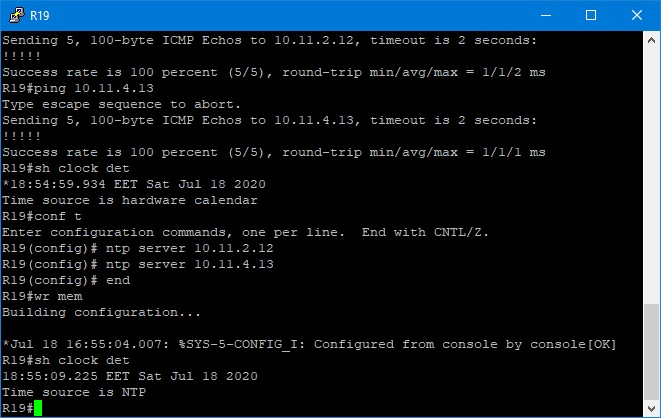
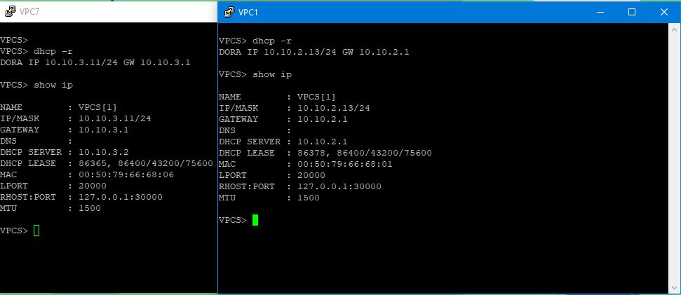
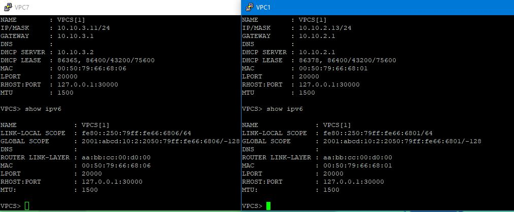

# Лабораторная работа №14. Основные протоколы сети Интернет


#### 1. Настроить NAT(PAT) на R14 и R15. Трансляция должна осуществляться в адрес автономной системы AS1001


Натить будем подсеть 10.10.0.0/16 включающая в себя пользовательские подсети, а именно 10.10.2.0/24 и 10.10.3.0/24


<details>
 <summary>R14</summary>

``` bash

conf t

access-list 1 permit 10.10.0.0 0.0.255.255
ip nat inside source list 1 int e0/2 overload

int e0/2
 ip nat outside
int e0/0
 ip nat inside
int e0/1
 ip nat inside
int e0/3
 ip nat inside
 end
wr mem

```
</details>


<details>
 <summary>R15</summary>

``` bash

conf t

access-list 1 permit 10.10.0.0 0.0.255.255
ip nat inside source list 1 int e0/2 overload

int e0/2
 ip nat outside
int e0/0
 ip nat inside
int e0/1
 ip nat inside
int e0/3
 ip nat inside
 end
wr mem

```
</details>


#### 2. Настроить NAT(PAT) на R18. Трансляция должна осуществляться в пул из 5 адресов автономной системы AS2042

Разделим NAT на две подсети: 10.20.2.0/24 и 10.20.3.0/24. Первая подсеть будет натиться от e0/2 R18 (200.20.20.20), вторая от e0/3 R18 200.20.20.35) соответственно.


<details>
 <summary>R18</summary>

``` bash

conf t

access-list 22 permit 10.20.2.0 0.0.0.255
ip nat inside source list 22 int e0/2 overload

access-list 23 permit 10.20.3.0 0.0.0.255
ip nat inside source list 23 int e0/3 overload

int e0/2
 ip nat outside
int e0/3
 ip nat outside
int e0/0
 ip nat inside
int e0/1
 ip nat inside
 end
wr mem

```
</details>

#### 3. Настроить статический NAT для R20

Будем натить lo20 в свой int e0/0

<details>
 <summary>Настройки Static NAT на R20</summary>

``` bash

conf t
int lo20
 ip address 100.0.10.20 255.255.255.255
 ipv6 enable
 ipv6 address FC00::10:20/128
 ipv6 address FE80::20 link-local
 ipv6 ospf 1 area 102
 ip nat inside
 
int e0/0
 ip nat outside
 exit

ip nat inside source static 100.0.10.20 10.11.10.20
exit
wr mem

```
</details>


#### 4. Настроить NAT так, чтобы R19 был доступен с любого узла для удаленного управления

Для удаленного управления целесообразно испрользовать ssh, его порт (22) и будем прокидывать через стат нат на R14. Порт на выходе заменим на 1922 (логика такова - 19 номер роутера)


<details>
 <summary>R14</summary>

``` bash

conf t

ip nat inside source static tcp 10.11.0.19 22 100.10.10.14 1922
exit
wr mem

```
</details>

#### 5. Настроить статический NAT(PAT) для офиса Чокурдах


<details>
 <summary> R28</summary>

``` bash

conf t
int e0/0
 ip nat outside

 int e0/1
 ip nat outside

int e0/2.3
 ip nat inside

int e0/2.4
 ip nat inside
 exit

ip nat inside source static 10.30.3.30 200.30.30.33
ip nat inside source static 10.30.4.31 200.30.33.45

exit
wr mem

```
</details>


#### 6. Настроить DHCP сервер в офисе Москва на маршрутизаторах R12 и R13. VPC1 и VPC7 должны получать сетевые настройки по DHCP

Из-за использования 2 клиентских vlan, надо соединения маршрутизаторов с коммутаторами сделать на подинтерфейсах.

<details>
 <summary>R12</summary>

``` bash

#SUB

conf t
default int e0/0
default int e0/1

int e0/0.2
  description "R12 to SW4"
  encapsulation dot1q 2
  ip address 10.10.2.1 255.255.255.0
  ipv6 address FE80::12 link-local
  ipv6 address 2001:ABCD:0010:2::2/128
  ipv6 enable
  no shutdown
  exit

int e0/0.3
  description "R12 to SW5"
  encapsulation dot1q 3
  ip address 10.10.3.2 255.255.255.0
  ipv6 address FE80::12 link-local
  ipv6 address 2001:ABCD:0010:3::3/128
  ipv6 enable
  no shutdown
  end

#DHCP

conf t
service dhcp
ip dhcp excluded-address 10.10.2.1 10.10.2.9
ip dhcp excluded-address 10.10.2.250 10.10.2.254
ip dhcp excluded-address 10.10.3.1 10.10.3.9
ip dhcp excluded-address 10.10.3.250 10.10.3.254

ip dhcp pool VLAN2
 network 10.10.2.0 255.255.255.0
 default-router 10.10.2.1

ip dhcp pool VLAN3
 network 10.10.3.0 255.255.255.0
 default-router 10.10.3.1

ipv6 unicast-routing

ipv6 dhcp pool IPV6-VLAN2
address prefix 2001:ABCD:10:2::/64

ipv6 dhcp pool IPV6-VLAN3
address prefix 2001:ABCD:10:3::/64

int e0/0.2
ipv6 dhcp server IPV6-VLAN2
ipv6 nd managed-config-flag

int e0/0.3
ipv6 dhcp server IPV6-VLAN3
ipv6 nd managed-config-flag
end
wr mem

```
</details>

<details>
 <summary>R13</summary>

``` bash

#SUB
conf t
default int e0/0
default int e0/1

int e0/0.3
  description "R13 to SW5"
  encapsulation dot1q 3
  ip address 10.10.3.1 255.255.255.0
  ipv6 address FE80::13 link-local
  ipv6 address 2001:ABCD:0010:3::4/128
  ipv6 enable
  no shutdown
  exit

int e0/0.2
  description "R13 to SW4"
  encapsulation dot1q 2
  ip address 10.10.2.4 255.255.255.0
  ipv6 address FE80::13 link-local
  ipv6 address 2001:ABCD:0010:2::4/128
  ipv6 enable
  no shutdown
  end
  

#DHCP

conf t
service dhcp
ip dhcp excluded-address 10.10.2.1 10.10.2.9
ip dhcp excluded-address 10.10.2.250 10.10.2.254
ip dhcp excluded-address 10.10.3.1 10.10.3.9
ip dhcp excluded-address 10.10.3.250 10.10.3.254

ip dhcp pool VLAN2
 network 10.10.2.0 255.255.255.0
 default-router 10.10.2.1

ip dhcp pool VLAN3
 network 10.10.3.0 255.255.255.0
 default-router 10.10.3.1

ipv6 unicast-routing

ipv6 dhcp pool IPV6-VLAN2
address prefix 2001:ABCD:10:2::/64

ipv6 dhcp pool IPV6-VLAN3
address prefix 2001:ABCD:10:3::/64

int e0/0.2
ipv6 dhcp server IPV6-VLAN2
ipv6 nd managed-config-flag

int e0/0.3
ipv6 dhcp server IPV6-VLAN3
ipv6 nd managed-config-flag
end
wr mem

```
</details>


#### 7. Настроить NTP сервер на R12 и R13

Настройка NTP серверов

<details>
 <summary>R12</summary>

``` bash
conf t

ntp master 2
 clock timezone UTC 3
 clock calendar-valid
 ntp update-calendar

int e0/0.999
 encapsulation dot1q 999
 ip address 1.1.1.12 255.252.0.0
 ipv6 address FD00::12/8
 ipv6 enable
 ntp broadcast
 no shut
</details>


<details>
 <summary>R13</summary>

​``` bash

conf t

ntp master 2
 clock timezone UTC 3
 clock calendar-valid
 ntp update-calendar
 

int e0/0.999
 encapsulation dot1q 999
 ip address 1.1.1.13 255.252.0.0
 ipv6 address FD00::13/8
 ipv6 enable
 ntp broadcast
 no shut

```
</details>

Настройка NTP клиентов

<details>
 <summary>На свитчах:</summary>

``` bash

conf t
int vlan 999
 ntp broad client
 end
wr mem

```
</details>


<details>
<summary>На роутерах:</summary>

``` bash

conf t
 ntp server 10.11.2.12
 ntp server 10.11.4.13
 end
wr mem
 

```
</details>

<details>
<summary>Скриншоты</summary>








</details>


