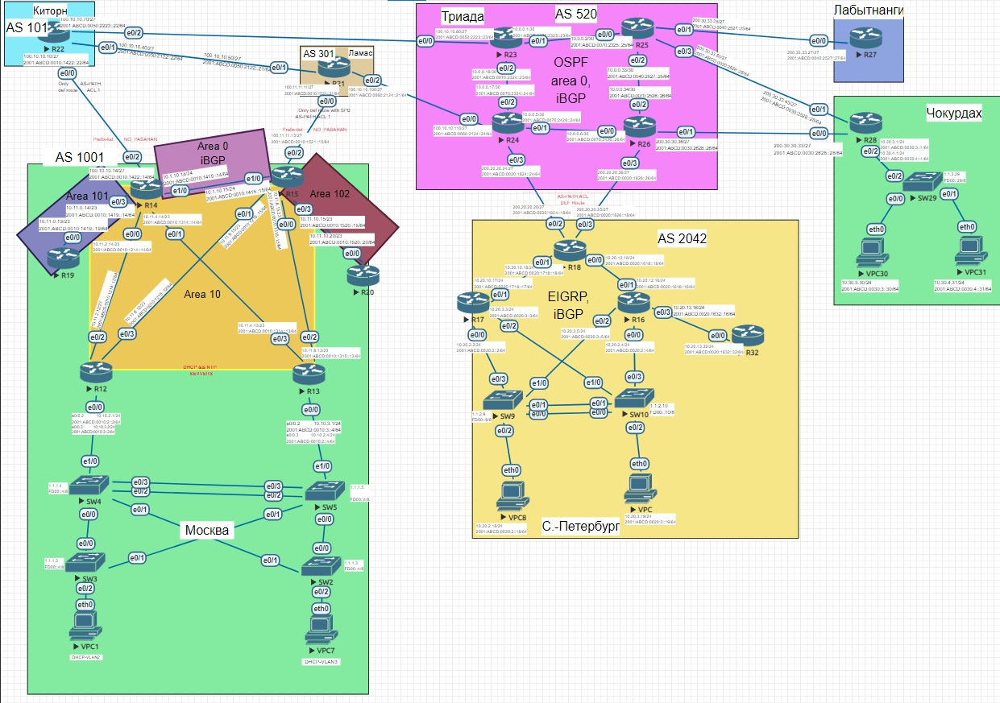
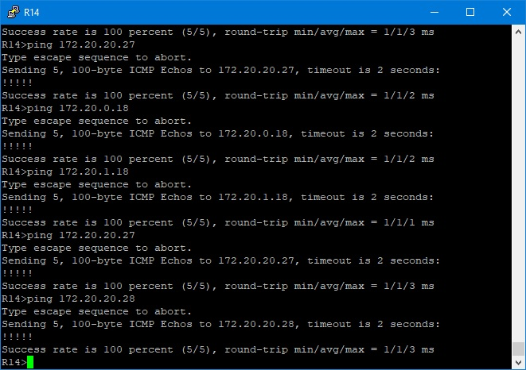
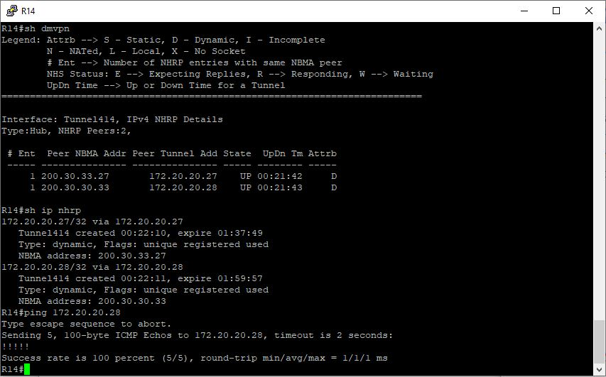
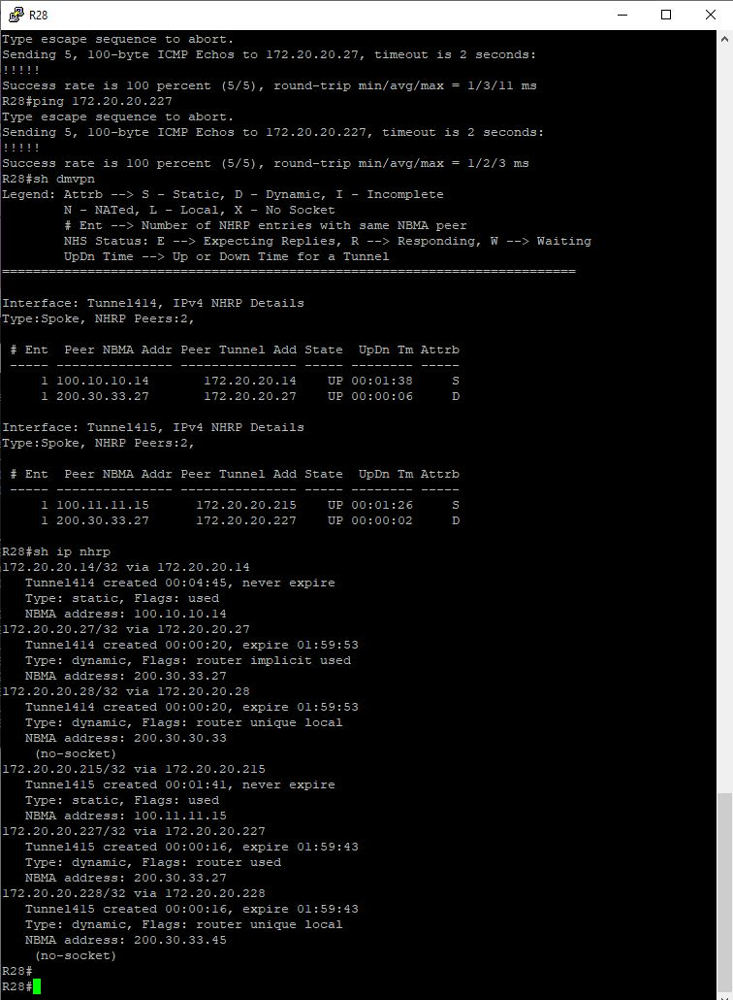

# Лабораторная работа №15. VPN. GRE. DmVPN



#### Для туннелирования будем использовать адреса из подсети 172.20.0.0/16, а для ipv6 - fd00::/8 (чтоб не путаться с lo интерфейсами, там использовали fc00::/8)
#### ipv4 - 172.20.0.Y - где Y - номер настраиваемого роутера
#### ipv6 - FD00::ZY - где Y - номер настраиваемого маршрутизатора, Z - удаленного

### 1. Настроить GRE между офисами Москва и С.-Петербург

Туннельные интерфейсы получат вид tunX - где Х - номер противоположенного маршрутизатора

<details>
 <summary>R14</summary>

``` bash

conf t
int tun18
  ip addr 172.20.0.14 255.255.255.252
  tunnel source 100.10.10.14
  tunnel destination 200.20.20.20
  no shut

  int tun1806
  ipv6 enable
  ipv6 address FE80::14 link-local
  ipv6 address FD00::1814/128
  tunnel source Ethernet0/2
  tunnel destination 2001:ABCD:20:1824::18
  tunnel mode gre ipv6
  no shut
  end
wr mem

```
</details>

<details>
 <summary>R15</summary>

``` bash

conf t
int tun18
  ip addr 172.20.1.15 255.255.255.252
  tunnel source 100.11.11.15
  tunnel destination 200.20.20.35
  no shut

  int tun1806
  ipv6 enable
  ipv6 address FE80::15 link-local
  ipv6 address FD00::1815/127
  tunnel source 2001:ABCD:10:1521::15
  tunnel destination 2001:ABCD:20:1826::18
  tunnel mode gre ipv6
  no shut
  end
wr mem

```
</details>

<details>
 <summary>R18</summary>

``` bash

conf t
int tun14
  ip addr 172.20.0.18 255.255.255.252
  tunnel source 200.20.20.20
  tunnel destination 100.10.10.14
  no shut

  int tun1406
  ipv6 enable
  ipv6 address FE80::18 link-local
  ipv6 address FD00::1418/128
  tunnel source Ethernet0/3
  tunnel destination 2001:ABCD:10:1422::14 
  tunnel mode gre ipv6
  no shut

int tun15
  ip addr 172.20.1.18 255.255.255.252
  tunnel source 200.20.20.35
  tunnel destination 100.11.11.15
  no shut

  int tun1506
  ipv6 enable
  ipv6 address FE80::18 link-local
  ipv6 address FD00::1518/128
  tunnel source 2001:ABCD:20:1826::18
  tunnel destination 2001:ABCD:10:1521::15
  tunnel mode gre ipv6
  no shut
  end
wr mem

```
</details>


### 2. Настроить DMVPN между Москва и Чокурдах, Лабытнанги

Будет 2 канала, с хабами на R14 & R15

Для DMVPN туннеля будем использовать подсеть 172.20.20.0/24, для ipv6 - fd00:dd::/32

В качестве HUB'a выступит R14, R27 && R28 будут споками соответственно

На основном канале (хаб R14):
ipv4 - 172.20.20.X - где X - номер настраиваемого роутера
ipv6 - FD00:DD::14Y - где Y - номер настраиваемого маршрутизатора

На резервном (хаб R15):
ipv4 - 172.20.20.2X - где X - номер настраиваемого роутера
ipv6 - FD00:DD::15Y - где Y - номер настраиваемого маршрутизатора

Туннельный интерфейс для ipv4 будет привязан к каналу и будет иметь вид 4x, где х - номер маршрутизатора хаба (414, 415)
Туннельный интерфейс для ipv6 будет 6x (614, 615)

Будем использовать 3 режим DMVPN (phase 3)

Настройка основного канала: 

<details>
 <summary>R14</summary>

 ``` bash

conf t
int tun414
  desc "DMVPN_ipv4_(hub)"
  ip addr 172.20.20.14 255.255.255.192
  ip nhrp auth 1
  ip nhrp network-id 1
  ip nhrp map multicast dynamic
  ip nhrp redirect
  tunnel source Ethernet0/2
  tunnel mode gre multipoint
  no shut
  end
 wr mem


 ```
</details>

<details>
 <summary>R27</summary>

 ``` bash

conf t
int tun414
  desc "DMVPN_ipv4_(spoke)"
  ip addr 172.20.20.27 255.255.255.192
  ip nhrp auth 1
  ip nhrp network-id 1
  ip nhrp nhs 172.20.20.14
  ip nhrp map 172.20.20.14 100.10.10.14
  ip nhrp map multicast 100.10.10.14
  ip nhrp shortcut
  ip nhrp redirect
  tunnel mode gre multipoint
  tunnel source e0/0
  ip ospf priority 0
  ipv6 ospf priority 0
  no shut
  end
 wr mem

 ```
</details>


<details>
 <summary>R28</summary>

 ``` bash

conf t
int tun414
  desc "DMVPN_ipv4_(spoke)"
  ip addr 172.20.20.28 255.255.255.192
  ip nhrp auth 1
  ip nhrp network-id 1
  ip nhrp nhs 172.20.20.14
  ip nhrp map 172.20.20.14 100.10.10.14
  ip nhrp map multicast 100.10.10.14
  ip nhrp shortcut
  ip nhrp redirect
  tunnel mode gre multipoint
  tunnel source Ethernet0/0
  no shut
  end
 wr mem

 ```
</details>

Настройка резервного канала: 

<details>
 <summary>R15</summary>

 ``` bash

conf t
int tun415
  desc "DMVPN_ipv4_(hub)"
  ip addr 172.20.20.215 255.255.255.192
  ip nhrp auth 1
  ip nhrp network-id 2
  ip nhrp map multicast dynamic
  ip nhrp redirect
  ip ospf priority 10
  tunnel source Ethernet0/2
  tunnel mode gre multipoint
  no shut
  end
 wr mem


 ```
</details>

<details>
 <summary>R27</summary>

 ``` bash

conf t
int tun415
  desc "DMVPN_ipv4_(spoke)"
  ip addr 172.20.20.227 255.255.255.192
  ip nhrp auth 1
  ip nhrp network-id 2
  ip nhrp nhs 172.20.20.215
  ip nhrp map 172.20.20.215 100.11.11.15
  ip nhrp map multicast 100.11.11.15
  ip nhrp shortcut
  ip nhrp redirect
  tunnel mode gre multipoint
  tunnel source e0/0
  no shut
  end
 wr mem

 ```
</details>


<details>
 <summary>R28</summary>

 ``` bash

conf t
int tun415
  desc "DMVPN_ipv4_(spoke)"
  ip addr 172.20.20.228 255.255.255.192
  ip nhrp auth 1
  ip nhrp network-id 2
  ip nhrp nhs 172.20.20.215
  ip nhrp map 172.20.20.215 100.11.11.15
  ip nhrp map multicast 100.11.11.15
  ip nhrp shortcut
  ip nhrp redirect
  tunnel mode gre multipoint
  tunnel source Ethernet0/1
  no shut
  end
 wr mem

 ```
</details>


<details>
 <summary>Скриншоты</summary>







</details>

<details>
 <summary>P.s.</summary>

Не смог завезти в OSPF Чокурдах и Лабытнанги (NBMA)
Прописывал в тоннельном интерфейсе хаба и споков 

 ``` bash
 
ip ospf network broadcast

 ```
 
На хабе 

``` bash

router ospf 1
network 172.20.20.0 0.0.0.63 area 0

 ```
 
На споках

``` bash

network 172.20.20.0 0.0.0.63 area 0 (от R14)
network 172.20.20.192 0.0.0.63 area 0 (от R15)
network 1.1.40.27 0.0.0.0 area 27

 ```
 
В результате соседство не устанавливалось
Также пробовал в тун интерфейсax:

``` bash

ip ospf network non-broadcast

 ```

И прописывая вручную соседей на каждом устройстве

``` bash

neighbor 172.20.20.27 (в хабе)
neighbor 172.20.20.14 (в споке)

 ```
 
Pезультат - отсутствие результата.
Пришел(ли) к выводу, что проблема в эмуляторе eve-ng
</details>

