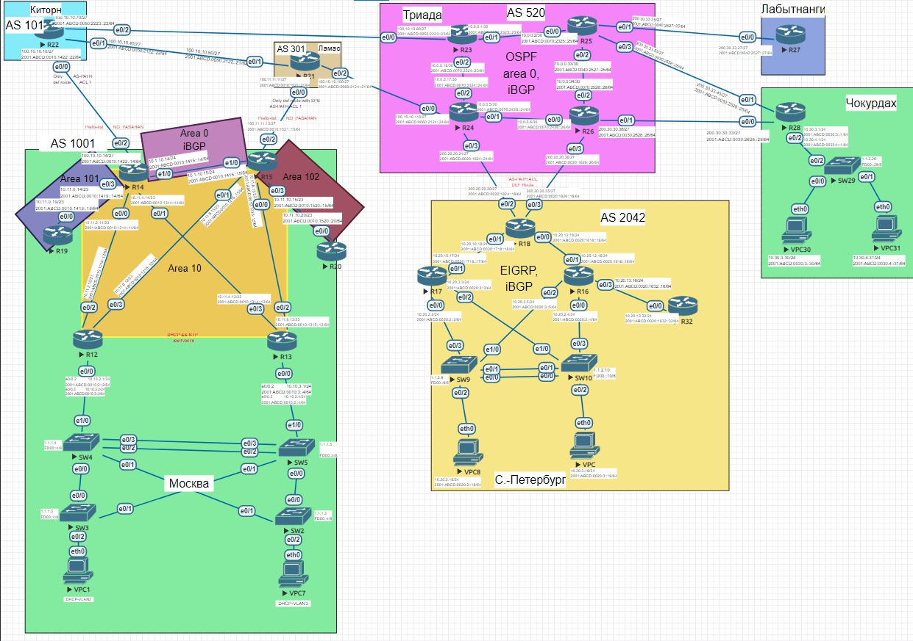
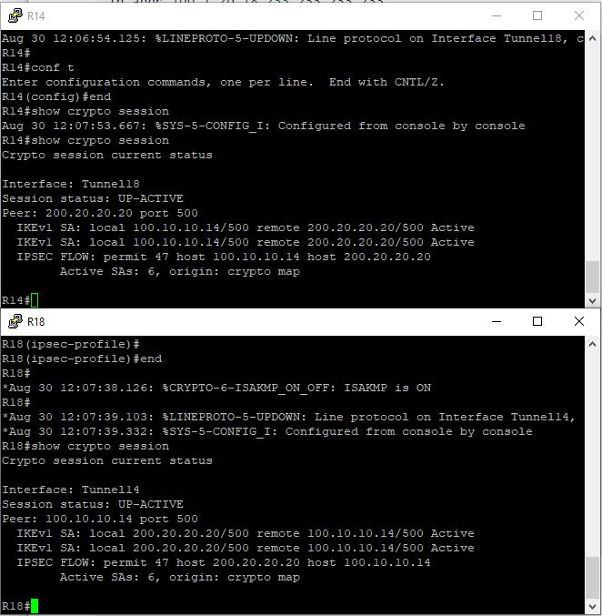
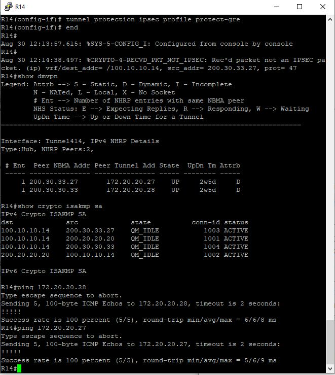

# Лабораторная работа №16. IPSec over DmVPN



#### Вся логика и часть настроек будут использованы с предыдущей работы

### Настроить GRE поверх IPSec между офисами Москва и С.-Петербург


<details>
 <summary>R14</summary>

``` bash

conf t
int tun18
  ip addr 172.20.0.14 255.255.255.252
  ip mtu 1400
  ip tcp adjust-mss 1360
  tunnel source 100.10.10.14
  tunnel destination 200.20.20.20
  tunnel protection ipsec profile protect-gre
  no shut
  
 crypto isakmp policy 1
 encr 3des
 hash md5
 authentication pre-share
 group 2
 lifetime 86400
 
crypto isakmp key yek address 200.20.20.20

crypto ipsec transform-set TS esp-3des esp-md5-hmac
 mode transport

crypto ipsec profile protect-gre
 set security-association lifetime seconds 86400
 set transform-set TS

end
wr mem

```
</details>


<details>
 <summary>R18</summary>

``` bash

conf t
int tun14
 ip addr 172.20.0.18 255.255.255.252
 tunnel source 200.20.20.20
 tunnel destination 100.10.10.14
 ip mtu 1400
 ip tcp adjust-mss 1360
 tunnel protection ipsec profile protect-gre
 no shut

crypto isakmp policy 1
 encr 3des
 hash md5
 authentication pre-share
 group 2
 lifetime 86400

crypto isakmp key yek address 100.10.10.14

crypto ipsec transform-set TS esp-3des esp-md5-hmac
 mode transport

crypto ipsec profile protect-gre
 set security-association lifetime seconds 86400
 set transform-set TS

end
wr mem

```

</details>

<details>
 <summary>R14-R18# sh cry ses</summary>
 


</details>

### Настроите DMVPN поверх IPSec между Москва и Чокурдах, Лабытнанги

<details>
 <summary>R14</summary>

 ``` bash

conf t
int tun414
  desc "DMVPN_ipv4_(hub)"
  ip addr 172.20.20.14 255.255.255.192
  ip nhrp auth 1
  ip nhrp network-id 1
  ip nhrp map multicast dynamic
  ip nhrp redirect
  tunnel source Ethernet0/2
  tunnel mode gre multipoint
  no shut


crypto isakmp policy 1
 encr 3des
 hash md5 
 authentication pre-share
 group 2  
crypto isakmp key isakmp1234 address 0.0.0.0 0.0.0.0
crypto ipsec transform-set TS esp-3des esp-md5-hmac 
 mode tunnel
         
         
crypto ipsec profile protect-gre
 set security-association lifetime seconds 86400
 set transform-set TS 

int t414
 tunnel protection ipsec profile protect-gre
 end
wr mem

 ```

</details>


<details>
 <summary>R27</summary>

 ``` bash

conf t
int tun414
  desc "DMVPN_ipv4_(spoke)"
  ip addr 172.20.20.27 255.255.255.192
  ip nhrp auth 1
  ip nhrp network-id 1
  ip nhrp nhs 172.20.20.14
  ip nhrp map 172.20.20.14 100.10.10.14
  ip nhrp map multicast 100.10.10.14
  ip nhrp shortcut
  ip nhrp redirect
  tunnel mode gre multipoint
  tunnel source e0/0
  ip ospf priority 0
  ipv6 ospf priority 0
  no shut

 crypto isakmp policy 1
 encr 3des
 hash md5 
 authentication pre-share
 group 2  
crypto isakmp key isakmp1234 address 0.0.0.0 0.0.0.0 
         
crypto ipsec transform-set TS esp-3des esp-md5-hmac 
 mode tunnel
         
         
crypto ipsec profile protect-gre
 set security-association lifetime seconds 86400
 set transform-set TS 

int t414
 tunnel protection ipsec profile protect-gre
 end
wr mem
 ```

</details>


<details>
 <summary>R28</summary>

 ``` bash

conf t
int tun414
  desc "DMVPN_ipv4_(spoke)"
  ip addr 172.20.20.28 255.255.255.192
  ip nhrp auth 1
  ip nhrp network-id 1
  ip nhrp nhs 172.20.20.14
  ip nhrp map 172.20.20.14 100.10.10.14
  ip nhrp map multicast 100.10.10.14
  ip nhrp shortcut
  ip nhrp redirect
  tunnel mode gre multipoint
  tunnel source Ethernet0/0
  no shut

crypto isakmp policy 1
 encr 3des
 hash md5 
 authentication pre-share
 group 2  
crypto isakmp key isakmp1234 address 0.0.0.0 0.0.0.0
crypto ipsec transform-set TS esp-3des esp-md5-hmac 
 mode tunnel         
         
crypto ipsec profile protect-gre
 set security-association lifetime seconds 86400
 set transform-set TS 

int t414
 tunnel protection ipsec profile protect-gre 
 end
wr mem

 ```
</details>

<details>
 <summary>R14#sh dmvpn, sh cry isakmp sa, ping</summary>



</details>